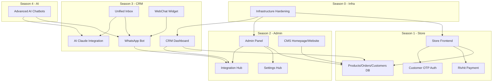

# ClalMobile - Comprehensive Project Audit Report

---

## A. Project Summary

- **Application Type:** Multi-application platform containing: Store (e-commerce), Admin Panel, CRM, WhatsApp Bot, WebChat Widget, and Website (landing)
- **Domain:** Official HOT Mobile reseller (ClalMobile) in Israel -- selling smartphones, accessories, and line plans
- **Current Season:** Season 3 (CRM + WhatsApp Integration) -- actively in progress
- **Estimated Completion:** ~75-80% overall. Store and Admin are mature. CRM/Inbox and Bot are functional but still evolving.
- **Languages:** Arabic (primary) + Hebrew. RTL-first layout.
- **Target:** `https://clalmobile.com`

---

## B. Technical Architecture

### Framework and Stack

| Layer      | Technology                                     | Version                           |
| ---------- | ---------------------------------------------- | --------------------------------- |
| Framework  | Next.js (App Router)                           | 14.2.35                           |
| Language   | TypeScript                                     | ^5.5.0                            |
| Styling    | Tailwind CSS                                   | ^3.4.0                            |
| State      | Zustand                                        | ^4.5.0                            |
| Database   | Supabase (Postgres)                            | @supabase/supabase-js ^2.45.0     |
| Auth       | Supabase Auth (admin) + Custom OTP (customers) | @supabase/ssr ^0.5.0              |
| Deployment | Cloudflare Pages                               | @cloudflare/next-on-pages ^1.13.0 |
| Icons      | Lucide React                                   | ^0.400.0                          |
| Toasts     | Sonner                                         | ^1.5.0                            |
| Dates      | date-fns                                       | ^3.6.0                            |
| AI         | Anthropic Claude (via lib/ai/claude.ts)        | Direct API                        |

### Database Connection

- Three client modes: `createBrowserSupabase` (client-side), `createServerSupabase` (server components/middleware), `createAdminSupabase` (service role for API routes)
- Defined in `[lib/supabase.ts](lib/supabase.ts)`

### Authentication System

- **Admin/CRM users:** Supabase Auth (email/password) via middleware protection
- **Store customers:** Phone-based OTP via Twilio Verify, custom `customer_otps` table, auth token stored in `customers.auth_token`
- **Protected routes:** `/admin/`*, `/crm/`*, `/api/admin/*`, `/api/crm/*` -- enforced by `[middleware.ts](middleware.ts)`
- **Roles:** super_admin, admin, sales, support, content, viewer -- with permission matrix in `[lib/constants.ts](lib/constants.ts)`

### State Management

- **3 Zustand stores** (all with localStorage persistence):
  - `useCart` -- cart items, coupon, abandoned cart tracking (`[lib/store/cart.ts](lib/store/cart.ts)`)
  - `useWishlist` -- wishlist products (`[lib/store/wishlist.ts](lib/store/wishlist.ts)`)
  - `useCompare` -- product comparison, max 4 items (`[lib/store/compare.ts](lib/store/compare.ts)`)

### Styling and Theme

- Dark theme by default (`#09090b` background, `#fafafa` text)
- Brand color: `#c41040` (red)
- Custom Tailwind tokens in `[tailwind.config.ts](tailwind.config.ts)`: `brand.`*, `surface.`*, `state.*`, `muted`, `dim`
- Custom breakpoints: `mobile` (max 767px), `tablet` (768-1023px), `desktop` (1024px+)
- Fonts: Tajawal (Arabic), David Libre + Heebo (Hebrew)
- RTL default: `html { direction: rtl; }` in `[styles/globals.css](styles/globals.css)`

### i18n / RTL

- Two languages: Arabic (`ar`) and Hebrew (`he`) in `[locales/](locales/)`
- ~302 translation strings per language, 23 top-level keys
- `useLang()` hook from `[lib/i18n.tsx](lib/i18n.tsx)` with `LangProvider`
- `LangSwitcher` component for toggling

---

## C. Pages and Routes

### Public / Website (7 pages)

| Route      | File                                           | Status   |
| ---------- | ---------------------------------------------- | -------- |
| `/`        | `[app/page.tsx](app/page.tsx)`                 | Complete |
| `/about`   | `[app/about/page.tsx](app/about/page.tsx)`     | Complete |
| `/contact` | `[app/contact/page.tsx](app/contact/page.tsx)` | Complete |
| `/faq`     | `[app/faq/page.tsx](app/faq/page.tsx)`         | Complete |
| `/deals`   | `[app/deals/page.tsx](app/deals/page.tsx)`     | Complete |
| `/privacy` | `[app/privacy/page.tsx](app/privacy/page.tsx)` | Complete |
| `/legal`   | `[app/legal/page.tsx](app/legal/page.tsx)`     | Complete |

### Auth (1 page)

| Route    | File                                                     | Status   |
| -------- | -------------------------------------------------------- | -------- |
| `/login` | `[app/(auth)/login/page.tsx](app/(auth)`/login/page.tsx) | Complete |

### Store (10 pages)

| Route                     | File                                                                         | Status   |
| ------------------------- | ---------------------------------------------------------------------------- | -------- |
| `/store`                  | `[app/store/page.tsx](app/store/page.tsx)`                                   | Complete |
| `/store/product/[id]`     | `[app/store/product/[id]/page.tsx](app/store/product/[id]/page.tsx)`         | Complete |
| `/store/cart`             | `[app/store/cart/page.tsx](app/store/cart/page.tsx)`                         | Complete |
| `/store/checkout/success` | `[app/store/checkout/success/page.tsx](app/store/checkout/success/page.tsx)` | Complete |
| `/store/checkout/failed`  | `[app/store/checkout/failed/page.tsx](app/store/checkout/failed/page.tsx)`   | Complete |
| `/store/wishlist`         | `[app/store/wishlist/page.tsx](app/store/wishlist/page.tsx)`                 | Complete |
| `/store/compare`          | `[app/store/compare/page.tsx](app/store/compare/page.tsx)`                   | Complete |
| `/store/account`          | `[app/store/account/page.tsx](app/store/account/page.tsx)`                   | Complete |
| `/store/auth`             | `[app/store/auth/page.tsx](app/store/auth/page.tsx)`                         | Complete |
| `/store/contact`          | `[app/store/contact/page.tsx](app/store/contact/page.tsx)`                   | Complete |

### Admin Panel (13 pages, protected)

| Route             | File                                                         | Status               |
| ----------------- | ------------------------------------------------------------ | -------------------- |
| `/admin`          | `[app/admin/page.tsx](app/admin/page.tsx)`                   | Complete (dashboard) |
| `/admin/products` | `[app/admin/products/page.tsx](app/admin/products/page.tsx)` | Complete             |
| `/admin/coupons`  | `[app/admin/coupons/page.tsx](app/admin/coupons/page.tsx)`   | Complete             |
| `/admin/heroes`   | `[app/admin/heroes/page.tsx](app/admin/heroes/page.tsx)`     | Complete             |
| `/admin/deals`    | `[app/admin/deals/page.tsx](app/admin/deals/page.tsx)`       | Complete             |
| `/admin/reviews`  | `[app/admin/reviews/page.tsx](app/admin/reviews/page.tsx)`   | Complete             |
| `/admin/lines`    | `[app/admin/lines/page.tsx](app/admin/lines/page.tsx)`       | Complete             |
| `/admin/push`     | `[app/admin/push/page.tsx](app/admin/push/page.tsx)`         | Complete             |
| `/admin/bot`      | `[app/admin/bot/page.tsx](app/admin/bot/page.tsx)`           | Complete             |
| `/admin/homepage` | `[app/admin/homepage/page.tsx](app/admin/homepage/page.tsx)` | Complete             |
| `/admin/website`  | `[app/admin/website/page.tsx](app/admin/website/page.tsx)`   | Complete             |
| `/admin/features` | `[app/admin/features/page.tsx](app/admin/features/page.tsx)` | Complete             |
| `/admin/settings` | `[app/admin/settings/page.tsx](app/admin/settings/page.tsx)` | Complete             |

### CRM (8 pages, protected)

| Route            | File                                                       | Status               |
| ---------------- | ---------------------------------------------------------- | -------------------- |
| `/crm`           | `[app/crm/page.tsx](app/crm/page.tsx)`                     | Complete (dashboard) |
| `/crm/inbox`     | `[app/crm/inbox/page.tsx](app/crm/inbox/page.tsx)`         | Complete             |
| `/crm/orders`    | `[app/crm/orders/page.tsx](app/crm/orders/page.tsx)`       | Complete             |
| `/crm/customers` | `[app/crm/customers/page.tsx](app/crm/customers/page.tsx)` | Complete             |
| `/crm/pipeline`  | `[app/crm/pipeline/page.tsx](app/crm/pipeline/page.tsx)`   | Complete             |
| `/crm/tasks`     | `[app/crm/tasks/page.tsx](app/crm/tasks/page.tsx)`         | Complete             |
| `/crm/chats`     | `[app/crm/chats/page.tsx](app/crm/chats/page.tsx)`         | Complete             |
| `/crm/users`     | `[app/crm/users/page.tsx](app/crm/users/page.tsx)`         | Complete             |

### API Routes (61 total)

- **Admin API:** 20+ routes (products CRUD, coupons, heroes, deals, reviews, lines, push, settings, upload, AI enhance, integrations test, etc.)
- **CRM API:** 15+ routes (inbox, orders, customers, pipeline, tasks, chats, users, dashboard)
- **Store/Public API:** orders, cart, coupons, reviews, payment, store/smart-search
- **Auth API:** customer auth (OTP)
- **Webhooks:** WhatsApp (yCloud), Twilio
- **Cron:** daily/weekly reports
- **Utility:** health, email, chat, push, settings/public, reports

---

## D. Components (37 files)

### Admin (3 files)

- `AdminShell.tsx` -- Layout shell with sidebar/tabs navigation
- `shared.tsx` -- Reusable UI: Modal, StatCard, EmptyState, Toggle, PageHeader, FormField, ConfirmDialog
- `ImageUpload.tsx` -- Image upload with preview and AI enhance

### Store (7 files)

- `StoreHeader.tsx` -- Header with logo, nav, cart badge, wishlist, lang switcher
- `StoreClient.tsx` -- Full catalog: filters, hero carousel, product grid, line plans
- `ProductCard.tsx` -- Product card with image, price, colors, storage, quick actions
- `ProductDetail.tsx` -- Product detail: gallery, specs, reviews, add to cart
- `ProductReviews.tsx` -- Review list and submit form
- `HeroCarousel.tsx` -- Auto-rotating hero carousel
- `CompareBar.tsx` -- Floating comparison bar

### Shared (6 files)

- `Logo.tsx` -- Dynamic logo from settings, cached
- `LangSwitcher.tsx` -- Arabic/Hebrew toggle
- `PWAInstallPrompt.tsx` -- PWA install banner + service worker
- `Analytics.tsx` -- GA4 + Meta Pixel from DB settings
- `CookieConsent.tsx` -- Cookie consent banner
- `Providers.tsx` -- LangProvider wrapper

### Website (3 files)

- `HomeClient.tsx` -- Homepage orchestrator
- `sections.tsx` -- Navbar, Hero, Stats, FeaturedProducts, LinePlans, Features, FAQ, CTA, Footer
- `index.ts` -- Re-exports

### CRM / Inbox (14 files)

- `CRMShell.tsx` -- CRM layout shell
- `InboxLayout.tsx` -- 3-column inbox (list / chat / contact panel)
- `ConversationList.tsx`, `ConversationItem.tsx`, `ConversationFilters.tsx` -- List management
- `InboxStats.tsx` -- Stats bar
- `ChatPanel.tsx`, `MessageBubble.tsx`, `MessageInput.tsx` -- Chat interface
- `QuickReplies.tsx`, `TemplateSelector.tsx` -- Reply tools
- `ContactPanel.tsx`, `AssignAgent.tsx`, `NotesPanel.tsx` -- Contact sidebar

### Chat (1 file)

- `WebChatWidget.tsx` -- Floating chat widget with bot and escalation

---

## E. Services and Integrations

| Integration        | Provider         | File                                                               | Purpose                                 |
| ------------------ | ---------------- | ------------------------------------------------------------------ | --------------------------------------- |
| Database/Auth      | Supabase         | `[lib/supabase.ts](lib/supabase.ts)`                               | Core data + admin auth                  |
| WhatsApp           | yCloud           | `[lib/integrations/ycloud-wa.ts](lib/integrations/ycloud-wa.ts)`   | Send/receive WhatsApp messages          |
| Payment            | Rivhit           | `[lib/integrations/rivhit.ts](lib/integrations/rivhit.ts)`         | Israeli payment gateway                 |
| SMS/OTP            | Twilio           | `[lib/integrations/twilio-sms.ts](lib/integrations/twilio-sms.ts)` | SMS and Verify service                  |
| Email              | SendGrid         | `[lib/integrations/sendgrid.ts](lib/integrations/sendgrid.ts)`     | Transactional email                     |
| Email              | Resend           | `[lib/integrations/resend.ts](lib/integrations/resend.ts)`         | Transactional email (primary)           |
| Background Removal | Remove.bg        | `[lib/integrations/removebg.ts](lib/integrations/removebg.ts)`     | Product image cleanup                   |
| Storage            | Cloudflare R2    | `[lib/storage-r2.ts](lib/storage-r2.ts)`                           | Image storage (with Supabase fallback)  |
| AI                 | Anthropic Claude | `[lib/ai/claude.ts](lib/ai/claude.ts)`                             | Bot AI, product descriptions, summaries |
| Product Data       | MobileAPI.dev    | `[lib/admin/mobileapi.ts](lib/admin/mobileapi.ts)`                 | Product specs autofill                  |
| Product Data       | GSMArena         | `[lib/admin/gsmarena.ts](lib/admin/gsmarena.ts)`                   | Fallback product data                   |

**Integration Hub** (`[lib/integrations/hub.ts](lib/integrations/hub.ts)`): Abstract provider registry supporting 6 types (payment, email, sms, whatsapp, shipping, analytics). Config stored in DB `integrations` table with env fallbacks. Providers are lazily initialized.

---

## F. Code Patterns and Conventions

- **Naming:** camelCase for variables/functions, PascalCase for components/types, snake_case for DB columns
- **Component pattern:** Each component in its own file, `index.ts` barrel exports per module
- **Error handling:** Try/catch in API routes returning `NextResponse.json({ error })` with appropriate status codes
- **Responsive:** `useScreen()` hook returns `{ isMobile, isTablet, isDesktop }` -- components render different layouts conditionally
- **RTL:** Default `dir="rtl"`, all spacing uses logical properties (`ms-`*, `me-`*, `ps-*`, `pe-*`)
- **TypeScript:** Strict mode enabled, types in `[types/database.ts](types/database.ts)` auto-generated from Supabase schema
- **API pattern:** Route handlers in `app/api/` using `createAdminSupabase()` for server operations
- **Translations:** All user-visible text from `locales/ar.json` / `locales/he.json` via `useLang()` hook

---

## G. Database Schema

### Tables (30 total across 13 migrations)

**Core (Migration 001):**

- `users` (admin users with roles)
- `settings` (key-value config)
- `integrations` (provider configs)
- `categories` (product categories)
- `products` (with variants JSONB, colors, storage_options)
- `customers` (with segment auto-calculation)
- `coupons`
- `orders`, `order_items`, `order_notes`
- `heroes` (carousel banners)
- `line_plans` (mobile bundles)
- `email_templates`
- `tasks`, `pipeline_deals`, `audit_log`

**Bot (Migrations 003-004):**

- `bot_conversations`, `bot_messages`, `bot_handoffs`
- `bot_policies`, `bot_templates`, `bot_analytics`

**Features (Migration 005):**

- `abandoned_carts`, `product_reviews`, `deals`
- `push_subscriptions`, `push_notifications`

**Customer Auth (Migration 006):**

- `customer_otps`

**Inbox (Migration 007):**

- `inbox_conversations`, `inbox_messages`, `inbox_labels`, `inbox_conversation_labels`
- `inbox_notes`, `inbox_templates`, `inbox_quick_replies`, `inbox_events`

**AI (Migration 008):**

- `ai_usage`

**CMS (Migration 009):**

- `website_content`

**Sub Pages (Migration 011):**

- `sub_pages`

### RLS Policies

- All tables have RLS enabled
- Public read: products, heroes, line_plans, coupons, categories, settings, deals, website_content
- Public insert: orders, order_items, customers, product_reviews, push_subscriptions
- Authenticated full access: all tables
- Service role full access: bot tables, inbox tables, ai_usage

### Key Functions and Triggers

- `update_updated_at()` -- auto-timestamp on products, orders, customers, tasks, pipeline_deals
- `update_customer_stats()` -- auto-recalculate customer totals on order changes
- `log_order_status_change()` -- audit trail for order status
- `update_customer_segment()` -- auto-segment (new/active/VIP/at-risk/churned)
- `decrement_stock()` -- handles product + variant stock
- `increment_coupon_usage()` -- atomic coupon counter
- `cleanup_expired_otps()` -- OTP garbage collection

---

## H. Issues and Observations

1. **No ESLint config file** -- relies on `eslint-config-next` default. No Prettier config either.
2. **No CSS custom properties** -- colors hardcoded in `globals.css` rather than using CSS variables (Tailwind tokens cover most needs).
3. **Duplicate migration file numbering** -- two `011_*.sql` files (`011_fix_product_colors.sql` and `011_sub_pages.sql`). This could cause ordering conflicts.
4. `**sub_pages` RLS policy** has `USING (true)` for `sub_pages_service_all` which grants all roles full access (not just service_role).
5. **No `error.tsx` per route segment** -- only the global `global-error.tsx` exists. Individual route errors are not caught gracefully.
6. `**images.unoptimized: true`** in next.config due to Cloudflare Pages limitations -- no server-side image optimization.
7. **No explicit `engines` field** in package.json -- Node version not enforced.
8. `**.npmrc` has `legacy-peer-deps=true`** -- indicates peer dependency conflicts exist.

---

## I. Readiness Map

### Complete (Season 1 - Store)

- Homepage and website pages
- Store catalog, product detail, cart, checkout flow
- Wishlist, compare, product reviews
- Hero carousel, line plans, deals
- Customer auth (OTP), account page
- Payment integration (Rivhit)
- PWA support (manifest, service worker, install prompt)
- Cookie consent, analytics (GA4 + Meta Pixel)
- SEO (robots.txt, sitemap, structured data, OpenGraph)

### Complete (Season 2 - Admin Panel)

- Admin dashboard with stats
- Product CRUD with AI tools (autofill, description generation, image enhance)
- Coupons, heroes, deals, reviews, lines management
- Push notifications
- Homepage CMS, website content CMS
- Feature flags
- Settings and integrations management
- Bot configuration page
- Image upload with Supabase Storage / R2

### In Progress (Season 3 - CRM + WhatsApp)

- CRM dashboard, orders, customers, pipeline, tasks
- Unified inbox (3-column layout with conversation management)
- WhatsApp bot engine with intent detection, playbook, policies
- WebChat widget
- Human handoff system
- AI-powered: conversation summary, sentiment analysis, smart replies
- Admin WhatsApp notifications
- Cron-based daily/weekly reports
- Bot analytics tracking

### Not Yet Started (Season 4 - AI Chatbots)

- Advanced AI chatbot features
- Multi-channel bot orchestration

### Not Yet Started (Season 0 - Infrastructure)

- Infrastructure hardening and optimization

---

## J. Continuity Answers

1. **Current application:** ClalMobile -- a multi-app platform (Store + Admin + CRM + Bot + WebChat + Website)
2. **Current season:** Season 3 (CRM + WhatsApp Integration)
3. **Previous seasons completed:**
  - Season 1: Full e-commerce store frontend (catalog, cart, checkout, auth, wishlist, compare, reviews, PWA)
  - Season 2: Full admin panel (products, coupons, heroes, deals, lines, push, CMS, settings, features, bot config)
4. **Remaining for Season 3:** Continued refinement of inbox, bot intelligence, handoff workflow, reporting, and integration testing
5. **Season dependencies:** Season 3 builds on Season 2 (admin settings/integrations) which builds on Season 1 (store data models). Season 4 (AI) will extend Season 3 bot infrastructure. Season 0 will optimize everything.
6. **Urgent issues:** Duplicate migration numbering (011), overly permissive RLS on `sub_pages`, missing per-route error boundaries
7. **Immutable rules:** 12 rules confirmed (responsive with useScreen, RTL/i18n, TypeScript strict, image upload not URL, Tailwind theme colors, component structure, Zustand state, Supabase only, integration hub pattern, quality standards, git hygiene, performance optimization)

---

## K. Project Dependency Graph

---

## L. File Inventory Summary

| Category           | Count                                                                                           |
| ------------------ | ----------------------------------------------------------------------------------------------- |
| Pages (app routes) | 39                                                                                              |
| API Routes         | 61                                                                                              |
| Components         | 37                                                                                              |
| Lib modules        | 54                                                                                              |
| Type files         | 1 (database.ts with ~30 entity types)                                                           |
| Migrations         | 13 SQL files                                                                                    |
| Translation files  | 2 (ar, he with ~302 strings each)                                                               |
| Config files       | 8 (package.json, tsconfig, next.config, tailwind.config, postcss, wrangler, .npmrc, .gitignore) |
| Public assets      | 14 (12 icons, manifest, SW)                                                                     |

