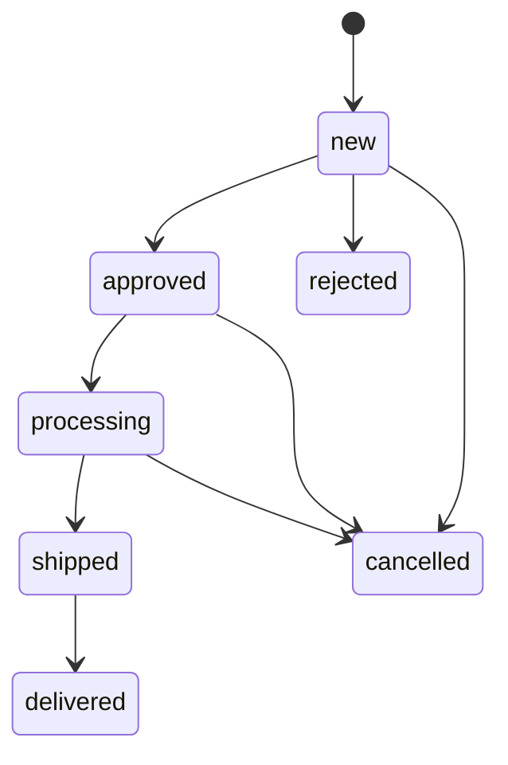
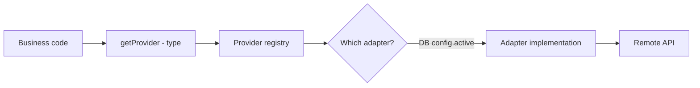
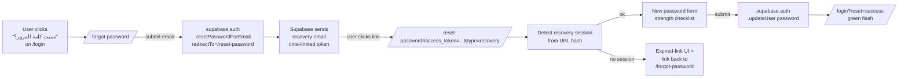

# ClalMobile Admin Panel

The admin panel is the operational cockpit for ClalMobile. It lives at `/admin`, sits behind Supabase Auth, and gives authorised staff full control over the catalogue, orders, customers, content and integrations that power the storefront.

---

## Table of contents

1. [Overview](#1-overview)
2. [Navigation](#2-navigation)
3. [Product management](#3-product-management)
4. [Order management](#4-order-management)
5. [Customer management (360 view)](#5-customer-management-360-view)
6. [Site CMS](#6-site-cms)
7. [Integration hub](#7-integration-hub)
8. [Reports](#8-reports)
9. [Settings and users](#9-settings-and-users)
10. Sales-docs, announcements, corrections, forgot-password ([10a](#10a-sales-docs-management) · [10b](#10b-announcements) · [10c](#10c-correction-requests) · [10d](#10d-forgot-password-flow))
11. [Audit log](#11-audit-log)
12. [File map](#12-file-map)

---

## 1. Overview

### What the admin can do

The admin panel is a single-page Next.js surface (App Router) wrapping **15+ management sub-pages** under `/admin/*`. From it, a staff member can:

- Create, edit and deactivate products (devices and accessories).
- Watch orders come in live, move them through the fulfilment pipeline, create manual orders for phone sales, and export ledgers.
- Browse every customer with a full 360° view (orders, conversations, deals, loyalty, HOT accounts, notes).
- Author and publish CMS content for the storefront — homepage heroes, category pages, footer links, contact info.
- Configure every external integration (WhatsApp, SMS, email, payment gateways, AI, storage, push) through a provider-switching UI.
- Generate monthly and ad-hoc reports (revenue, conversion, product performance, agent performance).
- Manage the team — invite users, assign roles and audit actions.

### Who can access it

Access gating is enforced on two levels:

1. **Route guard** — every `/admin/*` page loads `AdminShell`, which in turn relies on `requireAdmin()` on the server side of every admin API endpoint. An unauthenticated request returns `401`; an authenticated user without the right role returns `403`.
2. **UI hiding** — the nav only renders items the current role can reach. A content editor doesn't see the commissions link.

### Role layers

RBAC is defined in `lib/admin/auth.ts` with a six-tier ladder:

```
super_admin → admin → sales → support → content → viewer
```

The permission matrix lives in DB seed and is mirrored in-memory for fast checks. See the **Settings and users → Roles and permissions matrix** section for the full grid.

---

## 2. Navigation

`AdminShell` (in `components/admin/AdminShell.tsx`) is responsive in two completely different ways:

- **Mobile** — sticky top bar with logo and title, content area, fixed bottom tab bar with icon + label. Tapping a tab navigates and animates the active tint.
- **Desktop** — left sidebar (reversed for RTL, so it renders on the right) with logo, vertical nav list and cross-links to the store and the CRM at the bottom.

The top-level sections, in the order they appear in the nav:

| Icon | Section                    | Route                 | Role(s)                 |
| ---- | -------------------------- | --------------------- | ----------------------- |
| 🧾   | Orders                     | `/admin/orders`       | admin, sales, support   |
| 📊   | Dashboard                  | `/admin`              | all                     |
| 📱   | Products                   | `/admin/products`     | admin, content          |
| 🏷️   | Coupons                    | `/admin/coupons`      | admin                   |
| 🖼️   | Heroes / banners           | `/admin/heroes`       | admin, content          |
| 🔥   | Deals                      | `/admin/deals`        | admin, content          |
| ⭐   | Reviews                    | `/admin/reviews`      | admin, support          |
| 📡   | Line plans                 | `/admin/lines`        | admin                   |
| 🔔   | Push notifications         | `/admin/push`         | admin                   |
| 🤖   | Bot                        | `/admin/bot`          | admin                   |
| 🏠   | Homepage CMS               | `/admin/homepage`     | admin, content          |
| 🌐   | Website CMS                | `/admin/website`      | admin, content          |
| 💰   | Commissions                | `/admin/commissions`  | admin, sales            |
| 🎛️   | Feature flags              | `/admin/features`     | admin                   |
| 📄   | Sales docs                 | `/admin/sales-docs`   | admin, sales            |
| ⚙️   | Settings                   | `/admin/settings`     | admin                   |

Cross-links at the bottom of the sidebar go to `/store` (preview) and `/crm` (inbound + pipeline). Tapping either takes the admin user to a sibling surface that shares the same session.

---

## 3. Product management

`/admin/products` is the densest screen in the admin. It's split across three files for maintainability:

- `ProductTable.tsx` — paginated, sortable table with inline status toggles.
- `ProductFilters.tsx` — brand / type / active filter bar.
- `ProductForm.tsx` — the full create/edit modal (it carries about 30 props because it consolidates many sub-features).

### Create / edit / delete

**Create** — a modal opens with an empty form. Required fields: name (Arabic + Hebrew + English), brand, type (`device` or `accessory`), price, stock. Optional: old price (shows crossed out on the store), cost (for margin calc), description, specs, storage variants, colour variants, gallery.

**Edit** — the same modal prefilled. Changes are diffed on submit so the audit log records only the fields that changed.

**Delete** — soft delete via the `active` flag. A fully deleted product would break order line items that reference it, so removal is done by toggling `active: false` (hidden from the store, still present in historical orders). Hard deletion exists but is guarded for super-admins only.

### Bulk import

A "Bulk Import" button opens a file picker accepting CSV with columns: `name_ar, name_he, brand, type, price, stock, featured`. The browser parses the CSV client-side, validates each row, shows a preview table, then bulk-inserts via `POST /api/admin/products/bulk`. Invalid rows are highlighted and skipped with a per-row error.

### Auto-fill from name (AI)

When a staff member types an English model name (e.g. `iPhone 16 Pro Max`), a provider picker lets them choose:

- **MobileAPI** — fetches specs and images from the MobileAPI catalogue.
- **GSMArena** — scrapes specs from GSMArena.
- **Combined** — runs both and merges, preferring MobileAPI for images and GSMArena for specs.

The chosen provider populates brand, specs, storage options and pulls the primary image into the gallery. Auto-fill also flags potential duplicates — any existing product whose name is ≥ 85% similar shows up in a warning box so the staff can choose to edit rather than create.

### Auto-fill from a photo

Upload a product image, click "Auto-fill from photo", and Claude Vision reads the packaging or device to extract brand, model and colour. Useful for fast intake from supplier deliveries.

### Images and sort order

- **Main image** — drag-dropped or uploaded, stored in Cloudflare R2 (`lib/storage-r2.ts`), served from the CDN.
- **Gallery** — up to 8 extra images, reorderable by drag.
- **Enhancements** — a dropdown lets the staff choose `removebg` (strip background), `optimize` (resize + compress) or `both`. The enhanced result replaces the original; the original is retained in R2 history.
- **Per-colour images** — each colour variant can have a dedicated image. A "fetch all colour images" action queries PaynGo / GSMArena / Pexels for the same model in each declared colour and populates them in one go.

### Variants

- **Storage variants** — e.g. `128GB, 256GB, 512GB`, each with its own price delta. The cart records which variant was chosen and charges the correct price.
- **Colour variants** — hex + bilingual name pair. The product page shows colour swatches; the cart records the colour name with the line item so the fulfilment team knows what to ship.

---

## 4. Order management

`/admin/orders` renders `OrdersManagementPage` (a component shared with `/crm/orders` and `/admin/order` for compact variants).

### List with filters

- **Search** — free text across customer name, phone, city and order ID.
- **Status** — new, approved, processing, shipped, delivered, cancelled, rejected.
- **Source** — store, manual, whatsapp, webchat, facebook, external.
- **Date range** — start / end pickers with quick presets ("today", "this week", "this month").
- **Agent** — filter to orders assigned to a specific staff member.

The table is paginated server-side with URL-reflected filter state so a bookmark preserves the view.

### Status transitions



Business rules enforced by the API:

- Moving to `approved` requires a valid payment status (bank verified or credit card charged).
- Moving to `shipped` requires a tracking ID — if no shipping provider is configured, the staff can enter a manual tracking string.
- `delivered` triggers loyalty point earning and, if the order is a line plan sale, sets up the loyalty-bonus schedule for the sales agent (see `COMMISSIONS.md`).
- `cancelled` and `rejected` are terminal but reversible by super admins with a documented reason.

Every transition is written to `order_history` with a timestamp and the acting user's name. The history is visible as a timeline inside each order detail.

### Manual order creation

"Create order" opens `ManualOrderModal`. It mirrors the store checkout form but with three extras:

- **Customer picker** — search by phone/name/email, one-click select, auto-prefill.
- **Product search** — searchable dropdown with brand + model + price, click to add.
- **Source** — manual (default), phone, whatsapp, other.

On submit, the server runs the same `/api/admin/orders/create` logic the store calls (stock decrement, coupon usage, commission sync) and audits who created it.

### Cancel / refund

- **Cancel** — available from any non-terminal status. Writes to `order_history`, restocks the items (toggleable), notifies the customer.
- **Refund** — for paid orders. Calls the payment provider's refund method. If the gateway refund succeeds, the order moves to `cancelled` and a refund record is written. Partial refunds are supported by specifying the refunded amount.

---

## 5. Customer management (360 view)

### Basic info

`/crm/customers/[id]` (the admin and CRM share this view) is the customer detail page. The header shows name, phone, email, city, address, segment badge and loyalty tier. A segment is one of:

| Key      | Arabic      | Meaning                              |
| -------- | ----------- | ------------------------------------ |
| vip      | VIP         | Top-tier by spend / loyalty         |
| loyal    | مخلص         | Repeat buyer, high retention         |
| active   | نشط          | Recent purchase                      |
| new      | جديد         | First-time, < 30 days                |
| cold     | بارد         | Silent for 60+ days                  |
| lost     | مفقود        | No activity for 180+ days            |
| inactive | غير نشط       | Explicitly paused                    |

Segments are recomputed on order events by a scheduled function.

### Orders

Paginated list of the customer's orders with status, total, date, and click-through to the order detail. Lifetime totals (`total_orders`, `total_spent`, `avg_order_value`) are shown in a stats strip above the list.

### Comms timeline

A chronological feed combining every interaction with the customer: orders, pipeline deals, inbound/outbound conversations, internal notes, HOT account events, and audit actions that targeted the customer. See `lib/crm/customer-timeline.ts` for the entry shape.

Each entry shows an icon, title, description, actor (for notes and audits) and timestamp. Sticky filters at the top let the staff focus on one type of entry at a time.

### HOT accounts

Customers who carry HOT Mobile lines have one or more `hot_accounts` records linking their customer ID to a HOT customer code and line phone number. The 360 view lists them with activation status and source (store, manual, sync). The staff can add a new HOT account inline and it immediately becomes searchable from the customer list.

### Notes

Internal notes (not visible to the customer) are added via a textarea at the bottom of the timeline. They record the author, timestamp and content and also appear in the CRM Inbox contact panel when the customer starts a new conversation.

### Advanced search

The customer list offers two search boxes:

1. **General search** — debounced 300ms, queries name / phone / email / city.
2. **HOT account search** — matches against HOT customer code or HOT line phone, for quickly finding a customer from a HOT dealer reference.

Filter chips at the top let the staff narrow by segment (vip / loyal / …) or source (store / manual / pipeline / whatsapp / webchat).

---

## 6. Site CMS

The storefront content is editable without code changes.

### Pages and sub-pages

`/admin/website` manages the `website_content` table: each row is a `section` key (hero, categories-intro, plans-section, footer-about, etc.) with a `content_ar` and `content_he` JSON blob containing headline, body, image URL and CTA.

The editor renders an Arabic + Hebrew side-by-side form per section with live preview. On save, the storefront ISR cache is invalidated so the change is visible within seconds.

### Categories

`/admin/categories` (embedded) manages the `categories` table. A category has:

- Bilingual name and slug
- Parent category (for two-level hierarchy)
- Icon (emoji or SVG ref)
- Sort order
- Featured flag

Drag-to-reorder sets the sort order in one batch update.

### Navigation

Header nav items and footer links are driven from the same table — the storefront reads them and renders bilingual versions based on the active language.

### Site config

`/admin/settings` holds the single-row `settings` table: site name, tagline, logo, contact phone, contact email, business hours, social links, tax IDs, shipping defaults. All are bilingual where the customer sees them.

---

## 7. Integration hub

ClalMobile is **multi-provider for every external dependency**. The pattern is implemented once in `lib/integrations/hub.ts` and reused across the stack.

### Pattern overview



- **Interfaces** — `PaymentProvider`, `EmailProvider`, `SMSProvider`, `WhatsAppProvider`, `ShippingProvider` define the contract.
- **Adapters** — `RivhitProvider`, `UPayProvider`, `ResendProvider`, `SendGridProvider`, `TwilioSMSProvider`, `YCloudWhatsAppProvider`, etc. implement the interface.
- **Registry** — `providers` is a map from type to the currently registered instance.
- **Initialisation** — `initializeProviders()` reads the `integrations` table (via `getIntegrationConfig(type)`), picks the `active` row per type and registers the matching adapter. It runs once, lazily, on the first `getProvider()` call.

Business code never imports an adapter directly; it calls `getProvider<PaymentProvider>("payment")` and the hub returns whichever one is configured.

### Supported providers

From `INTEGRATION_TYPES` in `lib/constants.ts`:

| Type                 | Providers                   | Icon |
| -------------------- | --------------------------- | ---- |
| WhatsApp             | yCloud                      | 💬   |
| SMS / OTP            | Twilio SMS                  | 📱   |
| Payment — Israel     | Rivhit (iCredit)            | 💳   |
| Payment — PS / world | UPay                        | 💳   |
| Email                | Resend, SendGrid            | 📧   |
| AI (bot + search)    | Anthropic Claude            | 🤖   |
| Storage              | Cloudflare R2               | ☁️   |
| Push notifications   | Web Push (VAPID)            | 🔔   |

The settings UI carries an extended provider list (Tranzila, PayPlus, Stripe, Mailgun, Amazon SES, SMTP, Meta API, Twilio voice, InforUMobile SMS, HubSpot, Salesforce, Google Analytics, Mixpanel) with pre-configured field shapes ready to wire in when adapters are written.

### How to swap providers (admin UI flow)

1. Go to `/admin/settings`.
2. Find the integration card for the type you want to change (e.g. "Email").
3. Click a provider tab — this writes `{ provider: "Resend" }` to `integrations` for that type and clears the old config.
4. Fill in the provider-specific fields. Secret fields are masked (`••••••••`) and stored server-side; the form never round-trips them back to the browser.
5. Click "Test" to verify credentials (the API pings the provider's health endpoint).
6. Click "Save" — if there's any non-empty value the integration is auto-activated (`status = active`).
7. Optional: toggle active/inactive without deleting the config, e.g. to disable outbound email during maintenance.

No code changes or redeploys are needed — the hub lazily re-reads on the next cache miss. The CRM, store and bot all pick up the new provider seamlessly.

### WhatsApp-specific behaviour

- **yCloud** is the current primary provider with template message support.
- **Twilio** can be configured as a fallback (for voice OTP and SMS when WhatsApp is unreachable).
- Webhook URLs differ by provider — the admin screen displays the current webhook URL to paste into the provider's dashboard.

### Email-specific behaviour

- **Resend** is preferred for transactional mail (order confirmations, OTP).
- **SendGrid** is a drop-in fallback with a legacy template library. The hub tries Resend first when both are active.
- **From address** is configured per provider; DKIM/SPF setup is the operator's responsibility and is documented in `docs/OPERATIONS.md`.

### Payment-specific behaviour

- **Rivhit** is used for customers whose city is in the Israeli set.
- **UPay** is used for everyone else (see `STORE.md` → Payment providers for the city-based detection).
- Both adapters implement `createCharge`, `verifyPayment` and `refund`. Business code doesn't branch — `detectPaymentGateway(city)` selects which provider handle to fetch.

---

## 8. Reports

`/admin/analytics` is the primary reports surface. It renders a dashboard with:

### Daily / weekly / monthly

A toggle on top switches the time range. Each range shows:

- **Revenue** — total, with day-over-day and week-over-week deltas.
- **Orders** — count, split by status (new, processing, shipped, delivered, cancelled).
- **AOV** — average order value.
- **Conversion** — unique visitors → cart created → order placed → order paid, with the funnel visualised.
- **Abandoned carts** — count and potential revenue, with a "recover" CTA that sends a WhatsApp reminder.

### Revenue

A time-series chart (bar or line depending on range). Hover shows per-day totals, unit counts and top-selling product.

### Product performance

- Top 10 by revenue, by unit count, by margin.
- Slow movers — active products with zero sales in the selected range.
- Out-of-stock list — active products with `stock <= 0`, flagged for replenishment.

### Agent performance

- Orders handled per agent (manual orders, pipeline conversions).
- Average response time on CRM conversations.
- Commission snapshot — YTD per agent (see `COMMISSIONS.md` for the full commissions reporting surface).

### Exports

Every report has a CSV export button. Exports go through `POST /api/admin/analytics/export` which generates the CSV server-side and streams it to the browser. Large date ranges are chunked to avoid memory pressure.

---

## 9. Settings and users

### Roles and permissions matrix

Implemented in `lib/admin/auth.ts` (in-memory, mirrors the DB seed):

| Permission               | super_admin | admin | sales | support | content | viewer |
| ------------------------ | ----------- | ----- | ----- | ------- | ------- | ------ |
| `admin.view`             | ✅          | ✅    | ✅    | ✅      | ✅      | ✅     |
| `products.view`          | ✅          | ✅    | ✅    | 👁       | ✅      | 👁      |
| `products.create/edit`   | ✅          | ✅    | ❌    | ❌      | ✅      | ❌     |
| `products.delete`        | ✅          | ✅    | ❌    | ❌      | ❌      | ❌     |
| `orders.view`            | ✅          | ✅    | ✅    | ✅      | ❌      | 👁      |
| `orders.create/edit`     | ✅          | ✅    | ✅    | ✅      | ❌      | ❌     |
| `orders.export`          | ✅          | ✅    | ❌    | ❌      | ❌      | ❌     |
| `crm.view`               | ✅          | ✅    | ✅    | ✅      | ❌      | 👁      |
| `crm.create/edit`        | ✅          | ✅    | ✅    | ✅      | ❌      | ❌     |
| `crm.delete`             | ✅          | ✅    | ❌    | ❌      | ❌      | ❌     |
| `crm.export`             | ✅          | ✅    | ❌    | ❌      | ❌      | ❌     |
| `commissions.view`       | ✅          | ✅    | ✅    | ❌      | ❌      | 👁      |
| `commissions.create`     | ✅          | ✅    | ✅    | ❌      | ❌      | ❌     |
| `commissions.edit`       | ✅          | ✅    | ❌    | ❌      | ❌      | ❌     |
| `commissions.manage`     | ✅          | ✅    | ❌    | ❌      | ❌      | ❌     |
| `settings.view`          | ✅          | ✅    | ❌    | ❌      | ❌      | 👁      |
| `settings.edit`          | ✅          | ✅    | ❌    | ❌      | ❌      | ❌     |
| `users.view`             | ✅          | ✅    | ❌    | ❌      | ❌      | ❌     |
| `users.create/edit`      | ✅          | ✅    | ❌    | ❌      | ❌      | ❌     |
| `users.delete`           | ✅          | ✅    | ❌    | ❌      | ❌      | ❌     |
| `store.view/edit`        | ✅          | ✅    | 👁     | ❌      | ✅      | 👁      |
| `reports.view/export`    | ✅          | ✅    | ❌    | ❌      | ❌      | 👁      |

`✅` = full access. `👁` = read-only. `❌` = no access.

The server enforces this matrix on every `requireAdmin()` call; the UI mirrors it so users never see buttons they can't use.

### User management

`/admin/settings` has a "Users" tab (or a dedicated sub-page on mobile) that lets an admin:

- Invite a new user by email — Supabase Auth sends a magic link.
- Assign a role from the six-tier ladder.
- Deactivate a user — preserves their historical audit trail but revokes the session.
- Reset a user's password — triggers a Supabase password reset flow.

### Site-level settings

- **Branding** — site name, logo upload (cached for 24h, invalidation on change via `invalidateLogoCache()`), favicon.
- **Contact** — business phone, business email, WhatsApp line, social links.
- **Business hours** — per-day opening hours shown on the contact page.
- **Tax settings** — VAT percent, tax IDs for invoices.
- **Shipping** — default carrier, free-shipping threshold, delivery ETA copy.

---

## 10a. Sales-docs management

`/admin/sales-docs` is the manager console for every sales document the
system has ever produced — PWA submissions, pipeline auto-created
docs, and manual entries. As of 2026-04-18, it's the cancellation
surface for **direct-registered** commissions (see
`COMMISSIONS.md` — there is no "verify" step any more; PWA submissions
and pipeline auto-registrations go straight into
`synced_to_commissions`).

### List view

- **Filters** — `status` (draft / submitted / verified / rejected /
  synced_to_commissions / cancelled), `employee_id`, `from` / `to` date
  range, `source` (pipeline / pwa / manual / auto_sync), free-text
  `search` across notes, order id, customer id, employee key.
- **Layout** —
  - **Mobile (< 768 px)** — card list, one card per doc.
  - **Desktop** — table with sortable columns.
- **Stats strip** at the top — total docs, synced, cancelled, pending
  (any non-terminal).

### Per-row actions

- **View** — opens a drawer with:
  - Doc header (id, status, sale type, amount, source, created/submitted
    timestamps).
  - Items list (`sales_doc_items` — covered in `docs/COMMISSIONS.md`).
  - Event trail (`sales_doc_events`) — every lifecycle event in
    chronological order.
  - Linked commissions — the `commission_sales` rows this doc produced,
    with their current amounts (live — reflects any month-lock recalc).
- **Cancel** — only shown when the current status is cancellable
  (`synced_to_commissions`, `verified`, or `submitted`).

### Cancel modal

Cancelling opens a modal with:

1. **Reason** — required, minimum 3 characters, stored on the doc and
   echoed into both the event trail and the audit log.
2. **Linked commissions** — the rows that will be soft-deleted.
3. **Month-lock warning** — if any linked commission falls in a locked
   month, a prominent banner warns that cancellation will be rejected
   by the DB trigger. The request still runs — the trigger returns
   `423`, the server rolls the doc back, and the UI surfaces the error.

### What the cancel does

`POST /api/admin/sales-docs/[id]/cancel` — detailed in
`docs/COMMISSIONS.md` §7. Summary:

1. Atomic `UPDATE sales_docs SET status='cancelled' WHERE status IN
   cancellable` — concurrent second cancel returns 409.
2. `cancelCommissionsByDoc(docId)` soft-deletes linked
   `commission_sales` rows (`deleted_at = now()`).
3. Device-month recalc re-runs so the contract-wide milestone stays
   consistent.
4. DB trigger `check_month_lock` rejects any write inside a locked
   month → 423 returned, doc rollback.
5. `sales_doc_events(event_type='cancelled')` and `audit_log(action='cancel')`
   entries are written.

### No verify button

The legacy "verify" flow is gone. Direct registration (decision 1 from
the commission refactor) means agents' submissions land at
`synced_to_commissions` in one atomic transaction. Docs still in
`submitted` or `verified` are historical holdovers; once cancelled
they stay cancelled.

Requires `commissions:manage` permission for cancel; read requires
`commissions:view`.

---

## 10b. Announcements

`/admin/announcements` — broadcast messages from admin to employees (or
to other admins).

### List

Each row shows title, body preview, priority pill (urgent / high /
normal / low), target audience (all / employees / admins),
`expires_at`, and a **read counter** (e.g. `12/25 read`). Read state
lives in `admin_announcement_reads` (a per-user join table); the
counter is computed as `COUNT(reads) / COUNT(target_recipients)`.

### New-announcement modal

- **Title** — short headline.
- **Body** — longer content (plain text; newlines preserved).
- **Priority** — one of `low`, `normal`, `high`, `urgent`. Drives the
  colour in the employee UI (see `docs/PWA.md` §16).
- **Target** — `all`, `employees`, or `admins`.
- **Expires at** (optional) — datetime. Employees stop seeing
  announcements past their expiry.

Posting requires `settings:manage` permission. Employees see the
broadcast at `/sales-pwa/announcements` as soon as it's published (no
push notification today — the unread bell badge is updated on the next
page load).

---

## 10c. Correction requests

`/admin/commissions/corrections` — the admin-side queue for employee
correction requests filed from `/sales-pwa/corrections`. See
`docs/COMMISSIONS.md` §16 for the data model.

### Tabbed queue

- `pending` (default view — unresolved disputes).
- `approved`, `rejected`, `resolved` — historical views, grouped by
  status.
- `all` — everything, for search and filtering.

### Row

Employee name · linked sale id (click-through to the commission row)
· request type (`amount_error`, `wrong_type`, `wrong_date`,
`wrong_customer`, `missing_sale`, `other`) · description excerpt ·
status pill · actions.

### Respond modal

- **Admin response** — required free text, minimum 2 characters.
- **Status choice** — `approved`, `rejected`, or `resolved`.

Submission is an **atomic** `PUT /api/admin/corrections/[id]` with:

```sql
UPDATE commission_correction_requests
   SET status = <new>, admin_response = ..., resolved_at = now(),
       resolved_by = <appUserId>
 WHERE id = <id>
   AND status = 'pending'
```

A second concurrent resolve finds zero rows and the API returns 409.

**Side effects:**

- `audit_log(action='resolve_correction')` entry.
- `correction_resolved` row in the filer's activity log.

Requires `commissions:manage` permission.

---

## 10d. Forgot-password flow

Since 2026-04-18 the `/login` page exposes a **"نسيت كلمة المرور؟"**
link to `/forgot-password`. The flow applies to **every** user of the
Supabase project — admin panel, CRM agents, and Sales PWA employees —
because they all share one Supabase project.

### Pages

- [`app/(auth)/forgot-password/page.tsx`](../app/%28auth%29/forgot-password/page.tsx)
  — enter email, submit, see confirmation. No UI state whatsoever
  reveals whether the email is registered.
- [`app/(auth)/reset-password/page.tsx`](../app/%28auth%29/reset-password/page.tsx)
  — target of the recovery email link.

### Sequence



### Security properties

- **No email enumeration** — `/forgot-password` shows the same success
  message whether the email is registered or not. The server call's
  error is only surfaced to the UI when it's a rate-limit error
  (otherwise the user would be stuck in a silent-lockout state).
- **Rate limit** — handled by Supabase Auth server-side. The client
  detects rate-limit strings in the error and shows an explicit
  "wait a minute and try again" message.
- **Password strength** — mirrors `/change-password`:
  - 8+ characters,
  - at least one uppercase letter (A–Z),
  - at least one number (0–9),
  - confirm field matches.
  The form shows a live checklist and disables submit until all four
  rules pass.
- **Expired / invalid token handling** — on
  mount, `/reset-password` waits for the `PASSWORD_RECOVERY` auth event
  or reads `supabase.auth.getSession()` after a short handshake. If no
  session is installed (expired link, tampered hash), it shows an
  error card with a link back to `/forgot-password` instead of an
  empty form.

### Supabase configuration required

On the Supabase project:

- `site_url = https://www.clalmobile.com` (for the production recovery
  link domain).
- `uri_allow_list` includes a pattern matching `/reset-password` so the
  redirect is accepted. Without it, Supabase rejects the redirect as
  an open-redirect risk.

Both settings live in the Supabase dashboard → Authentication → URL
Configuration. Staging uses its own Supabase project with the staging
domain; the runbook (private) documents the exact values.

### Applies to all user types

Because admin, CRM, and Sales PWA all authenticate through the same
Supabase project, one reset email covers every role. A user who's both
a CRM agent and a Sales PWA employee has a single password — resetting
updates it everywhere.

---

## 11. Audit log

Every write operation in the admin surface writes an entry to `audit_log` via `logAudit()`. An entry carries:

- `user_id`, `user_name` — who did it
- `action` — `create`, `update`, `delete`, `assign`, `convert`, `refund`, etc.
- `module` — `products`, `orders`, `crm`, `commissions`, `settings`
- `entity_type`, `entity_id` — what was touched
- `details` — a JSONB diff of the changed fields
- `created_at`

The audit log is surfaced in several places:

- Per-customer — as "audit" entries in the comms timeline.
- Per-order — as the order history.
- Globally — at `/admin/settings/audit` (filterable by user, module, action, date range).

Only super-admins can purge audit entries, and purging writes its own "purge" event so the deletion itself is auditable.

---

## 12. File map

```
app/admin/
  layout.tsx                    Wraps AdminShell
  page.tsx                      Dashboard
  products/                     CRUD, bulk import, AI auto-fill
    ProductFilters.tsx
    ProductForm.tsx
    ProductTable.tsx
  orders/page.tsx               OrdersManagementPage (shared with CRM)
  order/                        Compact order widgets
  categories/                   Category CRUD
  coupons/                      Coupon CRUD
  heroes/                       Hero banner editor
  deals/                        Flash-sale manager
  reviews/                      Review moderation
  lines/                        Line plan CRUD
  prices/                       Price rules + apply/match flows
  push/                         Push notification composer
  bot/                          Bot script editor
  homepage/                     Homepage section editor
  website/                      Site content CMS
  commissions/                  See COMMISSIONS.md (sub-pages: calculator, history, import, live, sanctions, team, analytics)
  sales-docs/                   Sales doc generator
  features/                     Feature flags
  analytics/                    Reports dashboard
  settings/                     Integrations, users, branding

lib/admin/
  auth.ts                       requireAdmin, hasPermission, logAudit
  hooks.ts                      useAdminSettings and friends
  queries.ts                    Shared admin queries
  actor.ts                      Actor metadata for audits
  ai-tools.ts                   AI helpers for the product form
  gsmarena.ts                   Spec scraping
  mobileapi.ts                  External product data
  validators.ts                 Admin-side input validation

lib/integrations/
  hub.ts                        Provider abstraction
  rivhit.ts                     Rivhit adapter
  upay.ts                       UPay adapter
  resend.ts                     Resend adapter
  sendgrid.ts                   SendGrid adapter
  twilio-sms.ts                 Twilio SMS adapter
  ycloud-wa.ts                  yCloud WhatsApp adapter
  ycloud-templates.ts           Template message helpers
  removebg.ts                   Image background removal

components/admin/
  AdminShell.tsx                Responsive shell + nav
  shared/                       Modal, FormField, Toggle, PageHeader, etc.
  ImageUpload.tsx               Drag/drop with R2 upload

app/api/admin/
  ai-enhance/                   AI-assisted editing
  ai-usage/                     Usage tracking
  analytics/dashboard/          Reports API
  categories/                   Category CRUD API
  commissions/ (16 endpoints)   See COMMISSIONS.md
  coupons/                      Coupon CRUD API
  deals/                        Deal CRUD API
  features/                     Feature flags API
  heroes/                       Hero CRUD API
  image-enhance/                R2 image ops
  integrations/                 Integration config CRUD
  integrations/test/            Provider health-check
  lines/                        Line plan CRUD API
  order/, orders/               Order management API
  prices/                       Price rules API
```

For architectural context (tech stack, DB schema, security layers), see `DOCS.md`. For the storefront these tools manage, see `STORE.md`. For the CRM panel, see `CRM.md`. For commissions, see `COMMISSIONS.md`.
