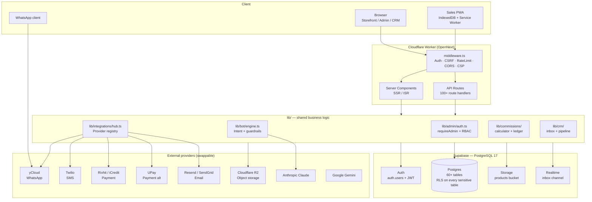

# Architecture

> System architecture, data flow, and design decisions for the ClalMobile stack.

## Table of Contents

- [Products overview](#products-overview)
- [Tech stack layers](#tech-stack-layers)
- [High-level topology](#high-level-topology)
- [Runtime stack](#runtime-stack)
- [Application layout](#application-layout)
- [Data model](#data-model)
- [Integration Hub](#integration-hub)
- [RBAC — roles & permissions](#rbac--roles--permissions)
- [Rendering & caching](#rendering--caching)
- [Bilingual + RTL](#bilingual--rtl)
- [Responsiveness](#responsiveness)
- [Key design decisions](#key-design-decisions)

---

## Products overview

ClalMobile is a single Next.js 15 monolith that serves **six distinct products** out of the same codebase, database, and Cloudflare Worker. Every product shares the same auth layer, RLS-protected Postgres, and Integration Hub — only the URL prefix and the role gate differ.

| # | Product | URL prefix | Audience | Purpose |
|---|---------|------------|----------|---------|
| 1 | **Website** | `/` (+ `/about`, `/faq`, `/legal`, `/contact`) | Public | Marketing surface + brand pages, CMS-managed via `website_content` + `sub_pages` |
| 2 | **Store** | `/store` | Customer (anon / OTP) | E-commerce storefront — catalog, cart, wishlist, compare, checkout, track, account |
| 3 | **Admin** | `/admin` | Staff (super_admin / admin) | Product/order/commission/CMS admin — reads and writes every table |
| 4 | **CRM** | `/crm` | Staff (super_admin / admin / sales) | Unified inbox, customer 360, deal pipeline, tasks, daily reports |
| 5 | **WhatsApp Bot** | `/api/webhook/whatsapp` | WhatsApp users (via yCloud) | Auto-reply engine with intent detection + handoff; logs into `bot_conversations` |
| 6 | **WebChat Widget** | embedded on `/` + `/store` | Anon site visitors | Floating chat bubble that shares the same engine as the WhatsApp Bot |

Additionally, a lightweight **Sales PWA** (`/sales-pwa`) runs as a seventh, internal-only installable app for field agents — offline-capable, syncing `sales_docs` to the backend when connectivity returns.

### Product relationship

```mermaid
graph LR
  Customer[Customer / visitor] --> Website
  Customer --> Storefront
  Storefront --> StoreAPI[Store API<br/>/api/store, /api/orders]
  Website --> CMS[CMS tables<br/>website_content, sub_pages]

  Agent[Field agent] --> SalesPWA[Sales PWA<br/>/sales-pwa]
  SalesPWA --> PWAAPI[PWA API<br/>/api/pwa]
  PWAAPI --> SalesDocs[(sales_docs)]

  Manager[Manager / admin] --> AdminPanel[Admin<br/>/admin]
  Manager --> CRM[CRM<br/>/crm]
  CRM --> Inbox[Unified Inbox<br/>WhatsApp + WebChat]
  CRM --> Pipeline[Deal Pipeline<br/>kanban]
  CRM --> Customers[Customer 360]

  WhatsappUser[WhatsApp user] --> yCloud
  yCloud --> BotWebhook[/api/webhook/whatsapp]
  BotWebhook --> BotEngine[lib/bot/engine]

  Visitor[Anon visitor] --> WebChat[WebChat Widget]
  WebChat --> BotEngine

  BotEngine --> Inbox
  BotEngine --> Claude[Claude API]

  StoreAPI --> Supabase[(Supabase<br/>Postgres + RLS)]
  PWAAPI --> Supabase
  AdminPanel --> Supabase
  CRM --> Supabase
  BotEngine --> Supabase
```

---

## Tech stack layers



---

## High-level topology

```
┌──────────────────────────────────────────────────────────────────────────┐
│                           CUSTOMER BROWSER                                │
│   Storefront · Cart · Compare · Wishlist · Customer account (i18n/RTL)   │
└────────────────────────────────┬─────────────────────────────────────────┘
                                 │ HTTPS
                                 ▼
┌──────────────────────────────────────────────────────────────────────────┐
│                    CLOUDFLARE WORKER (edge, global)                       │
│                    Next.js 15 App Router (via OpenNext)                   │
│                                                                           │
│   ┌──────────────────┐  ┌──────────────┐  ┌───────────────────────────┐  │
│   │ Server Components │  │ API Routes  │  │ Middleware (auth, CSRF,   │  │
│   │  (Storefront,     │  │  /api/*     │  │  rate-limit, CORS, lang)  │  │
│   │   Admin, CRM)     │  │  (100+)     │  │                            │  │
│   └─────────┬────────┘  └──────┬───────┘  └───────────────────────────┘  │
└─────────────┼──────────────────┼──────────────────────────────────────────┘
              │                   │
       Service role             Admin / Anon keys
              │                   │
              ▼                   ▼
┌──────────────────────────────────────────────────────────────────────────┐
│                   SUPABASE (PostgreSQL + Auth + Storage)                  │
│                                                                           │
│   PostgreSQL 17 · RLS on every sensitive table · 42+ migrations          │
│   Auth · Storage (products bucket) · Realtime (inbox)                     │
└────────┬─────────────────────────────────────────────────────────────────┘
         │
         │ Auxiliary services (all via lib/integrations/*)
         ▼
┌──────────────────────────────────────────────────────────────────────────┐
│  yCloud (WhatsApp)    Twilio (SMS)    Rivhit + UPay (payment)            │
│  SendGrid / Resend    Anthropic Claude    Google Gemini    OpenAI        │
│  Cloudflare R2 (storage)    Pexels + RemoveBG (images)                   │
└──────────────────────────────────────────────────────────────────────────┘
```

---

## Runtime stack

| Layer | Choice | Why |
|-------|--------|-----|
| **Edge runtime** | Cloudflare Workers (via OpenNext) | Global low-latency + generous free tier + no cold starts for the app we serve |
| **Framework** | Next.js 15 App Router | Server Components default, file-based routing, built-in image optimization (disabled on CF), middleware |
| **Language** | TypeScript `strict: true` | Non-negotiable — every refactor benefits |
| **Styling** | Tailwind CSS 3.4 + custom theme | Fast authorial iteration, theme tokens map 1:1 to design |
| **State** | Zustand (client) | Simple, no context boilerplate, persist middleware built in |
| **Schema validation** | Zod 4 | Used at every API boundary |
| **Database** | Supabase (Postgres 17 + PostgREST + Auth + Storage) | Single vendor for DB/auth/storage keeps ops simple; RLS gives us per-row auth |
| **Object storage** | Cloudflare R2 (primary) + Supabase Storage (fallback) | R2 is cheaper at scale; fallback ensures uploads work if R2 is unreachable |
| **Charts** | Recharts | Tree-shakeable, React-native components |
| **Testing** | Vitest + Playwright + Stryker + axe-core | See [TESTING.md](./TESTING.md) |

---

## Application layout

```
app/
├── layout.tsx                  # Root — fonts, i18n, PWA manifest, analytics
├── middleware.ts               # Auth, CSRF, rate limit, CORS, security headers
├── page.tsx                    # Landing page (Server Component)
│
├── store/                      # 🛒 Public storefront (anon or customer-auth)
│   ├── page.tsx                #   Product catalog
│   ├── product/[id]/           #   Product detail
│   ├── cart/                   #   Cart (client — Zustand)
│   ├── checkout/               #   Checkout flow (success/failed pages)
│   ├── wishlist/               #   Zustand persist
│   ├── compare/                #   Zustand persist
│   ├── account/                #   Customer profile (after OTP login)
│   └── track/                  #   Order tracking (no login)
│
├── admin/                      # 🔧 Admin (requireAdmin + role gates)
│   ├── page.tsx                #   Dashboard
│   ├── products/               #   Product CRUD
│   ├── orders/                 #   Order pipeline
│   ├── commissions/            #   Sales team commission tracking
│   ├── heroes/                 #   Homepage carousel CMS
│   ├── deals/, reviews/, ...   #   Content management
│   └── settings/, integrations/#   System config
│
├── crm/                        # 📋 Staff CRM (requireAdmin + role)
│   ├── inbox/                  #   Unified WhatsApp + WebChat
│   ├── customers/              #   360° customer view
│   ├── pipeline/               #   Lead → won/lost kanban
│   ├── tasks/                  #   Follow-up tasks
│   └── reports/                #   Daily/weekly reports
│
├── sales-pwa/                  # 📱 Offline-capable PWA for field sales
│
├── (auth)/login/               # 🔐 Admin/staff login (Supabase Auth)
├── change-password/
│
└── api/                        # 🔌 Next.js route handlers (100+)
    ├── admin/*                 #   50+ admin endpoints (role-gated)
    ├── crm/*                   #   20+ CRM endpoints
    ├── store/*                 #   autocomplete, smart-search, order-status
    ├── orders/                 #   POST: public order creation
    ├── customer/*              #   profile, orders, loyalty
    ├── auth/                   #   customer OTP + password change
    ├── payment/                #   create + callback endpoints
    ├── webhook/                #   WhatsApp + Twilio inbound
    ├── cron/                   #   Cloudflare-triggered jobs (gated by CRON_SECRET)
    ├── push/                   #   Web Push subscription + send
    ├── notifications/          #   In-app notifications CRUD
    ├── reports/                #   Daily + weekly report generation
    ├── health/                 #   Monitoring endpoint
    └── csrf/                   #   Token issuance

components/                     # React UI components
├── store/                      #   Storefront pieces
├── admin/                      #   Admin shell + shared widgets
├── crm/inbox/                  #   Unified inbox UI
├── mobile/                     #   Mobile-first variants
├── shared/                     #   Navbar, Footer, LangSwitcher, Logo, PWA prompt
└── ui/                         #   Generic primitives (Toast, Modal, etc.)

lib/                            # Business logic (not routed)
├── admin/                      #   auth, queries, validators, ai-tools
├── bot/                        #   Engine, intents, guardrails, playbook, webchat, whatsapp
├── commissions/                #   Calculator, ledger, sync-orders, crm-bridge
├── crm/                        #   Inbox, pipeline, queries, sentiment, realtime, timeline
├── integrations/               #   Hub + provider implementations
├── pwa/                        #   Sales PWA auth + customer linking
├── store/                      #   Cart, wishlist, compare, queries (Zustand)
├── ai/                         #   Claude, Gemini, OpenAI clients
├── reports/                    #   Report HTML + PDF generation
├── orders/admin.ts             #   Manual order creation
├── webhook-verify.ts           #   Signature verification (HMAC-SHA1/256)
├── csrf.ts / csrf-client.ts    #   Token generation + validation
├── rate-limit.ts / rate-limit-db.ts
├── loyalty.ts                  #   Points, tiers, transactions
├── supabase.ts                 #   Client factories (browser / server / admin)
├── api-response.ts             #   apiSuccess / apiError helpers
└── validators.ts, utils.ts, i18n.tsx, ...

supabase/migrations/            # 42+ sequential .sql migrations
types/database.ts               # Single-source-of-truth for every table shape
tests/                          # Six-layer test suite — see TESTING.md
```

---

## Data model

### Tables by domain (~60)

| Domain | Core tables |
|--------|-------------|
| **Products** | `products`, `product_reviews`, `categories`, `deals`, `heroes`, `line_plans` |
| **Orders** | `orders`, `order_items`, `order_notes`, `order_status_history`, `abandoned_carts` |
| **Customers** | `customers`, `customer_notes`, `customer_hot_accounts`, `customer_otps` |
| **Team & RBAC** | `users`, `permissions`, `role_permissions`, `audit_log` |
| **CRM / Inbox** | `inbox_conversations`, `inbox_messages`, `inbox_labels`, `inbox_notes`, `inbox_templates`, `inbox_quick_replies`, `pipeline_stages`, `pipeline_deals`, `tasks` |
| **Bot** | `bot_conversations`, `bot_messages`, `bot_handoffs`, `bot_policies`, `bot_templates`, `bot_analytics` |
| **Commissions** | `commission_sales`, `commission_targets`, `commission_sanctions`, `commission_sync_log`, `commission_employees`, `employee_commission_profiles` |
| **Engagement** | `push_subscriptions`, `push_notifications`, `notifications`, `loyalty_points`, `loyalty_transactions` |
| **Integrations** | `integrations` (key-value config per provider) |
| **Content** | `sub_pages`, `website_content`, `email_templates`, `settings` |
| **Sales docs (PWA)** | `sales_docs`, `sales_doc_items`, `sales_doc_attachments`, `sales_doc_events`, `sales_doc_sync_queue` |

Every table has a corresponding `Row` / `Insert` / `Update` type in `types/database.ts`. This file is the **single source of truth** — adding a column means updating it here first.

### Bilingual columns

Content tables use `*_ar` / `*_he` suffix pairs (e.g., `products.name_ar`, `products.name_he`). The `getProductName(p, lang)` helper picks the right one and falls back to Arabic.

### RLS

See [SECURITY.md → RLS](./SECURITY.md#row-level-security-rls-on-supabase).

---

## Integration Hub

`lib/integrations/hub.ts` implements a provider registry for 6 categories. Each category has a **TypeScript interface**; each active provider exports a class that satisfies it. The business logic never imports a provider directly — it always calls `getProvider(type)` and talks to the interface.

| Category | Interface | Primary provider | Alternative | Switch signal |
|----------|-----------|------------------|-------------|---------------|
| Payment | `PaymentProvider` | Rivhit (iCredit) | UPay | `integrations.config.provider` or env `RIVHIT_API_KEY` / `UPAY_API_KEY` |
| Email | `EmailProvider` | Resend | SendGrid | `RESEND_API_KEY` preferred; falls back to `SENDGRID_API_KEY` |
| SMS | `SMSProvider` | Twilio | — | `TWILIO_ACCOUNT_SID` or `integrations.sms.config` |
| WhatsApp | `WhatsAppProvider` | yCloud | *(Twilio WA reserved)* | `YCLOUD_API_KEY` or `integrations.whatsapp.config` |
| Shipping | `ShippingProvider` | — | — | *(interface defined, no concrete provider yet)* |
| Storage | *(direct module, not Hub-wrapped)* | Cloudflare R2 | Supabase Storage fallback | `lib/storage.ts` picks based on `R2_*` env |

### Runtime flow

```
API route needs to send an email
    │
    ▼
lib/notifications.ts → getProvider<EmailProvider>("email")
    │
    ▼
hub.ts → ensureInitialized() → initializeProviders() (only once per worker)
    │         │
    │         ├─ Read `integrations` table for "email" row
    │         ├─ If row.status='active' AND row.config.api_key → use that
    │         └─ Else fall back to process.env.RESEND_API_KEY / SENDGRID_API_KEY
    │
    ▼
Dynamic import the matching class (`./resend` → `new ResendProvider()`)
    │
    ▼
Registered in in-memory `providers` map; returned to caller
    │
    ▼
provider.send({ to, subject, html }) — caller never knows which vendor ran it
```

### Why this matters

1. **Hot-swap in the admin UI.** An admin can flip the payment vendor from Rivhit to UPay by editing one `integrations` row — no deploy, no code change.
2. **Cost/latency tuning.** Under load, Resend is faster for transactional email while SendGrid is better for bulk marketing — we can hint the hub per call type.
3. **Testing.** `registerProvider("email", fakeProvider)` in a Vitest setup file swaps the real vendor for a mock.

---

## RBAC — roles & permissions

The in-memory permission map in `lib/admin/auth.ts` mirrors the `permissions` + `role_permissions` seed in migration `20260406000002_rbac_permissions.sql`. Roles are persisted on `users.role` (values constrained by a `CHECK` constraint).

### Role catalog

| Role | Where it's assigned | Can access | Notable restrictions |
|------|---------------------|------------|----------------------|
| **super_admin** | Bootstrap (first user in empty `users` table); can promote others | Everything — wildcard `*` permission | None; only role allowed to `users.manage_roles` |
| **admin** | Promoted by super_admin in `/admin/settings/users` | Full admin + CRM + commissions + reports | Cannot reassign roles of other users |
| **sales** | Assigned to field / in-store sales staff | CRM (`view`, `create`, `edit`), commissions (`view`, `create`), orders (`view`, `create`, `edit`), products (view), store (view), admin (view only) | Cannot delete records, edit settings, or manage users |
| **support** | Assigned to support desk | Configured per deploy (typically CRM-only) | No commissions, no settings |
| **content** | Assigned to content/marketing | Store edit, website CMS, products (view) | No orders, no CRM, no commissions |
| **viewer** | Read-only staff | Every module's `.view` action | No writes anywhere |
| **customer** | Auto-created on first store checkout via OTP | Only `/store` + `/store/account` + `/store/track` | Blocked by `requireAdmin()` from any `/admin` or `/crm` route |
| **guest** | No `users` row — just an IP | `/`, `/store`, FAQ, legal, contact, webchat | Cannot check out without providing phone + address |

> `customer` and `guest` are not rows in `role_permissions` — they are excluded from the staff permission system and gated at the route level.

### Permission model (simplified)

```
users.role  →  role_permissions  →  permissions (module.action pairs)

Example chain:
  users.role = 'sales'
     └─► role_permissions rows for role='sales'
            └─► permission "commissions.create" is in the set
                  ⇒ /api/admin/commissions/sales/POST succeeds
```

All admin API routes wrap their handler in `withPermission(module, action, ...)`. The wrapper:

1. Calls `requireAdmin(req)` — 401 if no session, 403 if `users.status != 'active'` or role is blocked (`customer`, `viewer`).
2. Looks up the in-memory `ROLE_PERMISSIONS` map — 403 if missing.
3. Passes a typed `{ user, db }` context to the handler.

Bootstrapping note: if the `users` table is empty, the first authenticated Supabase user is auto-inserted as `super_admin` so the system is never left without an operator.

---

## Rendering & caching

| Page pattern | Rendering | Cache |
|--------------|-----------|-------|
| `app/page.tsx` (home) | Server Component | ISR — `revalidate: 3600` |
| `app/store/page.tsx` | Server Component | ISR — `revalidate: 3600` |
| `app/store/product/[id]` | Server Component | Dynamic — revalidated on product mutation |
| `app/admin/**`, `app/crm/**` | Client (most) with `"use client"` | No cache — auth-gated |
| `app/api/**` | Node route handler | Varies (most dynamic) |

Cloudflare Workers handles edge caching of static assets; dynamic routes hit the Worker directly.

---

## Bilingual + RTL

- `lib/i18n.tsx` provides `<LangProvider>` + `useLang()` hook returning `{ lang, setLang, t, dir: "rtl", fontClass }`
- Language preference persists to `localStorage` under `clal_lang`
- Arabic is the default; Hebrew is the secondary switch
- All JSX trees use `dir="rtl"` on the root; Tailwind's logical properties (`ms-*`, `me-*`, `ps-*`, `pe-*`) are preferred over physical (`ml-*`, `pr-*`)
- `ar.json` and `he.json` keys are kept in sync by a test in `tests/i18n/translations.test.ts`

---

## Responsiveness

Every page renders on **mobile, tablet, and desktop**. The `useScreen()` hook (in `lib/hooks.ts`) returns `{ mobile, tablet, desktop, width }` and is the canonical way to branch layout — no raw media queries in components.

Patterns:
- Admin/CRM: sidebar on desktop, bottom-tab nav on mobile (e.g., `components/admin/AdminShell.tsx`)
- Storefront: grid density shifts (4 cols desktop → 2 cols mobile)
- Inbox: 3-pane on desktop (list + chat + contact panel), single pane with navigation on mobile (`app/m/inbox/`)

---

## Key design decisions

### Why one monolithic Next.js repo, not six separate services?

Each "product" (Website / Store / Admin / CRM / Bot / WebChat) shares ~80% of its code: the same `lib/` utilities, the same `types/database.ts`, the same auth layer, the same RLS rules, the same build pipeline. Splitting would mean duplicating all of that, plus adding an internal API contract we'd have to keep in sync. A single App Router tree lets us cross-reference types, rely on the same middleware, and ship every product from one deploy — with a route-level gate (`requireAdmin` / `requireEmployee` / anon) picking the audience at request time.

### Why OpenNext on Cloudflare Workers, not Vercel?

Cost at scale + global edge for Israeli traffic routing. OpenNext adapter is mature enough to run Next.js 15 App Router seamlessly, including server components, server actions, edge middleware, and ISR — the only concession is `images.unoptimized: true` (Cloudflare Workers can't ship `sharp`).

### Why Zustand, not Redux/Jotai/Context?

Three stores total (`cart`, `wishlist`, `compare`) — Redux is overkill, context adds prop-drilling. Zustand's `persist` middleware ships localStorage out of the box.

### Why `service_role` from API routes, not anon JWT + RLS-scoped queries?

Two reasons:

1. **RLS is a safety net, not the primary gate.** Our primary gate is `requireAdmin()` / `requireEmployee()` in `lib/admin/auth.ts` — those functions resolve the Supabase session, look up `users.role`, and reject on wrong role or suspended status before a query is ever run. RLS policies then add a defense-in-depth layer.
2. **Some flows require cross-row writes.** Creating an order touches `orders`, `order_items`, `customers` (upsert), `coupons` (increment), `products` (stock decrement), `audit_log`, and `commission_sales` — all in one transaction via the `create_order_atomic()` RPC. An anon or customer JWT can't legally touch most of those tables, and `SECURITY DEFINER` RPCs would still need elevated grants. Using `service_role` from the API route is the simplest correct design.

Anon client code does exist (`lib/supabase.ts → createServerSupabase()`) for read-only public queries that go through PostgREST with the `public_read` policies.

### Why no client-side Supabase SDK for writes?

Every write path in the app goes through a Next.js route handler that calls `createAdminSupabase()` (service_role) after auth. We deliberately avoid `createBrowserSupabase()` for writes because:

- The browser client would need the anon key and rely purely on RLS policies for authorization. One buggy policy and a user could exfiltrate any row that passes `auth.uid() IS NOT NULL`.
- CSRF, rate-limiting, audit logging, and server-side schema validation (Zod) all happen in the API route layer. Bypassing that for "direct writes" removes half our safety mechanisms.
- We still use `createBrowserSupabase()` for realtime subscriptions on the CRM inbox (read-only channel).

### Why RLS `FORCE` on only 2 tables instead of all?

`FORCE` applies even to `BYPASSRLS` roles, which breaks Postgres's internal FK validation on tables that are FK targets (when the FK check needs to SELECT the referenced row). We keep `FORCE` on `sub_pages` and `audit_log` (no FK-inbound writes) and rely on standard `ENABLE RLS` + service-role-only policies elsewhere. See migration `20260418000002_harden_rls_followup.sql` for the full reasoning.

### Why mock Supabase in CI instead of using Supabase CLI locally?

CLI requires Docker and 2 min of bootstrap per test run. A 100-line mock HTTP server (`tests/ci/mock-supabase.mjs`) answers enough of the PostgREST shape that Server Components render empty-state UI. Real Supabase behavior is tested in Layer 3 (staging) where it matters.

### Why `sb_secret_` keys, not JWT `service_role`?

Supabase's newer key format; simpler to rotate and doesn't require decoding. The `@supabase/supabase-js@2.100+` client handles both.

### Why self-host the status page on GitHub Pages?

Zero cost, zero maintenance, strong uptime independence from the thing being monitored (i.e., Cloudflare could go down while GitHub Pages remains up, and vice versa). The status page pulls `status.json` + `history.json` committed by the `publish-status.yml` workflow.

---

## Reference diagrams

### Request flow — product detail page

```
Browser GET /store/product/abc123
   │
   ▼
Cloudflare Worker (edge)
   │  middleware.ts: attach lang cookie, rate limit, CSRF (read-only → skip)
   ▼
app/store/product/[id]/page.tsx (Server Component)
   │  uses getProduct(id) via createServerSupabase() (anon key)
   ▼
Supabase PostgREST → RLS: products.active = true public-read policy → data
   ▼
Server Component returns HTML with ProductDetail component
   │
   ▼
Browser hydrates client portions (add-to-cart button, gallery)
```

### Request flow — checkout

```
Browser POST /api/orders
  body: { items, shipping, customer }
   │
   ▼
Cloudflare Worker
   │  middleware.ts: CSRF check on x-csrf-token header
   │  rate limit: 60 req/min/IP
   ▼
app/api/orders/route.ts
   │  validate with Zod
   │  createAdminSupabase() (service role) → insert into `orders`, `order_items`
   │  trigger commission sync via syncCommissionForOrder()
   ▼
Return order id + payment redirect URL
   │
   ▼
Browser redirects to Rivhit / UPay
   │
   ▼
Provider callback → app/api/payment/callback/route.ts
   │  verify HMAC signature
   │  update order status
   │  send WhatsApp order-confirmation
   ▼
Customer sees /store/checkout/success
```

### Request flow — WhatsApp inbound message

```
Customer → yCloud
   │
   ▼
yCloud POST /api/webhook/whatsapp (signed)
   │
   ▼
app/api/webhook/whatsapp/route.ts
   │  verify HMAC-SHA256 signature
   │  parse incoming message
   ▼
lib/bot/engine.ts → processMessage()
   │  detect intent, apply guardrails
   │  if handoff: write to inbox_conversations
   │  else: generate bot reply via Claude
   ▼
Reply sent via yCloud
   │
   ▼
inbox_messages row inserted (+ realtime event to CRM tab)
```
