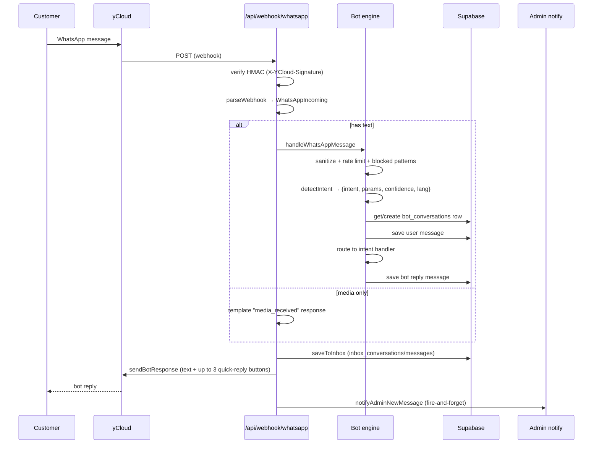
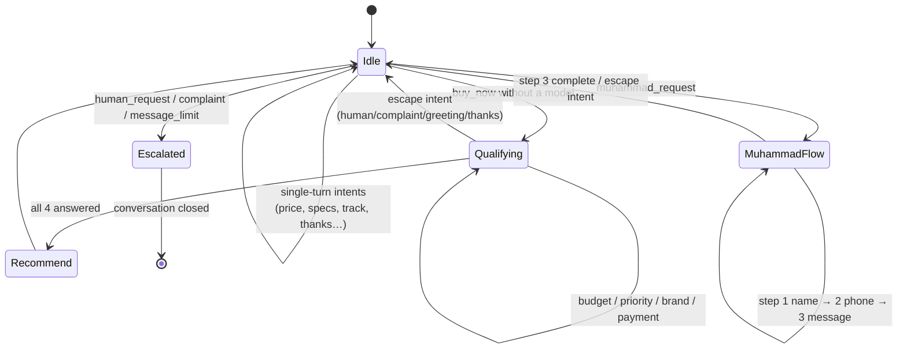

# WhatsApp Bot & WebChat

Public reference for the ClalMobile bot — the first-line conversational
surface customers hit on WhatsApp and the embedded WebChat widget.
Handles greetings, product search, order lookup, basic policy questions,
and escalation to human agents.

Source: [`lib/bot/`](../lib/bot/),
[`app/api/webhook/whatsapp/route.ts`](../app/api/webhook/whatsapp/route.ts),
[`lib/crm/inbox.ts`](../lib/crm/inbox.ts).

---

## 1. Overview

Two transports share a single bot engine:

| Channel | Transport | Entry point |
|---------|-----------|-------------|
| **WhatsApp** | yCloud (HOT-approved WhatsApp Business) | `POST /api/webhook/whatsapp` |
| **WebChat** | JSON over HTTPS (polling from the in-page widget) | `POST /api/webchat` |

Both land in `processMessage(visitorId, message, channel, opts)` in
`lib/bot/engine.ts`. The engine owns:

- Intent detection (keyword + pattern based).
- Session/qualification state (in-memory cache + `bot_conversations` as
  source of truth).
- Per-intent handlers (greeting, buy_now, order_tracking, etc.).
- Rate limiting and blocked-pattern guardrails.
- Escalation / handoff to the CRM inbox.
- Optional AI fallback via Claude (when keyword confidence is low).

Every conversation is persisted in the `bot_*` tables and mirrored into
the customer-facing `inbox_conversations` / `inbox_messages` so human
agents can read the full thread and take over when escalation fires.

### What it handles today

- **Greetings** — returning-customer greeting with name, variation for
  repeat hellos.
- **Product browsing** — brand / model keyword match against the product
  catalogue, surfaces top 3 items with deep links to the store.
- **Price & specs inquiry** — same catalogue, focused on price or
  specs.
- **Comparisons** — two-model or two-brand comparison cards.
- **Installments** — the 1-18-payment bank-transfer explainer, seeded
  from the last discussed product when possible.
- **Order tracking** — by order id (matches `CLM-\d{4,6}`) or by the
  caller's phone number.
- **Line plans** — HOT Mobile packages listing.
- **Policy** — shipping / warranty / return.
- **Contact info** — website + contact form + working hours.
- **Complaint / anger escalation** — keyword and punctuation triggers
  (see §3) route straight to a human.
- **Explicit human request** — "كلم موظف" / "נציג" / "agent" → handoff.
- **Muhammad request** — named-person escalation (three-step data
  collection, notifies the admin).
- **Thanks + CSAT** — asks "did I help?" with 👍 / 👎.

---

## 2. Inbound flow (WhatsApp)



### Webhook verification

Two-layer check in `POST /api/webhook/whatsapp`:

1. **GET verification** — yCloud sends a `GET` with a `token` query param
   at configuration time; handler compares to `WEBHOOK_VERIFY_TOKEN` and
   echoes the `challenge` if valid, otherwise 403.
2. **HMAC on every POST** — when `WEBHOOK_SECRET` is set, the handler
   requires `X-YCloud-Signature` (or `X-Hub-Signature-256`) and verifies
   the raw body against the secret using
   `lib/webhook-verify.verifyWebhookSignature`. Missing or invalid
   signature → 401.

### Message parsing

`parseWebhook(body)` pulls the yCloud `whatsappInboundMessage` shape and
normalises it into a `WhatsAppIncoming` object covering: text, button,
interactive-reply, image, document, audio, video. Media-only messages
(no caption) get a canned `media_received` template reply instead of
going through intent detection.

### Inbox mirror (always runs, before reply)

Every inbound message — plus the bot reply — is written to
`inbox_conversations` / `inbox_messages` **before** the reply is sent via
yCloud. This guarantees no customer message is ever lost to a
downstream send failure, and human agents can always see the full
thread in the CRM Inbox.

Existing conversations are matched by normalised phone (`+XXXX`,
`XXXX`, raw form — same dedup approach used in `PWA.md` §8). If no
conversation exists, a new one is inserted with `status = 'bot'`.

### Sending the reply

`sendBotResponse(phone, response)`:

- If `response.quickReplies` has entries → send as yCloud interactive
  buttons (up to 3; `type: 'button'`). Titles are capped at 20 chars
  (WhatsApp limit).
- If buttons fail (e.g. session-window issue) → fall back to plain
  `sendWhatsAppText`.

### Admin notification

Fire-and-forget `notifyAdminNewMessage` is called after the inbox write
— used for "new conversation" alerts (admin's phone set in
`lib/bot/admin-notify.ts`). Failure is swallowed so admin-notify outages
never block customer replies.

---

## 3. Bot engine

Source: [`lib/bot/engine.ts`](../lib/bot/engine.ts).

The engine is a sequenced pipeline:

1. **Sanitize** (`sanitizeInput`) — strip HTML, control chars; cap at
   1000 chars.
2. **Rate limit** (`checkRateLimit`) — see §5.
3. **Blocked patterns** (`checkBlockedPatterns`) — see §5.
4. **Intent detection** (`detectIntent`) — see below.
5. **Session fetch / create** — `bot_conversations` scoped to
   `(visitor_id, channel)`, 24h TTL.
6. **Sentiment check** — if `analyzeSentiment(text) === 'angry'`, notify
   admin and force the intent to `complaint`.
7. **Escalation threshold** — after `ESCALATION_THRESHOLD = 15`
   messages without resolution, auto-escalate.
8. **Multi-step flow capture** — if the session is currently inside a
   "Muhammad request" three-step collection or an active qualification
   loop, route to that flow first (with escape hatches for anger and
   explicit intents).
9. **Intent router** (`routeIntent`) — dispatches to the per-intent
   handler.
10. **Save bot reply** (`saveMessage`) + persist session state.

### Supported intents

Declared in [`lib/bot/intents.ts`](../lib/bot/intents.ts):

| Intent | Trigger (simplified) |
|--------|----------------------|
| `greeting` | `مرحبا`, `שלום`, `hi`, `صباح`, `مساء`, `hello`, `שלום`, … |
| `buy_now` | Brand / model keyword (`iphone 17`, `galaxy s25 ultra`, …) or verbs like `بدي / أريد / לקנות / buy` |
| `price_inquiry` | `سعر / מחיר / price / how much` (often with a brand) |
| `compare` | `فرق / مقارنة / vs / versus / השוואה` between 2 models or brands |
| `installment_info` | `قسط / תשלומים / installment` |
| `specs_inquiry` | `كاميرا / بطارية / שכנוע / ram / specs` |
| `availability` | `متوفر / במלאי / available / in stock` |
| `shipping_info` | `توصيل / شحن / משלוח / delivery / shipping` |
| `warranty_return` | `ضمان / ارجاع / אחריות / warranty / return` |
| `order_tracking` | `CLM-XXXXX` pattern or `طلبي / הזמנה / track / order` |
| `line_plans` | `باقة / خط / hot mobile / חבילה / קו` |
| `contact_info` | `عنوان / כתובת / ساعات عمل / شغل / מתי פתוח / how to reach` |
| `complaint` | `شكوى / مشكلة / غلط / تلונה / scam`; also `!!!`/`؟؟؟` or 3+ exclamation marks |
| `human_request` | `موظف / בשר / נציג / agent / human / بدي احكي` |
| `muhammad_request` | `محمد / מוחמד` + intent verb (ask-for-person flow) |
| `thanks` | `شكرا / תודה / thanks` |
| `csat_response` | `👍`, `👎`, `نعم`, `لا`, `כן` as a single-message response |
| `unknown` | Everything else |

### Language detection

`detectLanguage(text)`:

- Hebrew unicode range → `he`
- Arabic unicode range → `ar`
- Plain Latin → `en`
- Default: `ar`

The bot replies in the detected language on every turn. Templates and
per-intent responses have `ar` / `he` variants.

### State machine

Conceptually linear with two multi-step flows:



### Session persistence

The in-memory `sessionCache` is a per-instance fast path. Source of
truth is `bot_conversations`:

- `conversation_id` (uuid), `visitor_id`, `channel`, `language`
- `qualification` JSONB — also carries `_muhammadStep`, `_muhammadData`,
  `_greetingCount`
- `message_count`, `products_discussed[]`, `customer_phone`,
  `customer_name`, `customer_id`, `csat_score`

TTL: a conversation is considered active if `updated_at` is within the
last 24h. After 24h, the next inbound message starts a fresh session.

### Response templates

Defined in [`lib/bot/templates.ts`](../lib/bot/templates.ts) with
fallbacks hard-coded and overrides loaded from the `bot_templates` table
(cached 5 min). Every template has `ar` + `he` variants; variables use
`{placeholder}` syntax.

Keys include: `welcome`, `welcome_returning`, `handoff`, `upsell`,
`not_available`, `csat`, `goodbye`, `out_of_hours`, `rate_limited`,
`unknown`, `media_received`.

### AI fallback

When keyword confidence is low (`detected.confidence < 0.5` and intent
isn't `unknown`), or the intent is `unknown`, the engine calls
`getAIResponse` (see [`lib/bot/ai.ts`](../lib/bot/ai.ts)) which:

1. Loads the last 8 messages from `bot_messages`.
2. Looks up product context via RAG (by message content) or by the last
   discussed `product_ids`.
3. Builds a paraphrased store-knowledge system prompt (payment methods,
   shipping, warranty, no-cash policy). The prompt is paraphrased here
   on purpose — do not copy it verbatim.
4. Calls Claude via `lib/ai/claude.ts` (`callClaude`) and tracks usage.
5. Returns `{ text, quickReplies }` or `null` on failure (fall back to
   the template-driven handler).

---

## 4. Safety rails (guardrails)

Source: [`lib/bot/guardrails.ts`](../lib/bot/guardrails.ts).

### Rate limiting

In-memory counters (per-instance; acceptable because the bot is
best-effort and multi-instance dilution is harmless):

| Limit | Value |
|-------|-------|
| Per-minute | `MAX_MESSAGES_PER_MINUTE = 10` |
| Per-session | `MAX_MESSAGES_PER_SESSION = 100` |
| Escalation threshold | `ESCALATION_THRESHOLD = 15` messages without resolution |

When a `visitor_id` exceeds the per-minute cap, the next message returns
the `rate_limited` template. Exceeding the per-session cap behaves
similarly.

### Escalation threshold

`shouldEscalate(messageCount)` returns true once the session has 15+
messages. The engine then runs `handleEscalation(session, 'message_limit', lang)`
which:

- Creates a `bot_handoffs` row.
- Flips the conversation status to `escalated`.
- Creates a follow-up `tasks` row (high priority if reason is
  `complaint`).
- Optionally creates a `pipeline_deals` lead if products were discussed.
- Notifies admin + team (see §6).
- Replies with the empathetic "I'll escalate to a human" template.

### Blocked patterns

Regex list with categorised responses:

| Category | Trigger |
|----------|---------|
| `wholesale_price` | Queries about wholesale/cost pricing |
| `profit_margin` | Queries about margin / profit |
| `admin_access` | `admin / password / كلمة سر / סיסמה` |
| `other_customer_data` | Attempts to fish for other customers' data |
| `injection` | HTML/JS injection patterns (`<script`, `eval(`) |
| `sql_injection` | `UNION SELECT`, `DROP TABLE`, etc. |

Each category has an `ar` / `he` / `en` canned response (e.g. "prices on
the site are final including tax", "that's internal info", "I don't
have access to that"). Blocked messages are **not** routed to intent
detection or AI.

### Input sanitization

`sanitizeInput` strips HTML tags and control chars and caps at 1000
chars before anything else sees the string.

### PII masking helpers

`maskPhone`, `maskIdNumber` — used when logging or previewing, never on
send.

### Business hours

`isWithinWorkingHours()` checks Israel timezone (Asia/Jerusalem) against
Sunday–Thursday 09:00–18:00. Today it's exposed as a helper and used by
out-of-hours templates (`out_of_hours`), not as a hard gate — the bot
still replies 24/7 but flags off-hours in the wording. Full "queue
messages until office hours" behaviour is not yet wired.

---

## 5. Human handoff

When any of these fire:

- Intent = `human_request`, `complaint`, or `muhammad_request`
- Sentiment = `angry` (and not already complaint/human/muhammad)
- Message count >= escalation threshold

`handleEscalation(session, reason, lang)` calls
`createHandoff(req)` in [`lib/bot/handoff.ts`](../lib/bot/handoff.ts):

1. **`bot_handoffs` row inserted** with `reason`, `summary`,
   `products_interested`, `last_price_quoted`, `status = 'pending'`.
2. **`bot_conversations.status`** updated to `escalated`.
3. **Task created** in `tasks` if a `customer_id` is known — due in 24h,
   `priority: 'high'` when reason is `complaint`.
4. **Pipeline deal inserted** (stage = `lead`) if products were
   discussed — gives sales a trackable follow-up.
5. **Admin + team notified** via WhatsApp (from the report phone, not
   the bot phone — see [`lib/bot/admin-notify.ts`](../lib/bot/admin-notify.ts)).
6. **Inbox conversation flagged** `status = 'waiting'`, `priority = 'high'`
   on a complaint so agents see it at the top of the inbox.
7. **CSAT lockout** — `session.csatAsked = true` prevents CSAT prompts
   after escalation.

### What happens to bot replies after handoff

Once a conversation is `escalated`, the human agent takes over via the
CRM Inbox. The bot continues to log inbound messages into the inbox
(via the `saveToInbox` step in the webhook handler) but the engine
won't try to answer escalated conversations:
`bot_conversations.status = 'escalated'` filters it out of the 24h
"active" TTL query, so a fresh session will be created only if the
agent closes the handoff and the customer writes after the 24h window.

Practically, this means: **once handed off, the bot falls silent for
that conversation.**

### Named handoff (Muhammad)

Customer says "I want to talk to Muhammad" (or similar). Engine enters
a three-step flow:

1. Ask for full name.
2. Ask for phone number.
3. Ask for message / summary.

All three answers go into a `notifyAdminMuhammadHandoff` call that
pings Muhammad directly (via admin-notify). The conversation state is
preserved across retries; if the customer gets angry mid-flow or
explicitly asks for a different intent, the engine escapes the Muhammad
flow and routes to complaint/normal handling.

---

## 6. WebChat

Source: [`lib/bot/webchat.ts`](../lib/bot/webchat.ts).

Identical engine, different transport.

### Entry

`handleWebChatMessage(message, sessionId, opts)` wraps `processMessage`
with `visitorId = 'web_' + sessionId` and `channel = 'webchat'`. Called
from the WebChat API route.

### Transport

Client polls / fetches `POST /api/webchat` with the user's message and
the session id. Response shape:

```ts
{
  text: string;
  quickReplies: string[];
  escalate: boolean;
  conversationId?: string;
}
```

No WebSocket. Today the widget uses request/response fetches; Realtime
Supabase channels are used only in the CRM Inbox (see `lib/crm/realtime.ts`)
for agent-side live updates, not for the customer widget.

### Welcome

`getWelcomeMessage(lang)` returns the initial bot turn shown to the
customer when the widget first opens. Arabic and Hebrew variants ship
out of the box.

---

## 7. Outbound messages

Two modes, dictated by WhatsApp's session-window rules.

### Inside the 24-hour customer session window

Free-text replies work. The engine sends:

- Plain text via `sendWhatsAppText`.
- Interactive buttons (up to 3 quick replies) via `sendWhatsAppButtons`.
- Images via `sendWhatsAppImage`.
- Documents via `sendWhatsAppDocument`.

### Outside the 24-hour window

Only **HOT-approved WhatsApp templates** can be sent. Examples:

- Order status updates.
- New-order confirmation.
- Handoff notifications to the admin.

Send path: `sendWhatsAppTemplate(to, templateName, params[])` — yCloud
uses the Arabic (`"language": { "code": "ar" }`) template by default.

Template keys live in the yCloud console; the registry of what's
approved is mirrored in [`lib/integrations/ycloud-templates.ts`](../lib/integrations/ycloud-templates.ts).

### Admin notifications vs customer replies

- **Customer replies** are sent from the **bot phone** (via
  `sendWhatsAppText` in `whatsapp.ts`).
- **Admin / team alerts** are sent from the **report phone** via
  `lib/bot/admin-notify.ts` → `notifyAdmin`, `notifyTeam`,
  `notifyAdminMuhammadHandoff`, `notifyAdminAngryCustomer`,
  `notifyAdminNewMessage`.

The separation prevents customer-facing conversations from being
polluted by internal notifications and keeps admin numbers off the bot
number's 24h session clock.

---

## 8. Provider abstraction (Integration Hub)

Source: [`lib/integrations/hub.ts`](../lib/integrations/hub.ts).

Each integration type has a config row in the `integrations` table with
a `config` JSONB and a `status`. `getIntegrationConfig('whatsapp')`
returns the active config, merged with env-var fallbacks.

### WhatsApp providers

| Provider | Status | Source |
|----------|--------|--------|
| **yCloud** | Primary — used in production | `lib/integrations/ycloud-wa.ts`, `lib/bot/whatsapp.ts` |
| **Twilio WhatsApp** | Supported fallback / alt tenant | `lib/integrations/twilio-sms.ts` |

Switching providers is a config change (swap the `integrations` row and
restart), not a code change. The bot engine is provider-agnostic — it
deals in `WhatsAppIncoming` / `BotResponse` objects; the transport
shim translates.

### Other integrations

The hub covers SMS, email, payments, image services, and more (Resend,
SendGrid, Rivhit, UPay, removebg). They share the same "config in DB,
fallback in env" pattern.

---

## 9. File & route reference

| Path | Role |
|------|------|
| `lib/bot/engine.ts` | `processMessage`, intent router, all intent handlers, session state. |
| `lib/bot/intents.ts` | `detectIntent` (keyword + pattern), language detection, brand / model regex tables. |
| `lib/bot/templates.ts` | Template loader with DB override + 5-min cache. |
| `lib/bot/policies.ts` | Policy content loader (`warranty`, `return`, `shipping`, `installments`, `privacy`). |
| `lib/bot/playbook.ts` | Product search / comparison / recommendation helpers used by the handlers. |
| `lib/bot/guardrails.ts` | Rate limit, blocked patterns, PII masking, working hours. |
| `lib/bot/ai.ts` | Claude-backed contextual fallback. |
| `lib/bot/handoff.ts` | `createHandoff`, conversation-summary generation, pending-handoff helpers. |
| `lib/bot/admin-notify.ts` | Admin / Muhammad / angry-customer notifications via the report phone. |
| `lib/bot/whatsapp.ts` | yCloud transport (send / parse webhook). |
| `lib/bot/webchat.ts` | WebChat transport. |
| `lib/bot/analytics.ts` | `saveMessage`, `getOrCreateConversation`, `trackAnalytics`, `saveCsatScore`. |
| `lib/bot/notifications.ts` | Push / outbound templated notifications (order status, etc.). |
| `lib/crm/inbox.ts` / `lib/crm/inbox-types.ts` | CRM Inbox data-access layer the bot's outputs feed into. |
| `lib/crm/realtime.ts` | Agent-side Realtime subscription (not used by the customer widget). |
| `lib/crm/sentiment.ts` | `analyzeSentiment(text)` — anger detection. |
| `app/api/webhook/whatsapp/route.ts` | GET verify + POST webhook. |
| `app/api/webchat/route.ts` | WebChat message handler. |
| `lib/integrations/hub.ts` | Provider-neutral config loader. |
| `lib/integrations/ycloud-wa.ts` | yCloud-specific send helpers. |
| `lib/integrations/ycloud-templates.ts` | HOT-approved template registry. |
| `lib/integrations/twilio-sms.ts` | Twilio fallback / alt tenant. |

---

## 10. Related docs

- `docs/COMMISSIONS.md` — handoffs that lead to won pipeline deals flow
  into the commission system through §5.1.
- `docs/PWA.md` — the agent-facing sales documentation app. Distinct
  surface; no direct bot ties.
