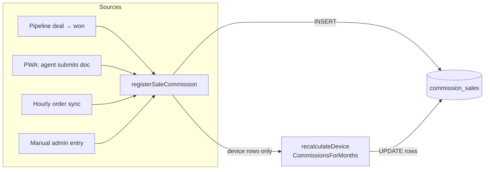
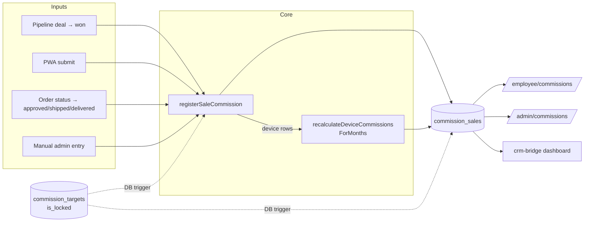

# Commission System

Public reference for the ClalMobile commission module. Describes concepts,
data flow, and operational surfaces. **All numeric rates, thresholds, and
bonuses in this document are placeholders.** The real figures live in the
private operator runbook (`docs/private/COMMISSION_RATES.md`).

---

> ## Direct registration — 2026-04-18
>
> As of 2026-04-18, **agent submissions fire commission registration
> immediately — there is no manager approval queue.** When a field agent
> submits a `sales_doc` from the PWA, the status transitions atomically
> to `synced_to_commissions` and `registerSaleCommission` runs in the
> same request. Same for pipeline: the moment a CRM deal enters an
> `is_won = true` stage, a `sales_doc` is auto-created and the commission
> is written.
>
> Managers still have full control **after the fact** — the cancel flow
> (§7) soft-deletes the commission row, re-runs device milestone
> allocation, and writes both an `audit_log` entry and a
> `sales_doc_events` row. The month-lock trigger (§8) blocks cancellation
> inside a locked month.
>
> See also: `docs/PWA.md` for the agent-side flow, `docs/ADMIN.md` for
> the cancel / announcements / corrections admin surfaces.

---

## 1. Overview

ClalMobile sells HOT Mobile lines, devices (phones + accessories), and mixed
packages through a mix of direct web orders, phone agents, and field sales.
Commission is paid to **the employee who closed the sale** under two parallel
schemes:

- **Contract commission** — what the marketing contract pays ClalMobile as a
  reseller. It acts as the revenue floor and a reference for profitability.
- **Employee commission** — what the individual agent earns, which can
  differ per employee based on a per-profile rate stored in
  `employee_commission_profiles`.

The system tracks line and device sales separately, computes monthly
aggregates with milestone bonuses and loyalty payouts, applies sanctions
(deductions), and locks finalised months so payroll snapshots don't drift.

### Who uses it

| Audience | What they do | Surface |
|----------|--------------|---------|
| **Sales agents** | Document sales, view their own monthly data, track progress to target | Sales PWA + `/employee/commissions` |
| **Field agents (PWA)** | Capture sales in person with attachments | `/sales-pwa` |
| **CRM agents (pipeline)** | Move deals through stages; commission created automatically on "won" | `/admin/pipeline` |
| **Managers / finance** | Configure employee profiles, targets, sanctions, cancel sales, lock months | `/admin/commissions/*`, `/admin/sales-docs` |
| **Super admins** | Unlock locked months, audit override | `/admin/commissions` + private runbook |

### What the system tracks

| Concept | Table | What it stores |
|---------|-------|----------------|
| Individual sales | `commission_sales` | One row per line or device sale, with `rate_snapshot` frozen at the time of the sale |
| Employee profiles | `employee_commission_profiles` | The rate an employee earns (line multiplier, device rate, milestone bonus, min package, loyalty tiers) |
| Monthly targets | `commission_targets` | Per-employee or contract-wide targets, plus the `is_locked` flag |
| Deductions | `commission_sanctions` | Penalty rows (categorised), with an optional sale-offset flag |
| Sync runs | `commission_sync_log` | One row per hourly `orders → commissions` sync execution |
| External directory | `commission_employees` | Legacy external agents referenced by token rather than `auth.uid()` |

Source files: [`lib/commissions/`](../lib/commissions/) — `calculator.ts`,
`register.ts`, `ledger.ts`, `sync-orders.ts`, `crm-bridge.ts`,
`date-utils.ts`, `cors.ts`, `safe-compare.ts`.

---

## 2. Sale types

```
commission_sales.sale_type ∈ { 'line', 'device' }
```

A `sales_doc` (the PWA-facing wrapper) can be `line`, `device`, or `mixed`.
A `mixed` doc expands into **one line row + one device row** in
`commission_sales` at submit time.

### Line sale

A line sale is a new HOT Mobile subscription that the agent sold to a
customer. Its monthly commission is a **package price × contract
multiplier**, subject to a **minimum package threshold** (packages priced
below that floor pay zero commission, protecting owner margin).

Line sales accrue a **loyalty bonus** as the customer stays active month
over month — see §4.

### Device sale

A device sale is a smartphone or accessory shipped to a customer. The
employee earns a **configurable base percentage** on the sale amount plus a
share of a contract-wide **milestone bonus** (§4).

---

## 3. Calculation model (conceptual)

All rates below are **configurable** and **intentionally not listed here**.
They are defined per employee in `employee_commission_profiles` and mirror
the contract defaults in `lib/commissions/calculator.ts` (`COMMISSION`).

### Dual model — contract vs employee

Every new row in `commission_sales` carries **two** commission values:

| Column | Computed from | Purpose |
|--------|---------------|---------|
| `contract_commission` | Contract-wide rates (same for everyone) | Revenue reference — what the reseller gets from HOT |
| `commission_amount` | The employee's profile rates | What the agent is actually paid |

Separating the two lets us report owner-side profit and agent-side payout
without mixing them, even when an agent earns a non-standard rate.

### Employee base percentage (device sales)

`commission_amount = sale_amount × profile.device_rate`

The rate lives in the employee's profile. The profile row is **copied into
the sale** at submission time (see §5 — Rate snapshot) so later edits to
the profile never rewrite history.

### Milestone bonus (device sales, contract-wide)

A **configurable contract-wide threshold** is applied to the **sum of all
device sales in the month across all employees**. When the running total
crosses the threshold, the bonus is attributed to the specific sale that
crossed it (whichever device row pushed the running total over the line).

This is **decision 4** in the codebase: the milestone is counted against
the whole contract, not per employee. See
[`allocateDeviceCommissionRows`](../lib/commissions/ledger.ts) for the
exact allocation loop.

```
sorted_devices = sort by (sale_date, id)
running_total = 0
for each row:
  before = floor(running_total / MILESTONE)
  after  = floor((running_total + amount) / MILESTONE)
  delta  = after - before      // 0 or 1 in the normal case
  row.bonus = delta × MILESTONE_BONUS_AMOUNT
  row.commission_amount = amount × profile.device_rate + row.bonus
  running_total += amount
```

Because the bonus depends on the running total, **any change to a device
row re-runs the allocation for the whole month**
(`recalculateDeviceCommissionsForMonths`). This is what makes delete/cancel
safe.

### Monthly line commission

`line_commission = package_price × profile.line_multiplier`

Subject to:
- `package_price >= max(contract_floor, profile.min_package_price)`
  — an employee's profile can't undercut the absolute contract floor
  (enforced in `calcDualCommission`).
- `has_valid_hk = true` — a boolean recorded on the sale indicating the
  customer set up a valid HK (bank auth / direct debit). Sales without a
  valid HK pay zero commission.

### Loyalty bonus (lines only)

A **tiered set of bonuses** is earned by the line as the customer stays
active month over month after activation. Each tier is a configurable
months-active threshold paired with a configurable payout amount. Once
`monthsActive >= tier.months`, the tier's amount accrues to the employee
who originally sold the line.

Tier structure and amounts are configurable; the loyalty tier table lives
in `profile.loyalty_bonuses` (and contract defaults in
`COMMISSION.LOYALTY_BONUSES`).

A line's loyalty pipeline activates when `loyalty_start_date` is set and
`loyalty_status = 'active'`. See
[`calcLoyaltyBonus`](../lib/commissions/calculator.ts).

### Sanctions (deductions)

Nine pre-defined sanction types are tracked in `commission_sanctions`,
each with a **configurable amount** and a `with_offset` (sale-offset)
flag. Examples (labels in Hebrew in the code — internal only):

- Fake payment method
- False promise / misrepresentation of plan terms
- Sale entered without documentation
- Illegal dialer use
- Duplicate connection
- Unauthorised marketing on behalf of the company
- Harassment (repeated unsolicited outreach)
- Failure to remove from DNC list
- Unauthorised Visor (dialer tool) use

Each type has a **configurable ILS amount** and a `with_offset` flag that
controls whether the sanction can be offset by future valid sales. Exact
amounts live in the private operator runbook.

### Targets

`commission_targets` stores either:

- **Per-employee target** (`user_id = <app_user_id>`), or
- **Contract-wide target** (`user_id = __contract__` sentinel).

Each row has a `target_total` plus optional line/device breakdowns and an
`is_locked` boolean (§6).

---

## 4. Rate snapshot (historical accuracy)

**Every row in `commission_sales` has a `rate_snapshot` JSONB** capturing
the employee's profile at the exact moment the sale was registered
(migration `20260418000003`, decision 7):

```json
{
  "line_multiplier":       <number>,
  "device_rate":           <number>,
  "device_milestone_bonus":<number>,
  "min_package_price":     <number>,
  "loyalty_bonuses":       { "<months>": <amount>, ... }
}
```

### Why

Without a snapshot, changing an agent's commission rate today would retro-
actively change what they earned for months they've already been paid for.
With a snapshot:

- Historical commissions stay **frozen** at the rates that applied when the
  sale was made.
- Month recalculations (triggered by device-row edits) use the snapshot
  first, falling back to the current profile only if the snapshot is
  missing.
- Rate changes take effect **prospectively** on the next sale.

The snapshot is captured by `registerSaleCommission` — see §5 — and is
read back by `allocateDeviceCommissionRows` during milestone re-allocation.

---

## 5. Three sources of commission creation

Commissions only enter `commission_sales` through the single function
`registerSaleCommission(db, input)`. Three upstream paths feed it:



Every row is stamped with `source ∈ {pipeline, sales_doc, auto_sync,
order, manual, csv_import}` so you can tell where a commission came from.

### 5.1 Pipeline → commission

When a CRM agent moves a pipeline deal into a stage flagged `is_won = true`
for the first time, a `sales_doc` is auto-created and
`registerSaleCommission` is called with `source = 'pipeline'`.

```mermaid
flowchart TD
    U[CRM agent moves deal to<br/>won stage] --> S[updatePipelineDealRecord]
    S -->|first-time transition to won| A[autoRegisterWonDealCommission]
    A -->|idempotency_key = pipeline_&#123;deal.id&#125;| D{sales_doc exists?}
    D -->|yes| X[return existing — no-op]
    D -->|no| C[INSERT sales_docs<br/>status = synced_to_commissions<br/>source = pipeline]
    C --> R[registerSaleCommission<br/>sourcePipelineDealId = deal.id]
    R --> G[(commission_sales)]
    R --> E[INSERT sales_doc_events<br/>event_type = auto_created_from_pipeline]
```



Idempotency guards:

- `sales_docs.idempotency_key = pipeline_<deal_id>` — unique partial index
  prevents a second doc for the same deal even if the stage is re-entered.
- `commission_sales.source_pipeline_deal_id` — unique partial index
  `uq_commission_sales_source_pipeline_deal` (one row per deal + sale_type).

Sale type heuristic: if `product_name` contains `باقة / חבילה / line / קו`
the deal becomes a line sale; otherwise a device. `estimated_value` or
`value` becomes the sale amount.

Source: [`lib/crm/pipeline.ts`](../lib/crm/pipeline.ts) →
`autoRegisterWonDealCommission`.

### 5.2 Sales PWA → commission

Field agents create a `sales_docs` row via `POST /api/pwa/sales`, upload
required attachments, then hit `POST /api/pwa/sales/[id]/submit`.

```mermaid
flowchart TD
    A[Agent creates doc<br/>POST /api/pwa/sales] --> B[(sales_docs<br/>status = draft)]
    B --> C[Upload attachments<br/>sign → PUT → register metadata]
    C --> D[POST /api/pwa/sales/&#91;id&#93;/submit]
    D --> V{Required<br/>attachments<br/>present?}
    V -->|no| X[400 — missing attachments]
    V -->|yes| T[Atomic UPDATE<br/>status draft→synced_to_commissions<br/>WHERE status IN &#40;draft,rejected&#41;]
    T -->|0 rows| Y[409 — already submitted]
    T -->|1 row| R[registerSaleCommission<br/>source = sales_doc<br/>sourceSalesDocId = doc.id]
    R -->|error| Z[rollback doc → rejected<br/>with failure reason]
    R -->|ok| G[(commission_sales)]
    R --> E[INSERT sales_doc_events<br/>event_type = submitted_and_synced]
```



Key properties:

- **No manager approval step.** Decision 1 — agents go directly to
  commission. Managers can cancel afterwards (§7).
- **Atomic double-submit guard** — the `UPDATE ... WHERE status IN
  ('draft','rejected')` returns zero rows on a second concurrent submit,
  which surfaces as a 409.
- **Mixed sales** → two commission rows (one line, one device) in the same
  `sales_doc`.
- **Rollback on commission failure** — the doc is moved to `rejected` with
  the error as `rejection_reason` if `registerSaleCommission` throws.

Source: [`app/api/pwa/sales/[id]/submit/route.ts`](../app/api/pwa/sales/%5Bid%5D/submit/route.ts).

### 5.3 Order sync → commission

An hourly GitHub Actions workflow (`.github/workflows/commission-sync.yml`)
runs `scripts/sync-commissions.ts`, which calls
`syncOrdersToCommissions(startDate, endDate)`.

```mermaid
flowchart TD
    W[GitHub Actions<br/>cron * :30] --> S[scripts/sync-commissions.ts]
    S --> F[syncOrdersToCommissions]
    F --> L[getCandidateOrderIdsForRange<br/>orders in status ∪ existing commission rows]
    L --> N[loadOrderSyncSnapshot<br/>orders + items + history + customers]
    N --> I{order has<br/>commissionable<br/>status AND devices?}
    I -->|no AND has existing row| D[soft-delete commission_sales row<br/>mark affected month for recalc]
    I -->|yes| U["upsert commission_sales<br/>on conflict (order_id, sale_type)<br/>source = auto_sync"]
    U --> R[recalculateDeviceCommissions<br/>ForMonths &#40;affected months&#41;]
    F --> G[INSERT commission_sync_log]
    F -->|failure| H[GH Actions alert<br/>opens or comments on issue]
```



Commissionable statuses: `approved`, `shipped`, `delivered`.

The sync is idempotent (unique index
`uq_commission_sales_order_type` on `(order_id, sale_type)`), so a second
run with the same window is a safe no-op.

Source: [`lib/commissions/sync-orders.ts`](../lib/commissions/sync-orders.ts).

### 5.4 Manual admin entry

`POST /api/admin/commissions/sales` inserts a row with `source = 'manual'`.
Used for one-off corrections; normal workflow goes through the three paths
above.

---

## 6. The `registerSaleCommission` function

The single entry point into `commission_sales`. Signature (simplified):

```ts
registerSaleCommission(db, {
  saleType: 'line' | 'device',
  amount: number,                 // line: package price, device: total
  employeeId: string,
  saleDate: 'YYYY-MM-DD',
  source: 'sales_doc' | 'pipeline' | 'order' | 'manual' |
          'auto_sync' | 'csv_import',
  sourceSalesDocId?: number,      // optional provenance — at most one
  sourcePipelineDealId?: string,  //    of these three should be set
  orderId?: string,
  customerId?: string | null,
  customerName?: string | null,
  customerPhone?: string | null,
  packagePrice?: number,          // line-only
  hasValidHK?: boolean,           // line-only (default true)
  loyaltyStartDate?: string,      // line-only
  deviceName?: string,            // device-only
  notes?: string,
  rateSnapshot?: EmployeeProfile, // only for tests; prod reads from DB
}): Promise<{ id, contractCommission, employeeCommission, rateSnapshot }>
```

### Input validation

- `employeeId` required.
- `saleDate` must match `^\d{4}-\d{2}-\d{2}$`.
- `amount > 0` and `amount <= MAX_SALE_AMOUNT` (configurable sanity cap).
- `saleType` must be `line` or `device` (PWA-level `mixed` is split
  earlier).

### Guarantees

1. **Exactly one row written** per call on success.
2. **`rate_snapshot` always populated** — either from the caller (tests),
   or fetched from `employee_commission_profiles` at call time, or falling
   back to `DEFAULT_EMPLOYEE_PROFILE` if the employee has no profile row.
3. **Device rows trigger a month-wide re-allocation** so the contract-wide
   milestone is always consistent after the insert. The re-read returns
   the possibly-adjusted `commission_amount` so callers see the final
   figure.
4. **Partial unique indexes reject duplicates** from the same source —
   double-registration from the same `sales_doc_id`, `pipeline_deal_id`,
   or `(order_id, sale_type)` pair surfaces as a DB unique-violation
   (surfaced as 409 at the API layer).
5. **Line rows do NOT trigger a recalc** (line commission is independent
   per-row, no running totals).

### Activity log fan-out

Every successful `registerSaleCommission` call also writes a
`sale_registered` row to `employee_activity_log` (best-effort — the write
never throws). The log powers `/sales-pwa/activity` and gives each
employee a timestamped audit trail of everything that touched their
ledger. See §15 for the full list of activity event types.

Source: [`lib/commissions/register.ts`](../lib/commissions/register.ts),
[`lib/employee/activity-log.ts`](../lib/employee/activity-log.ts).

---

## 7. Cancel flow

Managers cancel a sale via `POST /api/admin/sales-docs/[id]/cancel` from
the `/admin/sales-docs` page. The cancel is **not a delete** — rows are
soft-deleted (`deleted_at` set) so they remain auditable.

```mermaid
flowchart TD
    A[Manager clicks Cancel<br/>supplies reason] --> P{has<br/>commissions:manage<br/>permission?}
    P -->|no| X1[403]
    P -->|yes| L{current status in<br/>submitted / verified /<br/>synced_to_commissions?}
    L -->|no| X2[400 — bad state]
    L -->|yes| U[UPDATE sales_docs<br/>status = cancelled<br/>cancelled_at / by / reason<br/>WHERE status IN cancellable]
    U -->|0 rows| X3[409 — raced]
    U -->|1 row| M[DB TRIGGER check_month_lock<br/>checks commission_targets.is_locked]
    M -->|locked| X4[423 — month locked]
    M -->|unlocked| C[cancelCommissionsByDoc<br/>soft-delete commission_sales<br/>rows WHERE source_sales_doc_id = doc.id]
    C --> R[recalculateDeviceCommissions<br/>ForMonths &#40;affected months&#41;]
    R --> E[INSERT sales_doc_events<br/>event_type = cancelled]
    E --> Y[logAudit]
```



Properties:

- **Atomic** — double-cancel returns 409.
- **Rollback on sub-step failure** — if the commission soft-delete hits a
  month-lock exception, the `sales_docs.status` update is reverted so the
  two stay in sync.
- **Month recalc re-runs** because cancelling device rows changes the
  running total.

Pipeline cancellations go through `cancelCommissionsByDeal(dealId)` — same
mechanism, different lookup key.

Source:
- [`app/api/admin/sales-docs/[id]/cancel/route.ts`](../app/api/admin/sales-docs/%5Bid%5D/cancel/route.ts)
- [`lib/commissions/register.ts`](../lib/commissions/register.ts) →
  `cancelCommissionsByDoc`, `cancelCommissionsByDeal`.

---

## 8. Month lock

Commission months can be **locked** by setting
`commission_targets.is_locked = true` for that month. A locked month
rejects all writes to `commission_sales` and `commission_sanctions` for
dates in that month.

### Enforcement

A DB-level `BEFORE INSERT OR UPDATE OR DELETE` trigger called
`check_month_lock` (see migration `20260418000003`):

```sql
IF is_month_locked(sale_month) THEN
  RAISE EXCEPTION 'Month % is locked. Cannot modify commission data.'
    USING ERRCODE = '23514';
END IF;
```

Two triggers, one per table:

- `trg_check_month_lock_sales` on `commission_sales`
- `trg_check_month_lock_sanctions` on `commission_sanctions`

### Why at the DB, not the app

`service_role` (used by all API routes) **bypasses RLS but NOT triggers**.
So even a direct service-role insert is blocked. This defends against
careless admin scripts or future endpoints forgetting the check.

### Locking a month (normal path)

After payroll snapshot is taken and the month is final, a manager flips
`is_locked` on the relevant `commission_targets` row (or the contract-wide
row). From that moment on, all writes for that month fail with
`'Month <YYYY-MM> is locked'`.

### Unlocking (exceptional, runbook-only)

Unlocking requires explicit super-admin action and is **documented in the
private operator runbook** (`docs/private/COMMISSIONS_RUNBOOK.md`). The
public surface never exposes an "unlock" button.

---

## 9. Sanctions

Categorised deductions from the monthly payout. Each sanction type has:

| Field | Meaning |
|-------|---------|
| `sanction_type` | One of the nine pre-defined keys (see §3) |
| `amount` | Configurable ILS amount — real figures in private docs |
| `has_sale_offset` (in DB) / `withOffset` (in code) | Whether the sanction can be partially offset by subsequent valid sales in the same month |

Sanctions apply on a per-employee basis. They show up as a negative line
in the monthly summary:

`net_commission = lines_commission + devices_commission + loyalty_bonus − total_sanctions`

Month lock applies identically (via `trg_check_month_lock_sanctions`).

---

## 10. Targets

Two scopes:

- **Per employee** — `commission_targets.user_id = <app_user_id>`.
- **Contract-wide** — `user_id = __contract__` sentinel (or `NULL` for
  legacy rows).

Each row has:

- `month` (YYYY-MM)
- `target_total` (required)
- `target_lines_amount` / `target_devices_amount` (optional breakdown)
- `is_locked` (see §8)

The employee portal and admin dashboards show **pace tracking** (% of
target reached, projected end-of-month, required per-day to hit target)
using `calcRequiredForTarget` and `calcMonthlySummary`.

---

## 11. Admin `/admin/sales-docs`

Server-rendered list of all `sales_docs` (non-deleted) with filters:

| Filter | Values |
|--------|--------|
| Status | draft / submitted / verified / rejected / synced_to_commissions / cancelled |
| Employee | scoped to a single `employee_key` |
| Source | pipeline / pwa / manual |
| Date range | `sale_date` between `from` and `to` |
| Search | `notes`, `order_id`, `customer_id`, `employee_key` |

Managers can:

- **View** a doc's full event trail (`sales_doc_events`) and linked
  commission rows.
- **Cancel** a sale (see §7) with a mandatory reason.
- **Reject / verify** a doc (legacy flow; synced-directly docs bypass
  these states).

RLS on `sales_docs*` family (migration `20260418000003`): `service_role`
full access for server-side API routes; `authenticated` users can only
SELECT their own docs (employee read-own).

Source:
- [`app/admin/sales-docs/page.tsx`](../app/admin/sales-docs/page.tsx)
- [`app/admin/sales-docs/SalesDocsClient.tsx`](../app/admin/sales-docs/SalesDocsClient.tsx)

---

## 12. Employee commissions view

**Read-only** view of the authenticated employee's own data. Surfaced
inside the unified Sales PWA at `/sales-pwa/commissions` (see
`docs/PWA.md` §11). The legacy route `/employee/commissions` is now a
308 redirect to the new location.

The API (`GET /api/employee/commissions?month=YYYY-MM`) returns, for the
current app user only:

- Monthly `summary` (lines, devices, loyalty, sanctions, net, target
  progress)
- List of `sales` (line + device rows) with per-row
  `calculation` explanation strings derived from `rate_snapshot`.
- List of `sanctions`
- List of `sales_docs` (own only)
- The monthly `target` (per-employee → contract fallback)

Scoping:

- `commission_sales.employee_id = appUserId`
- `commission_sanctions.user_id = appUserId`
- `sales_docs.employee_key = appUserId`

Agents cannot see other agents' data. No write operations.

Source: [`app/api/employee/commissions/route.ts`](../app/api/employee/commissions/route.ts).

---

## 13. Hourly sync workflow

File: [`.github/workflows/commission-sync.yml`](../.github/workflows/commission-sync.yml).

```yaml
on:
  schedule:
    - cron: "30 * * * *"   # every hour at :30
  workflow_dispatch:
concurrency:
  group: commission-sync
  cancel-in-progress: false
```

Runs `npx tsx scripts/sync-commissions.ts` which invokes
`syncOrdersToCommissions(start, end)` for a rolling **48-hour** window —
that's wide enough to re-pick up any recent status transition (e.g. an
order moving `approved → shipped` right at the top of the hour). The
sync upserts `commission_sales` rows with `onConflict: "order_id,sale_type"`
so a second run with the same window is a safe no-op.

### Failure alert pattern

On a failed run, a GitHub Actions script opens (or comments on) an
issue labelled `alert` + `commission-sync` so on-call sees a durable
signal in the GitHub issues list. Existing open issues are de-duped by
title — subsequent failures append a comment instead of creating a new
issue.

This keeps alert noise low while still surfacing every failure. Resolve
the issue once the next successful run clears.

---

## 14. Data flow summary



---

## 15. Reference: key files

| File | Role |
|------|------|
| `lib/commissions/calculator.ts` | Pure calculation functions — no DB. `calcDualCommission`, `calcLineCommission`, `calcDeviceCommission`, `calcLoyaltyBonus`, `calcMonthlySummary`, `calcRequiredForTarget`. Holds `COMMISSION` constants and the nine `SANCTIONS` keys. |
| `lib/commissions/register.ts` | The single entry point `registerSaleCommission`. Cancel helpers. |
| `lib/commissions/ledger.ts` | `allocateDeviceCommissionRows` (milestone allocator), `recalculateDeviceCommissionsForMonths`, employee-key resolution, target resolution. |
| `lib/commissions/sync-orders.ts` | `syncOrdersToCommissions` + single-order `syncCommissionForOrder`. |
| `lib/commissions/crm-bridge.ts` | `getBridgeDashboard`, `getUnifiedEmployees`, `getSyncGaps`. |
| `lib/commissions/date-utils.ts` | `lastDayOfMonth`, `countWorkingDays`. |
| `lib/crm/pipeline.ts` | `autoRegisterWonDealCommission` — pipeline → commission path. |
| `supabase/migrations/20260101000025_commissions.sql` | Initial tables. |
| `supabase/migrations/20260101000026_commissions_lock_and_analytics.sql` | Locks + analytics views. |
| `supabase/migrations/20260101000027_employee_commission_profiles.sql` | Per-employee profiles. |
| `supabase/migrations/20260101000029_commission_employees.sql` | External agent directory. |
| `supabase/migrations/20260101000030_commission_soft_delete.sql` | `deleted_at` across commission tables. |
| `supabase/migrations/20260410000001_sales_docs_pwa.sql` | `sales_docs`, `sales_doc_items`, `sales_doc_attachments`, `sales_doc_events`, `sales_doc_sync_queue`. |
| `supabase/migrations/20260412000001_commission_identity_enrichment.sql` | `match_*` identity columns. |
| `supabase/migrations/20260418000003_commission_refactor.sql` | Unified registration, `rate_snapshot`, month-lock triggers, source columns, unique indexes. |

---

## 16. Correction requests

Since 2026-04-18, employees have a self-service channel for disputes.
Instead of back-channel WhatsApp messages asking "my commission is
wrong", they file a typed request from `/sales-pwa/corrections` and the
admin team responds from `/admin/commissions/corrections`.

### Table

`commission_correction_requests` — one row per employee-filed dispute.

| Column | Notes |
|--------|-------|
| `employee_id` | App-user id of the filer — RLS limits read/insert to the owner |
| `commission_sale_id` / `sales_doc_id` | Optional — pin the dispute to a specific row or doc |
| `request_type` | One of six enums (below) |
| `description` | Free text from the employee |
| `status` | `pending` → `approved` / `rejected` / `resolved` |
| `admin_response` | Free text written when admin resolves |
| `resolved_at`, `resolved_by` | Stamped on transition out of `pending` |

### Six request types

- `amount_error` — "the commission amount looks wrong"
- `wrong_type` — "this was logged as a device but it was actually a line"
- `wrong_date` — "the sale date is off"
- `wrong_customer` — "wrong customer linked"
- `missing_sale` — "a sale I made is not showing up"
- `other` — catch-all

### Endpoints

- `POST /api/employee/corrections` — employee files a request (status starts `pending`).
- `GET /api/employee/corrections` — employee lists their own requests.
- `GET /api/admin/corrections` — admin queue, filterable by status.
- `PUT /api/admin/corrections/[id]` — admin resolves. Requires
  `commissions:manage`; transition is atomic (only rows in `pending`
  move — a second concurrent resolve returns 409). Writes an
  `audit_log` entry and fires `correction_resolved` into the employee's
  activity log.

---

## 17. Weekly WhatsApp summary

Every Sunday at **05:00 UTC** (≈ 08:00 Asia/Jerusalem local), a
workflow sends each active employee a Hebrew WhatsApp summary with:

- Their sales count + total amount for the past 7 days.
- Month-to-date totals.
- Progress against their target.
- Pacing signal (on-track / behind / ahead).

### Workflow

File: [`.github/workflows/weekly-summary.yml`](../.github/workflows/weekly-summary.yml).

- **Cron**: `0 5 * * 0`.
- **Script**: `scripts/weekly-employee-summary.ts`.
- **Dry-run gate**: controlled by the `WEEKLY_SUMMARY_DRY_RUN` GitHub
  **Variable** (not secret). Default `true` so a fresh workflow won't
  mass-send by accident; set to `false` in production.
- **Skip rules**: employees with zero weekly **and** zero MTD activity
  are skipped (no empty summaries). Employees without a stored phone
  number are skipped.

### Failure alert

Mirrors the commission-sync pattern — failed runs open or comment on a
`[weekly-summary]` issue labelled `alert` + `weekly-summary`.

---

## 18. Activity log

Every commission-adjacent event is mirrored into `employee_activity_log`
so each employee has a single timeline to scroll. Surfaced in
`/sales-pwa/activity`.

### Event types

| `event_type` | Triggered by |
|---|---|
| `sale_registered` | `registerSaleCommission` (any source) |
| `sale_cancelled` | `cancelCommissionsByDoc` / `cancelCommissionsByDeal` |
| `sanction_added` / `sanction_removed` | Admin sanction CRUD |
| `target_set` / `target_updated` | Admin target CRUD |
| `correction_submitted` / `correction_resolved` | Correction request lifecycle |
| `milestone_reached` | Device milestone crossing (attributed to the row that crossed the threshold) |

### Write path

`logEmployeeActivity` in `lib/employee/activity-log.ts`. The helper is
**non-throwing** — an activity-log failure never takes down the
commission write that triggered it. The log is additive (rows are
immutable; "cancellation" is a new row, not a mutation of the original).

RLS: employees only see their own rows. Admin endpoints (service role)
can read any row for the manager-facing dashboards.

---

## 19. Related docs

- `docs/PWA.md` — how field agents produce `sales_docs` that flow into this
  system.
- `docs/BOT.md` — customer-facing bot (no direct commission writes, but
  creates pipeline leads that may eventually become won deals).
- `docs/private/COMMISSION_RATES.md` — **the actual numbers** (rates,
  thresholds, bonuses, sanction amounts). Restricted.
- `docs/private/RUNBOOK.md` — lock/unlock procedure, manual-correction
  steps, payroll snapshot flow.

---

## 20. Employee portal (2026-04-18)

The former standalone `/employee/commissions` screen has been merged into
the unified `/sales-pwa` PWA (see `docs/PWA.md`). The old route now
serves a 308 redirect to `/sales-pwa/commissions` so bookmarks and email
links keep working.

The three self-service surfaces added alongside — correction requests
(§16), announcements (`docs/ADMIN.md`), and activity log (§18) — all ship
with RLS so employees only see their own rows; service-role clients
inside admin endpoints bypass the policies.

