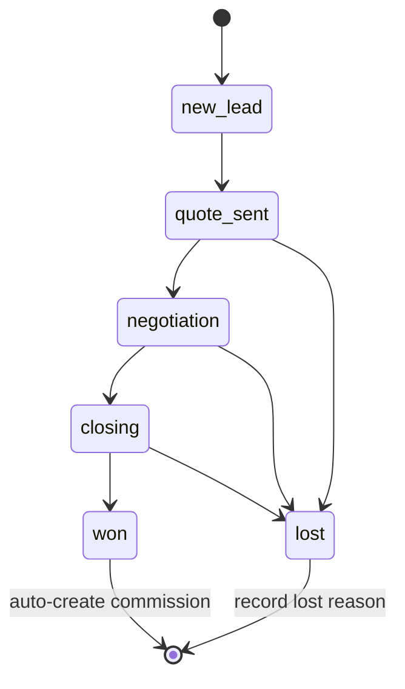

# ClalMobile CRM

The ClalMobile CRM lives side-by-side with the admin panel, sharing the same session and database but serving a different workflow: **conversations**, **deals** and **customer context**. This document covers the three pillars — the unified Inbox, the sales Pipeline and the 360° customer view — plus the AI assist layer and the reports that tie them together.

Mounted at `/crm`, the CRM is where the support team answers WhatsApp messages, the sales team works their pipeline, and any agent can pull up a customer history in one click.

---

## Table of contents

1. [Overview](#1-overview)
2. [Inbox](#2-inbox)
3. [Message handling](#3-message-handling)
4. [AI features](#4-ai-features)
5. [Pipeline](#5-pipeline)
6. [Tasks and follow-ups](#6-tasks-and-follow-ups)
7. [Reports](#7-reports)
8. [Agent-to-human handoff](#8-agent-to-human-handoff)
9. [File map](#9-file-map)

---

## 1. Overview

### How the CRM fits in

ClalMobile is a single Next.js monolith. The admin panel (at `/admin`) is for configuration and catalogue management; the CRM (at `/crm`) is for ongoing relationship work. They share:

- The same Supabase database and Supabase Auth session.
- The same RBAC matrix (see `ADMIN.md`).
- The same top-level tables — `customers`, `orders`, `users`, `audit_log`.
- A common integration hub — WhatsApp, SMS, email and AI providers are configured once and used by both surfaces.

But the CRM owns its own schema footprint: `inbox_conversations`, `inbox_messages`, `inbox_labels`, `inbox_notes`, `inbox_templates`, `inbox_quick_replies`, `pipeline_stages`, `pipeline_deals`, `crm_tasks` and `hot_accounts`.

### Navigation

`CRMShell` renders a sidebar (desktop) or bottom tab bar (mobile) with:

| Icon | Section   | Route            | Purpose                                        |
| ---- | --------- | ---------------- | ---------------------------------------------- |
| 📊   | Dashboard | `/crm`           | KPIs, inbox summary, pipeline snapshot         |
| 📥   | Inbox     | `/crm/inbox`     | 3-column unified inbox (Intercom-style)         |
| 📦   | Orders    | `/crm/orders`    | Orders view shared with admin                   |
| 👥   | Customers | `/crm/customers` | Customer list + 360° detail                    |
| 🎯   | Pipeline  | `/crm/pipeline`  | Kanban board of deals                          |
| ✅   | Tasks     | `/crm/tasks`     | Assigned follow-ups                            |
| 💬   | Chats     | `/crm/chats`     | Raw chat threads (alt view of inbox)           |
| 📊   | Reports   | `/crm/reports`   | Pipeline velocity, conversion, agent perf     |
| 🔑   | Users     | `/crm/users`     | Team directory                                  |

Cross-links at the bottom go to `/store` (preview storefront), `/admin` (catalogue & settings) and `/command-center` (operations dashboard).

---

## 2. Inbox

`/crm/inbox` is the workhorse of the support team: a **three-column, Intercom-style layout** that renders completely differently on mobile vs desktop.

### Three columns

```mermaid
flowchart LR
    subgraph Col1["Column 1 — Conversations"]
        A[Search + filters]
        B[Unread badges]
        C[Conversation list]
    end
    subgraph Col2["Column 2 — Active thread"]
        D[Header status + sentiment]
        E[AI summary collapsible]
        F[Messages timeline]
        G[Template picker]
        H[Composer + send]
    end
    subgraph Col3["Column 3 — Context"]
        I[Customer profile]
        J[HOT accounts]
        K[Orders summary]
        L[Notes]
        M[Labels + priority]
    end
    Col1 --> Col2 --> Col3
```



On mobile, columns become views: selecting a conversation replaces the list with the chat panel; tapping the info icon replaces the chat with the context panel. A back button returns to the previous view.

On desktop (default), columns 1 and 2 are always visible; column 3 is toggled by the info button so the chat can occupy the full centre when the agent is typing.

### Column 1 — Conversations list

Renders `ConversationList.tsx` with `ConversationItem.tsx` rows.

Each row shows:

- Customer name or phone if no name is known.
- Last-message preview with direction (inbound/outbound) indicator.
- Channel icon (WhatsApp 💬, WebChat 🌐, email ✉️).
- Time since last message (`timeAgo`).
- Status dot — **active** (green), **waiting** (yellow), **bot** (blue), **resolved** (grey), **archived** (muted grey).
- Priority chip — low / normal / high / urgent (colour-coded).
- Unread count badge if `unread_count > 0`.
- Pinned 📌 icon if pinned.
- Sentiment emoji if sentiment has been analysed (see [AI features](#4-ai-features)).

`ConversationFilters.tsx` above the list filters by status, assigned agent, label and sentiment, with a full-text search box. Filters and search are URL-synced.

### Column 2 — Active conversation

Renders `ChatPanel.tsx`:

**Header strip** — customer name + phone, status dot, sentiment emoji, channel icon, "open contact" toggle (mobile only), priority pill.

**AI summary card** — collapsible. When expanded, shows a generated summary of the conversation: short description, detected products discussed, current status, required action, priority, sentiment, detected language. Regenerated on demand. See [AI features](#4-ai-features).

**Messages timeline** — `MessageBubble.tsx` renders each message with direction-aware styling:

- Inbound (customer) — left-aligned, muted background.
- Outbound (agent) — right-aligned, brand-red background.
- System — centre, muted, smaller.
- Bot — left-aligned with a bot glyph.

Each bubble shows content, timestamp, delivery status icon (pending / sent / delivered / read / failed), and the sender's name. Media messages (images, documents, audio, video, location) render appropriately. A "reply-to" chip appears on quoted messages.

Date separators appear automatically between days.

**Composer** — `MessageInput.tsx` is a rich input:

- Text area with enter-to-send (shift-enter for newline).
- Attach media (image, video, document, location).
- Template picker (`TemplateSelector.tsx`) — pre-written messages by category.
- Quick replies (`QuickReplies.tsx`) — shortcut-based (type `/hi` to expand a greeting).
- Voice note recording (if the browser allows).

**24-hour window awareness** — for WhatsApp, if the last inbound message is older than 24 hours, the free-form input is disabled and the UI nudges the agent to send an approved template instead (WhatsApp's business-initiated-session policy).

### Column 3 — Customer context

Renders `ContactPanel.tsx`:

**Customer header** — name, phone, email, city; click-through to the full 360° view.

**Stats strip** — total orders, total spent, average order value, segment badge, loyalty tier.

**HOT accounts** — list of linked HOT Mobile subscriptions with status (see `ADMIN.md` → Customer management).

**Recent orders** — last 5 orders with status badges, click-through to `/admin/orders/[id]`.

**Labels** — current labels applied to the conversation, with an add/remove chip UI.

**Notes** — `NotesPanel.tsx` lets agents leave internal notes on the conversation. Notes are timestamped and author-attributed, never sent to the customer.

**Agent assignment** — `AssignAgent.tsx` shows who the conversation is assigned to and lets supervisors reassign.

### Realtime updates

`useInboxRealtime()` subscribes to Supabase Realtime channels on `inbox_conversations` and `inbox_messages`. When a new inbound message arrives, the conversation list reorders, the badge increments, and if the conversation is selected the new bubble slides in. Falls back to polling when Realtime is unavailable.

---

## 3. Message handling

### Inbound — webhook

**WhatsApp** — `POST /api/webhook/whatsapp` receives callbacks from the WhatsApp provider:

1. Verify the webhook signature (HMAC SHA256 via `lib/webhook-verify.ts`).
2. Parse the payload and extract sender phone, message type, content and media.
3. Upsert an `inbox_conversations` row by `customer_phone`.
4. Insert an `inbox_messages` row with `direction: inbound`, `sender_type: customer`.
5. Fire a Realtime broadcast so the inbox UI updates.
6. Trigger auto-labelling via `/api/crm/inbox/[id]/auto-label`.
7. If the conversation is assigned to the bot, dispatch to the bot engine.

**WebChat** — the `<WebChatWidget />` mounted on the store posts to `POST /api/chat`. Same pipeline as WhatsApp but channel is `webchat`.

**Twilio SMS** — `POST /api/webhook/twilio` funnels SMS into the same inbox, although SMS traffic is typically operational (OTPs) rather than conversational.

**Email** — email replies can be wired in via the email provider's inbound webhook; the hub exposes a shared parser that maps inbound email threads into `inbox_conversations` so agents see all channels in one list.

### Outbound — send

Clicking send in `MessageInput` calls `sendMessage(conversationId, body)` which posts to `POST /api/crm/inbox/[id]/send`:

1. Validate the agent has `crm.edit` permission.
2. If the content is a template, resolve the template name + params.
3. Insert a `status: pending` `inbox_messages` row with `direction: outbound`.
4. Call the channel provider via the integration hub.
5. Update the message row with the provider's returned message ID and `status: sent`.
6. The provider's delivery webhook will later update `status` to `delivered` or `read`.

Delivery failures are visible on the bubble with a red icon and a retry button.

### Template responses

Templates are WhatsApp-approved canned messages — required for business-initiated sessions outside the 24-hour window. They're defined in `inbox_templates` with:

- `name` — internal name matching the provider's registered template.
- `category` — `welcome`, `orders`, `shipping`, `payment`, `offers`, `followup`, `general`.
- `content` — the template text with `{{1}}`, `{{2}}` placeholders.
- `variables` — an ordered list of placeholder names so the UI shows meaningful labels.
- `is_active` and `usage_count` — so the picker can surface the most-used templates first.

The template selector groups templates by category (see icon/label list in `TEMPLATE_CATEGORIES`).

### Quick replies

Non-WhatsApp-template shortcuts. The agent types `/shortcut` and the content expands inline. Managed in `inbox_quick_replies` with a shortcut → content mapping. Useful for acknowledgements that don't need provider approval ("Thanks, I'll check and come back to you").

### Labels

`inbox_labels` is a flat taxonomy — colour, name, description. Applied to conversations for filtering and reporting. Auto-labelling uses lightweight heuristics (plus optional AI) to tag conversations: "pre-sale", "post-sale", "complaint", "return", "delivery-question", etc.

---

## 4. AI features

All AI copy below is **abstract** — no prompts or keys are exposed. Credentials are stored in the `integrations` table and consumed through the hub (see `ADMIN.md` → Integration hub).

### Smart reply suggestions

`POST /api/crm/inbox/[id]/suggest` takes an open conversation and returns 1–3 suggested replies the agent can accept with one click.

Under the hood:

1. Fetch the conversation and its last 15 messages.
2. Look up customer context — recent orders, loyalty tier, HOT accounts.
3. If the latest customer message mentions a product, resolve that product (via `getProductByQuery`) and include its catalogue data as grounding.
4. Ask Claude to draft replies, constrained to the business's tone, Arabic language, and a specific format.
5. Track token usage for cost reporting.
6. Return the suggestions to the UI.

The agent can accept a suggestion (fills the composer for review), edit it, or ignore it entirely.

### Sentiment analysis

Two-tier approach in `lib/crm/sentiment.ts`:

**Rule-based** (instant, no API) — `analyzeSentiment(text)` scans for positive, negative and angry keywords in Arabic, Hebrew and English, plus heuristics (exclamation marks, caps rage) to decide among four buckets: **positive**, **neutral**, **negative**, **angry**. Runs on every inbound message in the browser so the conversation list can show a sentiment dot immediately.

**Deep sentiment** — `POST /api/crm/inbox/[id]/sentiment` can reanalyse the last N messages with the AI provider for higher accuracy, used on demand from the chat header.

Sentiment is persisted on the conversation row for filtering and dashboarding.

### Conversation summaries

`POST /api/crm/inbox/[id]/summary` generates a structured JSON summary:

```
{
  summary: string,
  products: string[],
  status: 'interested_in_buying' | 'inquiring' | 'angry' | 'waiting_for_reply' | 'resolved',
  action_required: string,
  priority: 'high' | 'normal' | 'low',
  sentiment: 'positive' | 'neutral' | 'negative' | 'angry',
  language: string,
  generated_at: string,
  message_count_at_generation: number
}
```

Summaries are cached per conversation and regenerated when the message count since generation exceeds a threshold. Displayed as a collapsible card above the messages list.

### Auto-labelling

`POST /api/crm/inbox/[id]/auto-label` runs after every inbound message:

1. Lightweight keyword pass hits the obvious labels (delivery, pricing, returns, complaint).
2. For ambiguous messages, the AI is asked to pick from the active label set.
3. Labels are applied in an idempotent upsert so no duplicate assignments.

### Recommendations

`POST /api/crm/inbox/[id]/recommend` suggests a next product to the customer based on their history, the conversation topic and the current catalogue. Useful for upsell opportunities surfaced in the agent's UI.

### Translation

The CRM doesn't apply outbound translation automatically, but because every surface is already bilingual (Arabic + Hebrew), agents see suggestions in whichever language matches the customer's message. The sentiment engine and summary detect language and include it in the summary payload so an agent can react appropriately.

---

## 5. Pipeline

`/crm/pipeline` is a Kanban board of deals in progress.

### Stages

Stages are data-driven — `pipeline_stages` is a table so new stages can be added without a redeploy. The default seed is:

| Stage             | Hebrew         | Arabic           | Terminal?      |
| ----------------- | -------------- | ---------------- | -------------- |
| `new_lead`        | ליד             | عميل محتمل         | no             |
| `quote_sent`      | הצעת מחיר        | عرض سعر            | no             |
| `negotiation`     | משא ומתן         | تفاوض              | no             |
| `closing`         | סגירה          | إقفال              | no             |
| `won`             | נסגר           | تم البيع            | terminal (won) |
| `lost`            | הפסד           | خسارة             | terminal (lost)|

Each stage has a `sort_order`, a `color`, and flags `is_won` / `is_lost` that drive business logic (commission registration happens only on won).

### Kanban UI

- **Columns** — one per stage, ordered by `sort_order`.
- **Cards** — show customer name, product/notes, estimated value, assigned agent, age (`timeAgo`).
- **Drag between columns** — moving a card updates `stage_id` on the deal and writes an audit entry.
- **Filters** — by assigned agent, date range, min value.
- **Quick add** — "+" at the top of the first column opens a modal for new leads; a searchable product picker pre-fills the product name and estimated value.

### Deal → Order conversion

When a deal reaches an active negotiation, the agent can click "Convert to order" on the card:

1. Opens `ManualOrderModal` prefilled from the deal (customer, product, value).
2. Agent adds payment method and any missing fields.
3. `POST /api/crm/pipeline/[id]/convert` creates the order via the shared order API, stamps `deal.order_id`, and moves the deal to the **closing** stage.
4. The order then follows the normal status pipeline (see `ADMIN.md` → Order management).

### Won transition — commission auto-creation

Moving a deal to a `is_won: true` stage triggers `autoRegisterWonDealCommission()` in `lib/crm/pipeline.ts`:

1. Resolve the employee who owns the deal (from `deal.employee_id` or the acting user).
2. Classify the sale type (`line` or `device`) from the product name keywords.
3. Check for an existing `sales_docs` row with idempotency key `pipeline_${deal.id}` — if found, skip.
4. Insert a new `sales_docs` row linked to the deal.
5. Call `registerSaleCommission()` which computes the commission amount using the configured formulas (see `COMMISSIONS.md` for details — this document intentionally does not repeat the formulas).
6. Log a `sales_doc_events` entry tagged `auto_created_from_pipeline` with the commission ID.

The flow is **idempotent** — re-entering the won stage (or moving to `won` from `lost` and back) won't create duplicate docs or commissions, because `sales_docs.idempotency_key` and `commission_sales.source_pipeline_deal_id` both carry partial unique indexes.

See `COMMISSIONS.md` for the commission calculation engine, bonus schedules, sanctions and payroll export.



### Lost-reason tracking

When a deal moves to `lost`, the card modal requires a reason from a fixed enum:

- מחיר (price)
- מתחרה (competitor)
- תזמון (timing)
- אין תגובה (no response)
- אחר (other)

Lost reasons feed the reports so the team can see which objection patterns are killing deals.

### Forecasting

The pipeline snapshot (`getPipelineSnapshot`) computes:

- `total_deals` — count of open deals.
- `total_value` — sum of `estimated_value` for non-lost deals.
- `conversion_rate` — `won / total_deals` as a percent.
- `avg_deal_time` — average days between created and converted for won deals.

These drive the dashboard cards at the top of `/crm/pipeline`.

---

## 6. Tasks and follow-ups

`/crm/tasks` is a personal and team task list — lightweight, not a full project manager.

### Task model

`crm_tasks` has:

- `title`, `description`
- `priority` — `high` (🔴), `medium` (🟡), `low` (🟢)
- `status` — `pending`, `in_progress`, `done`, `cancelled`
- `due_at` — optional deadline
- `assigned_to` — user ID
- `customer_id` — optional link to a customer (shown in the customer's timeline)
- `deal_id` — optional link to a pipeline deal (shown on the deal card)
- `order_id` — optional link to an order

### Creation

Tasks can be created from three places:

1. The tasks page itself (`+ New task`).
2. A conversation — "Create task from this conversation" prefills customer and links back.
3. A deal card — "Create follow-up task" prefills customer, deal, and defaults due to tomorrow.

### Reminders

When `due_at` is within 24 hours, the task card highlights red. When overdue, it stays red with an "overdue" badge. Optional WhatsApp or email reminders can be wired to fire at a configurable offset before due (typically 1 hour) using the scheduled-tasks queue.

### Completion

Marking a task done writes an audit entry and, if the task was linked to a deal, adds a note on the deal timeline so the sales trail stays intact.

---

## 7. Reports

`/crm/reports` surfaces three families of metrics.

### Pipeline velocity

- **Average deal time** — days from lead to won.
- **Stage dwell time** — median time a deal spends in each stage; identifies bottlenecks (e.g. deals stuck in negotiation).
- **Throughput** — deals created per week, deals closed per week.
- **Win rate** — `won / (won + lost)` over the selected range.

### Conversion rate

Funnel view from top to bottom:

1. Conversation created
2. Deal created (from a conversation)
3. Quote sent
4. Negotiation
5. Won

Each step shows absolute count and percent of the previous step. The drop-off between steps is what the sales team optimises.

### Agent performance

Per agent:

- **Conversations handled** — volume, plus average first-response time.
- **Deals won** — count and total value (value shown in relative terms or percent of team total — no real commission amounts surface here).
- **Tasks completed on time** — hit rate on due dates.
- **Customer satisfaction proxy** — average sentiment shift over the conversations the agent handled.

Agent performance reports feed into the commissions surface (see `COMMISSIONS.md`) but are kept separate from the commission calculator so managers can look at performance without touching payout numbers.

### Exports

Every report has a CSV export. Heavy queries are streamed to avoid timing out.

---

## 8. Agent-to-human handoff

The bot can hold the first line of defence on simple inquiries; humans take over when the conversation warrants it.

### Bot-held conversations

A conversation's `status` can be `bot`, meaning the automated pipeline is answering. Messages arrive via webhook, the bot engine (under `lib/bot/`) classifies intent, looks up products or orders, and replies. The agent UI still shows bot-held conversations but dims them and labels them "🤖 bot".

### Handoff triggers

The bot hands off to a human under any of these conditions:

- **Explicit request** — the customer asks "agent", "human", "وكيل", "نماينده", "person", etc.
- **Low confidence** — the bot's intent classifier scores below a configured threshold.
- **Negative sentiment** — sentiment analysis flags `negative` or `angry` (see [AI features](#4-ai-features)) for two consecutive inbound messages.
- **Complex topic** — the message matches a pattern the bot is explicitly not trusted with (refunds, disputes, legal questions, unrelated inquiries).
- **24-hour escalation** — if the customer is still waiting after two bot turns without resolution.

### Handoff mechanics

On trigger:

1. `updateConversationStatus(convId, "waiting")` flips the status from `bot` to `waiting`.
2. The bot sends a final "handing you over to an agent" message with expected response time.
3. The conversation appears at the top of the agents' "waiting" bucket with a handoff label.
4. An available agent is notified (push + inbox alert), with auto-assignment if the ops team has enabled round-robin.
5. When the agent accepts, `status` becomes `active`, `assigned_to` is set, and `assigned_at` is stamped.

### Hand-back to bot

Once the human-led portion is resolved, the agent can hand back to the bot by setting status to `bot` (useful for periodic check-ins like delivery updates that can stay automated).

### Escalation policy

The support team's SLA:

- **First response** on a waiting conversation within 10 minutes during business hours.
- **Resolution** or clear next step within 24 hours.
- **Angry sentiment** triggers an immediate notification to the team lead regardless of queue length.

Metrics for these SLAs appear on the agent performance tab of `/crm/reports`.

---

## 9. File map

```
app/crm/
  layout.tsx                    Wraps CRMShell
  page.tsx                      Dashboard
  inbox/page.tsx                3-column inbox
  chats/page.tsx                Raw chat thread view
  customers/                    List + 360° detail
    page.tsx
    [id]/page.tsx
  orders/page.tsx               Shared OrdersManagementPage
  pipeline/page.tsx             Kanban board
  tasks/page.tsx                Task list
  reports/page.tsx              Pipeline + conversion + agent perf
  users/page.tsx                Team directory

components/crm/
  CRMShell.tsx                  Responsive shell + nav
  OrdersManagementPage.tsx      Shared with admin
  inbox/
    InboxLayout.tsx             3-column orchestrator
    ConversationList.tsx        Col 1
    ConversationItem.tsx
    ConversationFilters.tsx
    ChatPanel.tsx               Col 2
    MessageBubble.tsx
    MessageInput.tsx
    ContactPanel.tsx            Col 3
    NotesPanel.tsx
    AssignAgent.tsx
    TemplateSelector.tsx
    QuickReplies.tsx
    InboxStats.tsx

lib/crm/
  inbox.ts                      API calls + hooks (useInboxMessages, useInboxConversations)
  inbox-types.ts                Types + status/priority/category configs
  realtime.ts                   Supabase Realtime subscription
  sentiment.ts                  Rule-based sentiment engine
  customer-timeline.ts          360° timeline entry builder
  pipeline.ts                   Deal CRUD + won→commission logic
  queries.ts                    Shared CRM queries

components/chat/
  WebChatWidget.tsx             Storefront embed → webchat channel

app/api/crm/
  inbox/                        Conversations, messages, labels, templates, stats
    [id]/send                   Outbound message
    [id]/assign                 Reassign agent
    [id]/status                 Change conversation status
    [id]/suggest                AI smart reply
    [id]/summary                AI summary
    [id]/sentiment              Deep sentiment
    [id]/auto-label             Auto-labelling
    [id]/recommend              Product recommendation
  pipeline/
    route.ts                    List/create deals
    [id]/route.ts               Update/delete deal
    [id]/convert                Convert deal → order
  customers/
    [id]/360                    360° view payload
    [id]/hot-accounts           HOT account management
    [id]/notes                  Notes CRUD
  tasks/route.ts                Task CRUD
  dashboard/route.ts            CRM dashboard KPIs
  reports/route.ts              Pipeline + conversion + agent reports

app/api/webhook/
  whatsapp/                     Inbound WhatsApp
  twilio/                       Inbound SMS

app/api/chat/                   Storefront webchat ingress
```

---

For architectural context (tech stack, DB schema, security layers), see `DOCS.md`. For the admin surface that configures integrations and provisions CRM users, see `ADMIN.md`. For the storefront where customer conversations originate, see `STORE.md`. For the commission engine triggered by won deals, see `COMMISSIONS.md`.
