# Database

> Full reference for the ClalMobile Supabase (PostgreSQL 17) schema — tables, relationships, RLS, triggers, RPCs, and migration order.
>
> The **single source of truth** for every table shape is `types/database.ts`. Adding a column means updating that file first.

## Table of Contents

- [Overview](#overview)
- [ER diagram — core 20 tables](#er-diagram--core-20-tables)
- [Full table inventory](#full-table-inventory)
  - [Core commerce](#core-commerce)
  - [Customer identity](#customer-identity)
  - [CRM & Inbox](#crm--inbox)
  - [Bot (WhatsApp + WebChat)](#bot-whatsapp--webchat)
  - [Commissions & sales documents](#commissions--sales-documents)
  - [Employee portal](#employee-portal)
  - [Site CMS & content](#site-cms--content)
  - [Loyalty & engagement](#loyalty--engagement)
  - [Integrations & system](#integrations--system)
  - [Audit & RBAC](#audit--rbac)
- [RLS summary](#rls-summary)
- [Triggers](#triggers)
- [RPCs — stored procedures](#rpcs--stored-procedures)
- [Migration order](#migration-order)

---

## Overview

| Metric | Value |
|--------|-------|
| Total tables | **65+** (public schema) |
| Migrations applied | **54** sequential `.sql` files |
| Triggers | **15** (6 on orders/commissions, 4 `updated_at` keepers, 3 audit/legacy-sync, **2 month-lock**) |
| RPCs / stored functions | **15** |
| Tables with RLS enabled | ~100% of sensitive tables; 2 with `FORCE ROW LEVEL SECURITY` |
| Bilingual columns | `name_ar` / `name_he`, `title_ar` / `title_he`, `content_ar` / `content_he` across content tables |
| Primary key style | `UUID` (via `gen_random_uuid()` or `uuid_generate_v4()`) for most tables; `TEXT` for `orders.id` (human-readable `CLM-XXXXX`) and `settings.key`; `BIGSERIAL` for commission + sales-doc tables |

**Engine.** PostgreSQL 17, hosted on Supabase. Extensions: `uuid-ossp`, `pgcrypto` (for `gen_random_uuid`).

**Access pattern.** All writes go through Next.js API routes that use `createAdminSupabase()` (service_role key). Anon clients can only read public rows via `public_read` policies. RLS is enforced as defense-in-depth.

---

## ER diagram — core 20 tables

The following diagram covers the most frequently referenced tables. Tables are grouped by module; a line between two tables represents a foreign-key reference.

```mermaid
erDiagram
  products ||--o{ order_items : "in"
  products ||--o{ product_reviews : "reviewed"
  products ||--o{ pipeline_deals : "interested-in"
  categories ||--o{ products : "categorizes"

  orders ||--|{ order_items : "contains"
  orders ||--o{ order_notes : "annotated"
  orders ||--o{ order_status_history : "transitions"
  orders ||--o{ commission_sales : "earned-from"
  orders ||--o{ pipeline_deals : "converted-from"
  customers ||--o{ orders : "placed"

  customers ||--o{ customer_notes : "annotated"
  customers ||--o{ customer_hot_accounts : "owns"
  customers ||--o{ commission_sales : "linked"
  customers ||--o{ pipeline_deals : "lead"

  inbox_conversations ||--|{ inbox_messages : "contains"
  inbox_conversations ||--o{ inbox_notes : "annotated"
  inbox_conversations ||--o{ inbox_conversation_labels : "tagged"
  inbox_labels ||--o{ inbox_conversation_labels : "tags"

  pipeline_stages ||--o{ pipeline_deals : "at-stage"
  pipeline_deals ||--o{ commission_sales : "sourced-from"

  users ||--o{ orders : "assigned-to"
  users ||--o{ pipeline_deals : "owned-by"
  users ||--o{ commission_sales : "earned-by"
  users ||--o{ employee_commission_profiles : "configured"
  users ||--o{ commission_sanctions : "issued-to"

  commission_targets ||--o{ commission_sales : "month-lock-check"
  commission_employees }o--|| users : "links-to"

  sales_docs ||--|{ sales_doc_items : "line-items"
  sales_docs ||--o{ sales_doc_events : "timeline"
  sales_docs ||--o{ sales_doc_sync_queue : "async-sync"
  sales_docs ||--o{ commission_sales : "registers-as"

  products {
    uuid id PK
    text type "device|accessory"
    text brand
    text name_ar
    text name_he
    numeric price
    int stock
    jsonb variants "storage-specific pricing"
    jsonb colors
    uuid category_id FK
    boolean active
  }

  orders {
    text id PK "CLM-XXXXX"
    uuid customer_id FK
    text status "new|approved|shipped|..."
    text source "store|whatsapp|manual|..."
    numeric total
    text coupon_code
    uuid assigned_to FK
    timestamptz deleted_at "soft delete"
  }

  order_items {
    uuid id PK
    text order_id FK
    uuid product_id FK
    text product_name "denormalized snapshot"
    numeric price
    int quantity
  }

  customers {
    uuid id PK
    text phone "unique"
    text name
    text customer_code "internal stable code"
    text segment "vip|loyal|active|new|cold|lost"
    numeric total_spent
    int total_orders
  }

  customer_hot_accounts {
    uuid id PK
    uuid customer_id FK
    text hot_mobile_id
    text line_phone
    text status "pending|verified|active|..."
    boolean is_primary
  }

  inbox_conversations {
    uuid id PK
    text customer_phone
    text channel "whatsapp|webchat"
    text status
    uuid assigned_to
    int unread_count
    text sentiment
  }

  inbox_messages {
    uuid id PK
    uuid conversation_id FK
    text direction "inbound|outbound"
    text message_type "text|media|template"
    text content
    text whatsapp_message_id
  }

  pipeline_deals {
    uuid id PK
    uuid customer_id FK
    uuid product_id FK
    bigint stage_id FK
    numeric estimated_value
    uuid employee_id FK
    text order_id FK
  }

  commission_sales {
    bigserial id PK
    uuid employee_id FK
    uuid customer_id FK
    text sale_type "line|device"
    date sale_date "was TEXT pre-2026-04-18"
    text source "manual|auto_sync|sales_doc|pipeline|order"
    bigint source_sales_doc_id FK "nullable"
    uuid source_pipeline_deal_id FK "nullable"
    numeric commission_amount
    jsonb rate_snapshot "frozen profile at time of sale"
    timestamptz deleted_at
  }

  employee_commission_profiles {
    uuid user_id PK
    real line_multiplier
    real device_rate
    jsonb loyalty_bonuses
    boolean active
  }

  sales_docs {
    bigserial id PK
    uuid doc_uuid "stable offline id"
    uuid customer_id FK
    text order_id FK
    text employee_key
    text status "draft|submitted|verified|rejected|synced_to_commissions|cancelled"
    text sale_type "line|device|mixed"
    numeric total_amount
    text idempotency_key
  }

  sales_doc_items {
    bigserial id PK
    bigint sales_doc_id FK
    text item_type "line|device|accessory"
    int qty
    numeric unit_price
    numeric line_total
  }

  users {
    uuid id PK
    uuid auth_id FK "auth.users"
    text email "unique"
    text role "super_admin|admin|sales|support|content|viewer|customer"
    text status "active|suspended"
    boolean must_change_password
  }

  audit_log {
    bigserial id PK
    uuid user_id
    text user_role
    text action
    text module
    text entity_type
    text entity_id
    jsonb details
  }
```

> `auth.users` is Supabase-managed (in the `auth` schema). `users` (public schema) is our own row that links 1:1 via `users.auth_id = auth.users.id`.

---

## Full table inventory

### Core commerce

| Table | Purpose |
|-------|---------|
| `products` | Catalog — devices + accessories with bilingual names, price, stock, `variants` JSONB (per-storage pricing), `colors` JSONB, specs |
| `categories` | Collections (manual or rule-based) for grouping products in the storefront |
| `heroes` | Homepage carousel banners (bilingual titles + CTAs + sort order) |
| `line_plans` | HOT Mobile line plans shown on the storefront (name, data amount, price, features) |
| `deals` | Time-bound storefront promotions (flash sales, bundles, clearance) |
| `coupons` | Discount codes with percent/fixed value, min-order, max-uses, expiry |
| `orders` | Customer orders — header-level: status, source, total, coupon, payment details, shipping address, soft-delete via `deleted_at` |
| `order_items` | Order line items — snapshot of product name/brand/type + price + quantity + color + storage at time of order |
| `order_notes` | Free-text internal notes pinned to an order, authored by staff |
| `order_status_history` | Append-only log of every status transition on an order, with actor + optional note |
| `abandoned_carts` | Cart contents captured when a visitor leaves before checkout — used for reminder flows |
| `product_reviews` | Customer ratings (1-5) + title + body + admin reply, with `approved/pending/rejected` moderation |

### Customer identity

| Table | Purpose |
|-------|---------|
| `customers` | Master customer record keyed by phone — includes segment (RFM-derived), lifetime totals, tags, assigned-to owner |
| `customer_notes` | Free-text notes attached to a customer, authored by staff |
| `customer_hot_accounts` | One customer can have multiple HOT Mobile identities (multi-line households); tracks `hot_mobile_id`, line phone, verification status, primary flag |
| `customer_otps` | Passwordless login OTPs for store customers — expires in minutes |

### CRM & Inbox

| Table | Purpose |
|-------|---------|
| `inbox_conversations` | Unified conversation header — WhatsApp / WebChat / SMS channels; assignment, status, priority, pinned flag, unread count, sentiment |
| `inbox_messages` | Every message, inbound or outbound, with media + template metadata, WhatsApp msg id, delivery status |
| `inbox_labels` | Colored tags that can be attached to conversations (VIP, Urgent, Complaint, etc.) |
| `inbox_conversation_labels` | Join table — `(conversation_id, label_id)` |
| `inbox_notes` | Internal-only notes inside a conversation (not sent to the customer) |
| `inbox_templates` | Bilingual message templates with variable placeholders, category, usage counter |
| `inbox_quick_replies` | Slash-commands (`/hi`, `/price`) that expand to canned text |
| `inbox_events` | Timeline events (assignment changes, status changes, label add/remove) |
| `pipeline_stages` | Configurable kanban stages (lead, quote_sent, negotiation, closing, won, lost) with `is_won` / `is_lost` flags |
| `pipeline_deals` | Sales opportunities flowing through stages — customer, product, estimated value, assigned employee, lost reason |
| `tasks` | Staff to-dos tied to a customer / order / user, with priority and due date |

### Bot (WhatsApp + WebChat)

| Table | Purpose |
|-------|---------|
| `bot_conversations` | Bot-driven conversation header with intent, qualification JSONB, products discussed array, CSAT score |
| `bot_messages` | User/bot/system messages with confidence score and metadata |
| `bot_handoffs` | Escalation requests when the bot cannot resolve — products of interest, last price quoted, assigned agent |
| `bot_policies` | FAQ/policy content used by the bot for grounded answers (warranty, return, shipping, installments, privacy) |
| `bot_templates` | Bot reply templates keyed by intent/event with `{{1}}/{{var}}` placeholders; WhatsApp Business API approved templates |
| `bot_analytics` | Daily aggregated metrics per channel — conversations, handoffs, CSAT, top intents |
| `ai_usage` | Per-call telemetry for Claude / Gemini / OpenAI — feature, token counts, duration, model |

### Commissions & sales documents

| Table | Purpose |
|-------|---------|
| `commission_sales` | One row per commissionable sale (line or device), linked to employee + optionally to an order / pipeline deal / sales doc. Snapshots commission rate at time of sale in `rate_snapshot` JSONB for historical accuracy. `sale_date` is now `DATE` (was `TEXT`). New FK columns `source_sales_doc_id` and `source_pipeline_deal_id` identify the originating record; `source` CHECK widened to include both new paths. Uniqueness is now `UNIQUE(order_id, sale_type)`. Soft-delete via `deleted_at`. |
| `commission_targets` | Monthly target amounts per employee + per category (lines, devices); has `is_locked` flag that prevents downstream modifications via `check_month_lock` trigger |
| `commission_sanctions` | Penalty rows (amount, reason, offset flag) applied against a specific employee month; also guarded by month-lock trigger |
| `commission_sync_log` | Rolling log of auto-sync runs (orders → commissions) with counts + errors |
| `commission_employees` | Standalone lightweight employee registry (token-authed) for HOT Mobile sales team — can optionally link to a `users` row. `deleted_at` column supports soft-delete / archival. |
| `employee_commission_profiles` | Per-employee override of the default rate structure (`line_multiplier`, `device_rate`, `loyalty_bonuses` JSONB, `min_package_price`). Values are configurable per employee. |
| `sales_docs` | Sales-documentation headers created by the PWA (offline-capable via `doc_uuid`); flow: `draft → submitted → verified → synced_to_commissions`. New `cancelled` status + `cancelled_at` / `cancelled_by` / `cancellation_reason` audit columns for admin-driven cancellations. |
| `sales_doc_items` | Per-item breakdown of a sales doc (line / device / accessory) with qty + unit price |
| `sales_doc_attachments` | **Legacy / orphaned as of 2026-04-18.** Previously held uploaded proof files for sales docs. No longer read or written by application code after the attachments system was removed; table retained for legacy audit rows only. Not dropped. |
| `sales_doc_events` | Append-only audit trail of actions taken on a sales doc (submitted, verified, rejected, cancelled) |
| `sales_doc_sync_queue` | Async queue of docs awaiting sync to `commission_sales` with retry/backoff |

`orders` gained a related column: **`excluded_from_sync BOOLEAN`** — when `true`, the hourly `commission-sync.yml` job skips the order (used for refunded / test / edge-case orders that an admin explicitly suppressed).

### Employee portal

New tables that back the unified Sales PWA's employee-facing features (`/employee/*`). All enforce `service_role` full access + `authenticated` read-own.

| Table | Purpose |
|-------|---------|
| `commission_correction_requests` | Employee-raised disputes against a specific `commission_sales` row (wrong amount, wrong employee, should be cancelled). Flow: `pending → {approved, rejected, resolved}`. Each transition writes an `employee_activity_log` row + an `audit_log` row. |
| `admin_announcements` | Broadcast messages published by admins (release notes, policy changes, monthly kickoff). Columns: `title`, `body`, `priority`, `target` (`all` / `employees`), optional `expires_at`, `published_by`. |
| `admin_announcement_reads` | Per-user read receipts — UNIQUE `(announcement_id, user_id)`. Populated by `POST /api/employee/announcements/[id]/read` via idempotent upsert. |
| `employee_activity_log` | Personal append-only timeline of commission-relevant events for an employee: sale created, sanction applied, target changed, correction submitted, correction resolved, announcement read. Paginated via `/api/employee/activity`. |
| `employee_favorite_products` | Schema-only for a future "quick-sell" feature in the PWA — no routes read or write it yet. |

### Site CMS & content

| Table | Purpose |
|-------|---------|
| `website_content` | Homepage sections (hero, stats, features, faq, cta, footer) with JSONB payload; edited from admin |
| `sub_pages` | Custom CMS pages (terms, warranty, about, privacy) with bilingual title + markdown content + image |
| `email_templates` | Transactional email templates (order_confirmed, order_shipped, cart_abandoned, etc.) with variable placeholders and bilingual subject + HTML body |
| `settings` | Key-value store for global config (store name, tagline, contact info, delivery days, feature flags) |

### Loyalty & engagement

| Table | Purpose |
|-------|---------|
| `loyalty_points` | Current point balance + lifetime total + tier (bronze/silver/gold/platinum) per customer |
| `loyalty_transactions` | Ledger of point earns / redeems / bonuses / adjustments with running `balance_after` |
| `push_subscriptions` | Web Push endpoint + encryption keys + visitor/customer link |
| `push_notifications` | History of sent push campaigns with target filter + sent count |
| `notifications` | In-app staff notifications (CRM / admin bell icon) with read flag + link |

### Integrations & system

| Table | Purpose |
|-------|---------|
| `integrations` | Provider config per category (payment / email / sms / whatsapp / storage / analytics / ai_chat / ai_admin / image_processing / device_specs / image_search / push_notifications) — stores `provider` name + `config` JSONB + `status`; drives the Integration Hub at runtime |
| `rate_limits` | Persistent rate-limit counters (key, count, reset_at) shared across serverless instances |

### Audit & RBAC

| Table | Purpose |
|-------|---------|
| `users` | Staff accounts — 1:1 with `auth.users`; holds `role`, `status`, `must_change_password`, `invited_by`, `last_login_at` |
| `permissions` | Catalog of `(module, action)` pairs — seeded by RBAC migration |
| `role_permissions` | Join table — `(role, permission_id)` — determines what each role can do |
| `audit_log` | Append-only trail of every admin / CRM action: `user_id`, `user_role`, `action`, `module`, `entity_type`, `entity_id`, `details` JSONB, `ip_address` |

---

## RLS summary

Every sensitive table has RLS enabled. The gist per table (not a full policy transcript):

| Table(s) | RLS pattern |
|----------|-------------|
| `products`, `heroes`, `line_plans`, `categories`, `deals` | **public read** (`WHERE active = true`) + `service_role` full access |
| `coupons` | public read-only (active rows) + `service_role` full access |
| `settings` | public read (any row) + `service_role` full access |
| `product_reviews` | public read (approved only) + public insert (pending) + `service_role` full access |
| `bot_policies`, `bot_templates` | public read + `service_role` full access |
| `sub_pages` | anon / authenticated SELECT visible rows only; `service_role` full access; `FORCE ROW LEVEL SECURITY` |
| `orders`, `order_items`, `order_notes` | `service_role` only (all writes via API routes); anon/auth revoked |
| `customers`, `customer_notes`, `customer_hot_accounts` | `service_role` only |
| `abandoned_carts` | `service_role` full + same-visitor UPDATE for the owning anon session |
| `inbox_*` (all 8 tables) | `service_role` only; authenticated read via API routes |
| `bot_conversations`, `bot_messages`, `bot_handoffs`, `bot_analytics` | `service_role` full; authenticated read |
| `commission_sales` | `service_role` full; authenticated can SELECT own rows (via `users.auth_id = auth.uid()`); month-lock enforced by TRIGGER |
| `commission_sanctions`, `commission_targets` | same as `commission_sales` — service + employee-read-own |
| `commission_sync_log`, `commission_employees`, `employee_commission_profiles` | `service_role` only |
| `sales_docs`, `sales_doc_items`, `sales_doc_events`, `sales_doc_sync_queue` | `service_role` full + authenticated read-own by `employee_key = auth.uid()::text` (legacy `sales_doc_attachments` still RLS-protected but no longer referenced by app code) |
| `commission_correction_requests` | `service_role` full; authenticated SELECT/INSERT own (`employee_id = auth.uid()`), UPDATE only via admin API |
| `admin_announcements` | `service_role` full; authenticated SELECT active-non-expired rows where `target IN ('all','employees')` |
| `admin_announcement_reads` | `service_role` full; authenticated SELECT own, INSERT/UPSERT own (`user_id = auth.uid()`) |
| `employee_activity_log` | `service_role` full; authenticated SELECT own (`employee_id = auth.uid()`) |
| `employee_favorite_products` | `service_role` only (routes not wired yet) |
| `users`, `permissions`, `role_permissions` | authenticated read (for session bootstrapping) + `service_role` full access |
| `tasks`, `pipeline_deals`, `pipeline_stages` | authenticated full (legacy) — primary gate is `requireAdmin()` at the route level |
| `loyalty_points`, `loyalty_transactions` | `service_role` only |
| `notifications`, `push_subscriptions`, `push_notifications` | `service_role` only |
| `customer_otps` | `service_role` only |
| `ai_usage` | `service_role` only |
| `rate_limits` | `service_role` only |
| `integrations` | authenticated full (read) + `service_role` full (write) |
| `audit_log` | `service_role` only (writes from any module); `FORCE ROW LEVEL SECURITY` so even BYPASSRLS roles are subject to policy |
| `email_templates`, `website_content` | `service_role` only for writes; authenticated read |

**Forced RLS** (`ALTER TABLE ... FORCE ROW LEVEL SECURITY`) is applied to exactly two tables:

1. `sub_pages` — no inbound FK writes, safe to force
2. `audit_log` — append-only, no inbound FK writes

Everywhere else, `FORCE` was deliberately dropped because it breaks Postgres's internal FK validation on tables that are FK targets (see migration `20260418000002_harden_rls_followup.sql`).

---

## Triggers

| Trigger | Table | Timing | Purpose |
|---------|-------|--------|---------|
| `tr_products_updated` | `products` | BEFORE UPDATE | Set `updated_at = NOW()` |
| `tr_orders_updated` | `orders` | BEFORE UPDATE | Set `updated_at = NOW()` |
| `tr_customers_updated` | `customers` | BEFORE UPDATE | Set `updated_at = NOW()` |
| `tr_tasks_updated` | `tasks` | BEFORE UPDATE | Set `updated_at = NOW()` |
| `tr_pipeline_updated` | `pipeline_deals` | BEFORE UPDATE | Set `updated_at = NOW()` |
| `tr_order_customer_stats` | `orders` | AFTER INSERT/UPDATE | Recompute customer's `total_orders`, `total_spent`, `avg_order_value`, `last_order_at` |
| `tr_order_status_audit` | `orders` | AFTER UPDATE | Insert an `audit_log` row on every status transition |
| `tr_order_stock_reversal` | `orders` | AFTER UPDATE OF status | When status transitions to `cancelled/rejected/returned`, restore stock for each line item |
| `tr_customer_segment` | `customers` | AFTER UPDATE OF total_orders, total_spent, last_order_at | Recompute RFM segment (vip / loyal / active / new / cold / lost) |
| `trigger_inbox_conv_updated` | `inbox_conversations` | BEFORE UPDATE | Set `updated_at = NOW()` |
| `trg_customer_hot_accounts_updated_at` | `customer_hot_accounts` | BEFORE UPDATE | Set `updated_at = NOW()` |
| `tr_pipeline_sync_legacy` | `pipeline_deals` | BEFORE INSERT/UPDATE | Keep legacy columns (`stage`, `value`, `assigned_to`, `product_summary`) in sync with the new canonical columns (`stage_id`, `estimated_value`, `employee_id`, `product_name`) so both sets of reads work |
| **`trg_check_month_lock_sales`** | `commission_sales` | BEFORE INSERT/UPDATE/DELETE | Reject writes if `commission_targets.is_locked = true` for that month. Runs even when `service_role` bypasses RLS (triggers don't get bypassed). |
| **`trg_check_month_lock_sanctions`** | `commission_sanctions` | BEFORE INSERT/UPDATE/DELETE | Same month-lock check as above, adapted for `sanction_date` |

---

## RPCs — stored procedures

All RPCs are `SECURITY DEFINER` unless noted, callable via Supabase client `rpc(name, args)`.

| RPC | Purpose |
|-----|---------|
| `create_order_atomic(p_order_id, p_customer_id, ..., p_items JSONB)` | Creates the order + order_items + increments coupon + decrements stock + writes audit log in one transaction. Validates stock-per-item with `FOR UPDATE` row locks; validates coupon atomically to close the race window. |
| `process_payment_callback(p_order_id, p_payment_status, p_order_status, p_transaction_id, p_payment_details, p_audit_action, p_audit_details)` | Single-transaction update of `orders.payment_status` + `orders.status` + `orders.payment_transaction_id` + audit log insert, called from `/api/payment/callback` |
| `decrement_stock(product_id, qty, variant_storage?)` | Per-product stock decrement with `GREATEST(0, stock - qty)` floor and `sold += qty`; variant-aware in v2 (migration 013) |
| `increment_coupon_usage(coupon_code)` | Legacy helper — now superseded by the in-RPC update inside `create_order_atomic` |
| `increment_template_usage(tname)` | Increments the `usage_count` on an `inbox_templates` row by name (used for analytics) |
| `update_customer_segment(cust_id)` | Recomputes the RFM segment for a customer; called by `trigger_update_segment` but also exposed for manual reruns |
| `update_customer_stats()` | Trigger function body behind `tr_order_customer_stats` |
| `update_updated_at()` | Generic `updated_at = NOW()` trigger function (reused everywhere) |
| `trigger_update_segment()` | Trigger function that calls `update_customer_segment()` |
| `log_order_status_change()` | Trigger function that writes `audit_log` row on status change |
| `update_inbox_conversation_timestamp()` | Trigger function for `inbox_conversations.updated_at` |
| `restore_order_stock()` | Trigger function behind `tr_order_stock_reversal` — restores stock + sold counters when an order is cancelled/rejected/returned |
| `sync_pipeline_deals_legacy_fields()` | Trigger function behind `tr_pipeline_sync_legacy` — bidirectional sync of legacy ↔ canonical columns on `pipeline_deals` |
| `check_month_lock()` | Trigger function behind `trg_check_month_lock_sales` — raises `23514` SQLSTATE if sale's month is locked |
| `check_month_lock_sanctions()` | Same check adapted for `commission_sanctions.sanction_date` |
| `check_rate_limit(p_key, p_max, p_window_ms, p_reset_at)` | Atomic check-and-increment rate-limit counter; returns `{allowed, remaining, reset_at}` JSONB |
| `cleanup_rate_limits()` | Periodic cleanup of expired rate-limit rows |
| `cleanup_expired_otps()` | Periodic cleanup of expired `customer_otps` rows |

---

## Migration order

Migrations are stored in `supabase/migrations/` and applied in lexicographic order. Each file is idempotent where possible (uses `IF NOT EXISTS`, `DROP ... IF EXISTS`) so re-running a suffix of the list is safe.

1. `20260101000001_initial_schema.sql` — 16 base tables + indexes + first round of RLS + seed settings + seed email templates + seed integrations slots
2. `20260101000002_functions.sql` — `decrement_stock`, `increment_coupon_usage`, `update_customer_segment` + RFM trigger
3. `20260101000003_bot_tables.sql` — `bot_conversations`, `bot_messages`, `bot_handoffs`, `bot_policies`, `bot_templates`, `bot_analytics` + seed default policies + seed default templates
4. `20260101000004_bot_fixes.sql` — missing columns on bot tables + `service_role` policies
5. `20260101000005_features.sql` — `abandoned_carts`, `product_reviews`, `deals`, `push_subscriptions`, `push_notifications` + feature-flag settings
6. `20260101000006_customer_auth.sql` — `customer_otps` + `customers.auth_token` + `cleanup_expired_otps` RPC
7. `20260101000007_inbox.sql` — 8-table inbox system (conversations, messages, labels, notes, templates, quick replies, events) + seed labels/templates
8. `20260101000008_ai_enhancement.sql` — `ai_usage` table + `inbox_conversations.sentiment` column
9. `20260101000009_product_variants_and_cms.sql` — `products.variants` JSONB + `website_content` table + seed homepage sections
10. `20260101000010_populate_product_variants.sql` — data-only: seed variants + colors for iPhone / Galaxy / Xiaomi models
11. `20260101000011_fix_product_colors.sql` — data-only: correct colors from GSMArena source
12. `20260101000012_product_name_en.sql` — add `products.name_en` column
13. `20260101000013_reset_stocks.sql` — variant-aware `decrement_stock` RPC
14. `20260101000014_sub_pages.sql` — `sub_pages` CMS table
15. `20260101000015_template_usage_rpc.sql` — `increment_template_usage` RPC
16. `20260101000016_whatsapp_templates.sql` — seed WhatsApp Business API templates + inbox templates + quick replies + labels
17. `20260101000017_tighten_rls_policies.sql` — narrow `svc_*` policies on `abandoned_carts`, `product_reviews`, `deals`, `push_subscriptions`, `push_notifications` to service_role only
18. `20260101000018_add_integration_types.sql` — seed `integrations` rows for `ai_chat`, `ai_admin`, `storage`, `image_processing`, `device_specs`, `image_search`, `push_notifications`
19. `20260101000019_user_management.sql` — `users.must_change_password`, `temp_password_expires_at`, `invited_by`, `invited_at` columns
20. `20260101000020_rate_limits.sql` — `rate_limits` table + `check_rate_limit` RPC + `cleanup_rate_limits` RPC
21. `20260101000021_atomic_order_and_rls_fix.sql` — `create_order_atomic` RPC (v1) + tighten sub_pages RLS
22. `20260101000022_order_status_alignment.sql` — expand `orders.status` CHECK to include `processing`, `cancelled`, `returned`
23. `20260101000023_stock_coupon_integrity.sql` — `create_order_atomic` (v2) with `FOR UPDATE` stock locking + atomic coupon increment + `restore_order_stock` trigger
24. `20260101000024_performance_indexes.sql` — missing indexes on `audit_log`, `bot_messages`, `inbox_conversations`, `orders.payment_status`, `customers.last_order_at`, `customer_otps`
25. `20260101000025_commissions.sql` — base commission tables: `commission_sales`, `commission_targets`, `commission_sanctions`, `commission_sync_log`
26. `20260101000026_commissions_lock_and_analytics.sql` — `commission_targets.is_locked` + `locked_at` + target line/device counts
27. `20260101000027_employee_commission_profiles.sql` — `employee_commission_profiles` table + `commission_sales.employee_id` + `contract_commission` columns
28. `20260101000028_team_commissions.sql` — canonical `employee_commission_profiles` (PK on `user_id`) + backfill `contract_commission`
29. `20260101000029_commission_employees.sql` — `commission_employees` standalone registry with unique access token
30. `20260101000030_commission_soft_delete.sql` — `commission_sales.deleted_at` + `commission_sanctions.deleted_at`
31. `20260311000001_loyalty.sql` — `loyalty_points` + `loyalty_transactions`
32. `20260311000002_notifications.sql` — in-app `notifications` table
33. `20260406000001_employee_unification.sql` — link `commission_employees.user_id` to `auth.users` + `orders.commission_synced`
34. `20260406000002_rbac_permissions.sql` — `permissions` + `role_permissions` + seed 30+ permission rows + expanded `audit_log` (with `user_role`, `module`, `ip_address`)
35. `20260407000001_order_management_pipeline.sql` — `order_status_history` + `pipeline_stages` (seeded) + expanded `pipeline_deals` schema + `sync_pipeline_deals_legacy_fields` trigger + `orders.payment_status`, `created_by_id`, `deal_id`, `commission_synced`
36. `20260407000002_soft_delete.sql` — `orders.deleted_at` + partial indexes
37. `20260407000003_payment_callback_rpc.sql` — `process_payment_callback` RPC
38. `20260408000001_customer_management_360.sql` — `customers.source`, `assigned_to`, `created_by_id`, `gender`, `preferred_language`, `notes` + `customer_notes` table
39. `20260410000001_sales_docs_pwa.sql` — 5-table sales-docs family (`sales_docs`, `sales_doc_items`, `sales_doc_attachments` [now orphaned — see table docs], `sales_doc_events`, `sales_doc_sync_queue`)
40. `20260411000001_customer_identity.sql` — `customers.customer_code` + `customer_hot_accounts` table
41. `20260411000002_commission_customer_link.sql` — `commission_sales.customer_id` FK
42. `20260411000003_sales_docs_customer_fk_and_commission_backfill.sql` — convert `sales_docs.customer_id` to UUID FK + backfill `commission_sales.customer_id` from order
43. `20260412000001_commission_identity_enrichment.sql` — `commission_sales.customer_hot_account_id`, `hot_mobile_id_snapshot`, `store_customer_code_snapshot`, `match_status`, `match_method`, `match_confidence`
44. `20260417000001_fix_sub_pages_rls.sql` — explicit per-role SELECT policies on `sub_pages`; revoke INSERT/UPDATE/DELETE from anon + authenticated
45. `20260418000001_harden_rls_global.sql` — globally enable RLS + `FORCE` on sensitive tables (sub_pages, audit_log, commission_*, customers, orders, inbox_*) + service_role-only policies + revoke direct grants
46. `20260418000002_harden_rls_followup.sql` — drop `FORCE` on FK-target tables (products, customers, orders, order_items, inbox_*, commission_*) to restore service_role bypass for FK validation; close `orders_public_insert` / `customers_public_upsert` loopholes
47. `20260418000003_commission_refactor.sql` — unified commission registration: `UNIQUE(order_id, sale_type)` replacing `UNIQUE(order_id)`, `rate_snapshot` JSONB, `source_sales_doc_id` + `source_pipeline_deal_id` FKs, month-lock triggers (`check_month_lock` on `commission_sales` + `commission_sanctions`), RLS on sales_docs family, `sales_docs.cancelled` status + audit columns, `orders.excluded_from_sync`, `match_confidence` CHECK, `sale_date` TEXT → DATE (with data migration), `commission_employees.deleted_at`
48. `20260418000004_employee_portal_rls.sql` — defense-in-depth `read-own` policies on `commission_sales` / `commission_sanctions` / `commission_targets` for the `/employee/commissions` portal
49. `20260418000005_fix_onconflict_constraint.sql` — drop partial unique index on `(order_id, sale_type)` and replace with plain unique index so PostgREST upsert works; keep partial indexes on `source_sales_doc_id` / `source_pipeline_deal_id` (plain INSERT path)
50. `20260418000006_employee_portal_tables.sql` — create 5 new tables for the employee portal: `commission_correction_requests`, `admin_announcements`, `admin_announcement_reads`, `employee_activity_log`, `employee_favorite_products` (schema-only); seed RLS policies (service_role full + authenticated read-own) + appropriate indexes

> Migration numbering is `YYYYMMDDHHMMSS_description.sql`. The `20260101*` prefix is the initial-schema batch applied on day 1; later migrations use real dates (`20260311*`, `20260406*`, etc.).

---

## See also

- [`types/database.ts`](../types/database.ts) — generated TypeScript row/insert/update types, the single source of truth for table shapes.
- [`docs/ARCHITECTURE.md`](./ARCHITECTURE.md) — system architecture + RBAC + Integration Hub.
- [`docs/SECURITY.md`](./SECURITY.md) — RLS hardening playbook + threat model.
- [`supabase/migrations/`](../supabase/migrations/) — raw SQL source of truth.
