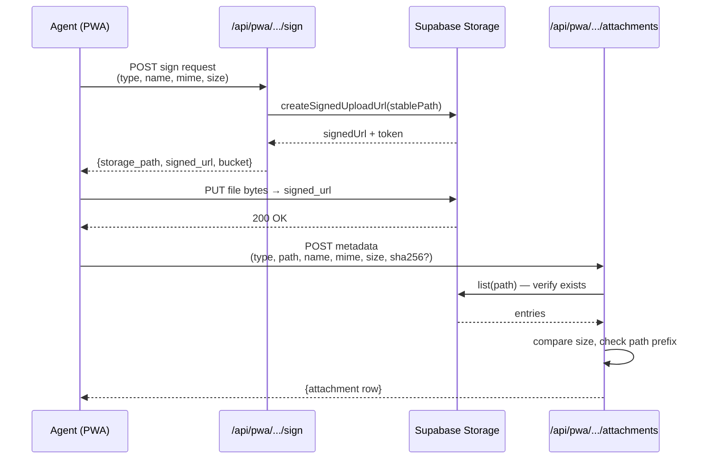

# Sales PWA

Public reference for the ClalMobile Sales PWA — the mobile-first web app
field sales agents use to document in-person sales, capture signed
contract photos, and flow the sale through to the commission ledger.

Route: `/sales-pwa`.
Source: [`app/sales-pwa/`](../app/sales-pwa/),
[`app/api/pwa/`](../app/api/pwa/),
[`lib/pwa/`](../lib/pwa/).

---

## 1. Overview

The Sales PWA is a progressive web app (installable to the home screen,
mobile-first UI, service worker for static caching) that lets a field
agent:

1. Create a **draft sales doc** with customer + sale metadata.
2. Optionally **create a new customer** on the spot (phone lookup first).
3. Upload **required attachments** (photos of the contract, signed form,
   invoice, device serial) directly to Supabase Storage.
4. **Submit** the doc, which atomically flips its status and registers
   the commission.

It's a thin client over the same Supabase backend the rest of the app
uses — no separate identity, no separate DB. The PWA-specific additions
are:

- A service worker scoped to `/sales-pwa/` for static-asset caching.
- A manifest so it installs cleanly to the home screen.
- A set of API routes under `/api/pwa/*` with tight employee-scoped auth.

### Who uses it

Field agents who close sales in person (stands, events, door-to-door)
and need a phone-friendly way to record the sale and its supporting
documents before leaving the customer.

---

## 2. Authentication

Same Supabase login as the rest of ClalMobile. There is no separate PWA
sign-in.

### Flow

1. Agent opens `/sales-pwa`. If not logged in, Supabase SSR cookies
   resolve to `null` and the API rejects with 401 (the UI then prompts
   for login via the main `/login` page).
2. All `/api/pwa/*` endpoints use `requireEmployee(req)` which:
   - Resolves the Supabase auth user via cookies.
   - Looks up the matching row in `public.users` by `auth_id`.
   - Rejects if `role === 'customer'` or `status ∈ {inactive, suspended}`.
   - Returns `{ appUserId, name, email, role }`.
3. `appUserId` is the canonical **app-user id** (not the Supabase auth
   id). It's used as `employee_key` / `employee_user_id` on every
   `sales_docs` row.

CSRF: every client request carries `csrfHeaders()` (see `lib/csrf-client.ts`).

Source: [`lib/pwa/auth.ts`](../lib/pwa/auth.ts).

---

## 3. End-to-end flow

```mermaid
flowchart TD
    A[Agent: /sales-pwa/new] -->|POST /api/pwa/sales| B[(sales_docs<br/>status = draft)]
    A -->|optional| C[POST /api/pwa/customers]
    C --> CU[(customers)]

    B --> D[Open doc detail page]
    D -->|for each attachment| E1[POST /api/pwa/sales/&#91;id&#93;/attachments/sign]
    E1 --> E2[PUT file → Supabase Storage signed URL]
    E2 --> E3[POST /api/pwa/sales/&#91;id&#93;/attachments]

    D -->|POST /api/pwa/sales/&#91;id&#93;/submit| F{required<br/>attachments<br/>present?}
    F -->|no| X[400 — missing list]
    F -->|yes| S[Atomic UPDATE<br/>status → synced_to_commissions<br/>WHERE status IN draft,rejected]
    S -->|0 rows| Y[409 — already submitted]
    S -->|1 row| R[registerSaleCommission<br/>source = sales_doc]
    R --> CS[(commission_sales)]
    R -->|on error| Z[rollback status → rejected]
```



The agent-facing steps:

1. **Create draft** at `/sales-pwa/new` → `POST /api/pwa/sales`.
2. **(Optional) Register customer** if phone lookup returns nothing →
   `POST /api/pwa/customers`.
3. **Attach files** — one round trip per file: `/sign` → `PUT` →
   `/attachments`.
4. **Submit** → `POST /api/pwa/sales/[id]/submit`. On success the sale is
   already in `commission_sales`. No manager approval queue.

---

## 4. API routes

All routes are rooted at `/api/pwa/*`. All require `requireEmployee`
auth. All operate on the authenticated employee's own data
(`employee_key = authed.appUserId`).

### `GET /api/pwa/sales`

List the authed employee's docs, newest first (limit 200).

Query: `status`, `date_from`, `date_to`, `search` (matches `notes`,
`order_id`, customer name/phone/code). Returns `{ docs }` with each doc
joined to its `customer` summary (id / name / phone / code).

### `POST /api/pwa/sales`

Create a draft doc.

Required body: `sale_type ∈ {line, device, mixed}`, `total_amount > 0`.
Optional: `sale_date` (YYYY-MM-DD, within the last 90 days),
`customer_id`, `customer_phone`, `order_id`, `notes`, `items[]`,
`doc_uuid` (stable client UUID for offline), `idempotency_key`.

**Customer auto-resolution:**

- If `customer_id` not supplied but `customer_phone` is → phone lookup
  via normalised candidates.
- Else if `order_id` is → fetch the order's `customer_id`.

Creates `sales_docs` row + `sales_doc_items` rows (if supplied) +
`sales_doc_events(event_type='created')`.

Idempotency: partial unique index on `(employee_key, idempotency_key)`
prevents accidental double-inserts from retries.

### `GET /api/pwa/sales/[id]`

Fetch a single doc (must belong to the authed employee) with its items,
attachments, and event trail.

### `PUT /api/pwa/sales/[id]`

Update a doc **only while it's in `draft` or `rejected` state**. Rejects
updates to submitted/verified/cancelled/synced docs with 400.

### `POST /api/pwa/sales/[id]/attachments/sign`

**First half of the upload flow.** Returns a signed Supabase Storage
upload URL plus the server-chosen storage path.

Request body:

```json
{
  "attachment_type": "contract_photo | signed_form | invoice | device_serial_proof | id_photo | other",
  "file_name": "contract.jpg",
  "mime_type": "image/jpeg",
  "file_size": 1048576
}
```

Response:

```json
{
  "storage_path": "sales-docs/<docId>/<type>/<uuid>.jpg",
  "signed_url": "https://<supabase>/storage/...",
  "token": "...",
  "bucket": "sales-docs-private",
  "expected": { "attachment_type", "mime_type", "file_size", "file_name", "original_name" }
}
```

The path is **server-controlled** (contains a `randomUUID()`) so agents
cannot forge file_path values. Signed URLs are short-lived (~5 min
window to PUT).

### `POST /api/pwa/sales/[id]/attachments`

**Second half of the upload flow** — records the metadata after the
client has actually uploaded to the signed URL.

Before inserting, the server:

1. Validates `file_path` starts with `sales-docs/<docId>/` (injection
   guard).
2. Calls `storage.from(BUCKET).list(...)` to **verify the file actually
   exists** at that path. If missing → 400 "الملف غير موجود في التخزين".
3. Compares reported `file_size` with the actual size from Storage. If
   they disagree → 400.

This is the fix for audit issue 4.3 (previously, arbitrary metadata was
accepted without proof a file existed).

### `POST /api/pwa/sales/[id]/submit`

See §6 — submit flow.

### `POST /api/pwa/customers`

Create a new customer from the PWA. Deduplicates:

- By normalised phone (handles `+9725XXXXXXXX`, `9725XXXXXXXX`,
  `05XXXXXXXX` variants — see `buildCustomerPhoneCandidates`).
- By `national_id` if supplied.

If a match is found, returns the existing customer with `existed: true`
(no insert). Otherwise inserts with `source: 'pwa'`.

### `GET /api/pwa/customer-lookup?phone=<phone>&code=<code>`

Quick client-side lookup for the draft form — returns a single customer
match (id / name / phone / customer_code) or `null`.

---

## 5. Required attachments by sale type

Enforced at submit time (`POST /api/pwa/sales/[id]/submit`):

| sale_type | Required attachments |
|-----------|----------------------|
| `line` | `contract_photo` + `signed_form` |
| `device` | `invoice` + `device_serial_proof` |
| `mixed` | `contract_photo` + `signed_form` + `invoice` + `device_serial_proof` |

Attachment types (enum in the validator):

- `contract_photo` — photo of the customer's signed contract paperwork
- `signed_form` — photo of the agent-customer agreement form
- `invoice` — invoice / receipt for the device
- `device_serial_proof` — photo of the IMEI / serial sticker
- `id_photo` — customer ID photo (optional — used for fraud-prone flows)
- `other` — catch-all

If any required attachment is missing at submit, the API returns
`400 — مرفقات ناقصة: <list>` and the submit is aborted.

---

## 6. Submit flow

`POST /api/pwa/sales/[id]/submit` is the linchpin. Sequence:

1. **Auth** — `requireEmployee`. Doc must belong to the authed employee.
2. **State check** — doc status must be `draft` or `rejected`. Anything
   else → 409 "هذه الوثيقة تم إرسالها مسبقاً".
3. **Amount check** — `total_amount > 0`.
4. **Required attachments check** — see §5.
5. **Atomic transition:**

    ```sql
    UPDATE sales_docs
       SET status = 'synced_to_commissions',
           submitted_at = NOW(), synced_at = NOW(),
           rejection_reason = NULL, rejected_at = NULL
     WHERE id = <id>
       AND status IN ('draft','rejected')
       AND deleted_at IS NULL
    RETURNING *;
    ```

   A concurrent second submit sees zero rows returned → 409. This is the
   fix for audit issue 4.2.

6. **Register commission(s)** — one call per sale type:
   - `line` → one call, `saleType='line'`, `amount = doc.total_amount`
   - `device` → one call, `saleType='device'`, `amount = doc.total_amount`
   - `mixed` → split into line + device using `sales_doc_items`
     breakdown; if no items exist, split 50/50 as a fallback.

   Each call uses `source: 'sales_doc'` and
   `sourceSalesDocId: doc.id` so the commission row is linked back.

7. **Rollback on failure** — if `registerSaleCommission` throws (e.g.
   month is locked → DB trigger), the doc is flipped back to `rejected`
   with the error as `rejection_reason`, an event is logged, and a 500
   is returned.

8. **Audit event** — `sales_doc_events(event_type='submitted_and_synced')`
   with the commission ids and total employee commission attached.

Return shape:

```json
{
  "success": true,
  "data": {
    "doc": { ...sales_docs row... },
    "commissions": [
      { "id": 123, "contractCommission": 1.23, "employeeCommission": 1.23, "rateSnapshot": {...} }
    ]
  }
}
```

Source: [`app/api/pwa/sales/[id]/submit/route.ts`](../app/api/pwa/sales/%5Bid%5D/submit/route.ts).

---

## 7. File upload — signed URL flow

The Supabase bucket `sales-docs-private` is **private** (no public
reads). Upload and download both go through signed URLs.



### MIME whitelist

Defined in `lib/pwa/validators.ts`:

```
application/pdf
image/jpeg
image/jpg
image/png
image/webp
image/heic
```

Anything else is rejected at the `/sign` step.

### Size cap

`MAX_ATTACHMENT_SIZE_BYTES = 10 MB`. Enforced both at `/sign` (rejects
absurd requests up front) and at the metadata step (re-checks against
the actual stored object).

### Path structure

`sales-docs/<docId>/<attachment_type>/<uuid>.<ext>`

- `<docId>` scopes the object to a specific sales_doc.
- `<attachment_type>` groups by semantic role.
- `<uuid>` is server-generated — prevents collisions and makes paths
  unguessable.

---

## 8. Customer linking

Finding/creating a customer from phone input is one of the most
commonly-hit paths. Normalisation lives in
[`lib/pwa/customer-linking.ts`](../lib/pwa/customer-linking.ts) →
`buildCustomerPhoneCandidates`:

Input variants all normalise to the same set of candidates:

- `05XXXXXXXX` (Israeli mobile, local)
- `9725XXXXXXXX` (international, no plus)
- `+9725XXXXXXXX` (E.164)

`buildCustomerPhoneCandidates("054-111-2233")` returns the set of these
three variants. A `.in("phone", candidates)` query matches regardless of
how the phone was originally stored.

### Dedup rules (on create)

`POST /api/pwa/customers`:

1. If any row in `customers` matches any normalised phone candidate →
   return that customer with `existed: true`.
2. Else if `national_id` matches an existing row → return it.
3. Else INSERT a new `customers` row, `source: 'pwa'`.

Phone is normalised on insert (strips `-` and spaces; keeps leading `+`
if present).

### National ID

Optional (`national_id`). Agents are encouraged but not required to
capture it. When present, it acts as a secondary dedup key and lets
finance cross-reference with HOT Mobile records.

---

## 9. Idempotency

Two layers protect against duplicate rows under retries.

### `doc_uuid`

Stable client-generated UUID attached to `sales_docs.doc_uuid` (unique
index). Used to keep a client-side record of "this doc I created" even
if the server returned a network error. If the client retries the
create with the same `doc_uuid`, the UNIQUE constraint returns the
existing row (the API doesn't currently re-use it for idempotent
upserts; it just refuses the duplicate — this is acceptable because
`GET /api/pwa/sales` will still show the original).

### `idempotency_key`

Per-employee stable key on `sales_docs`. Partial unique index:

```sql
UNIQUE(employee_key, idempotency_key)
  WHERE deleted_at IS NULL AND idempotency_key IS NOT NULL
```

The PWA client sets `idempotency_key = <timestamp>-<random>` on every
create call. For pipeline auto-creation (see `COMMISSIONS.md` §5.1), the
key is `pipeline_<deal_id>` so repeated "won" transitions don't spawn
duplicate docs.

---

## 10. Offline

**Current state: read-only offline via service worker; writes require
network.**

### What works offline

The service worker at `public/sales-pwa/sw.js` caches:

- `/sales-pwa` (list page shell)
- `/sales-pwa/new` (create form shell)
- `/sales-pwa/manifest.json`

Strategy:

- **Navigation requests** — network-first, fall back to the cached
  shell. Lets the agent open the PWA even without signal.
- **Static assets** — cache-first.
- **API calls (`/api/*`)** — explicitly bypassed (`return` early in the
  fetch handler).

### What doesn't work offline (yet)

- `POST` requests — the service worker doesn't queue writes. A submit
  made without network returns a fetch error; the agent sees the retry
  UI.
- Attachment uploads — the signed URL model requires network.

### Future work

Queued write support is a known follow-up. The `doc_uuid` +
`idempotency_key` scheme is deliberately designed for it — once
background-sync lands, queued POSTs can replay safely without creating
duplicate rows.

---

## 11. Row-level security (RLS)

Enabled on the whole `sales_docs` family in migration
`20260418000003_commission_refactor.sql`:

```sql
ALTER TABLE sales_docs             ENABLE ROW LEVEL SECURITY;
ALTER TABLE sales_doc_items        ENABLE ROW LEVEL SECURITY;
ALTER TABLE sales_doc_attachments  ENABLE ROW LEVEL SECURITY;
ALTER TABLE sales_doc_events       ENABLE ROW LEVEL SECURITY;
ALTER TABLE sales_doc_sync_queue   ENABLE ROW LEVEL SECURITY;
```

### Policies

- **`service_role` full access** — all API routes use `createAdminSupabase()`
  which authenticates as `service_role` and bypasses RLS. This is the
  main write path.
- **`authenticated` employee read-own** on `sales_docs`:

  ```sql
  USING (
    employee_key       = auth.uid()::text OR
    employee_user_id   = auth.uid()::text OR
    employee_user_id IN (SELECT id::text FROM users WHERE auth_id = auth.uid())
  )
  ```

  This is in place for future client-side direct-read scenarios; today
  the UI reads via the API, so the service-role policy is what's hit in
  practice.

### What this means in practice

If a future client bypasses the API and reads `sales_docs` directly
through the Supabase JS SDK with an authenticated user token, they will
only see their own rows. The API layer is the source of truth for
permission checks today, but RLS is the defence-in-depth layer.

---

## 12. Pipeline PWA integration

Sales docs aren't only created by field agents. CRM staff working the
**pipeline** also generate them — see `COMMISSIONS.md` §5.1. Those docs
get:

- `source = 'pipeline'` (vs `source = 'pwa'` for field-agent docs).
- `status = 'synced_to_commissions'` at creation time (no draft state —
  they skip the PWA lifecycle).
- `idempotency_key = pipeline_<deal_id>`.
- `employee_key` / `employee_user_id` = the deal's assigned employee or
  the actor who moved it to won.
- A `sales_doc_events(event_type='auto_created_from_pipeline')` event
  logging the deal_id and resulting commission_id.

From the employee portal's perspective these look like any other doc and
they count toward the same monthly totals. Managers can cancel them via
the same `/admin/sales-docs` cancel flow.

---

## 13. File & route reference

| Path | Role |
|------|------|
| `app/sales-pwa/layout.tsx` | Shell + SalesPwaInit (service worker registration). |
| `app/sales-pwa/page.tsx` | List page — uses `/api/pwa/sales`. |
| `app/sales-pwa/new/page.tsx` | Create-draft form. |
| `app/sales-pwa/docs/[id]/page.tsx` | Doc detail + attachment upload UI + submit button. |
| `components/pwa/SalesPwaInit.tsx` | Client-side service worker registration. |
| `public/sales-pwa/sw.js` | Service worker (static cache, nav fallback). |
| `public/sales-pwa/manifest.json` | PWA manifest (installability). |
| `lib/pwa/auth.ts` | `requireEmployee(req)` — Supabase SSR auth gate. |
| `lib/pwa/customer-linking.ts` | `buildCustomerPhoneCandidates`, `attachCustomersToSalesDocs`. |
| `lib/pwa/validators.ts` | Zod schemas + MIME/size caps. |
| `app/api/pwa/sales/route.ts` | List / create draft. |
| `app/api/pwa/sales/[id]/route.ts` | Detail / update (draft+rejected only). |
| `app/api/pwa/sales/[id]/submit/route.ts` | **Submit** → commission. |
| `app/api/pwa/sales/[id]/attachments/sign/route.ts` | Signed upload URL. |
| `app/api/pwa/sales/[id]/attachments/route.ts` | Metadata record + existence check. |
| `app/api/pwa/customers/route.ts` | Create customer with dedup. |
| `app/api/pwa/customer-lookup/route.ts` | Phone / code lookup. |
| `supabase/migrations/20260410000001_sales_docs_pwa.sql` | Tables. |
| `supabase/migrations/20260418000003_commission_refactor.sql` | RLS + cancel state + source columns. |

---

## 14. Related docs

- `docs/COMMISSIONS.md` — what happens after submit.
- `docs/BOT.md` — WhatsApp bot (separate channel; creates pipeline
  leads, not sales_docs).

---

## 15. Unified Employee App (2026-04-18)

The former standalone `/employee/commissions` screen and the document-only
`/sales-pwa` have been merged into a single installable PWA under
`/sales-pwa`. One session, one layout, one navigation — no more separate
tabs for sales docs vs. commission tracking.

### New routes (all under `/sales-pwa`)

| Route | Purpose |
|---|---|
| `/sales-pwa/commissions` | Daily dashboard: today, month-to-date, pacing, milestones. Replaces `/employee/commissions`. |
| `/sales-pwa/calculator` | Preview a commission for a hypothetical sale (line or device) without touching the ledger. |
| `/sales-pwa/corrections` | Employee dispute workflow — submit a correction request, track status. |
| `/sales-pwa/activity` | Personal audit timeline (sales registered, sanctions, target changes, corrections). |
| `/sales-pwa/announcements` | Broadcast messages from admin, with per-user read state. |

### Legacy compatibility

`/employee/commissions` is now a server-side 308 redirect to
`/sales-pwa/commissions`. Old emails, push links, and bookmarks keep
working unchanged. Middleware does not gate `/employee/*` — the redirect
short-circuits before any auth wall.

### Data model

Migration `20260418000006_unified_employee_pwa.sql` introduced four
tables: `commission_correction_requests`, `admin_announcements` +
`admin_announcement_reads`, `employee_activity_log`, and
`employee_favorite_products`. RLS restricts reads/writes to the owning
employee; service role bypasses for admin endpoints.
