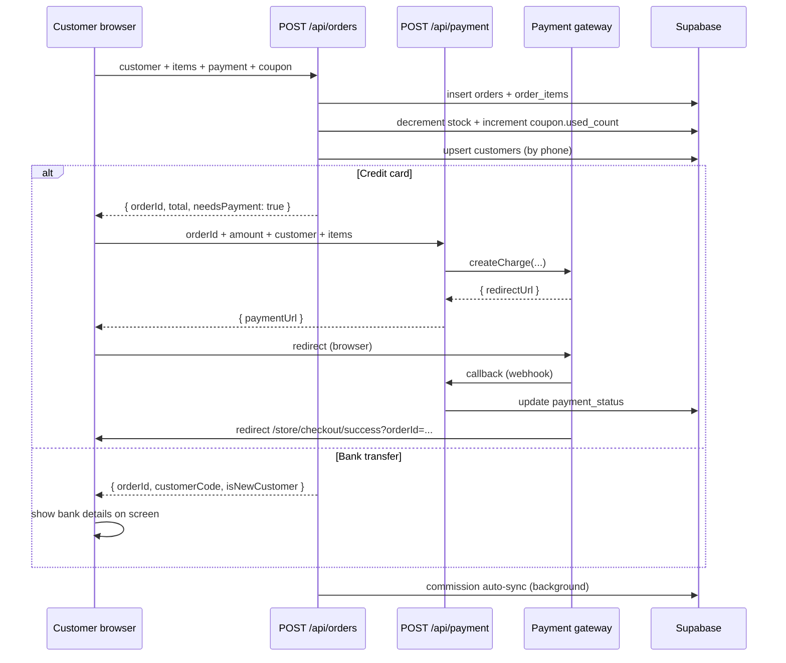
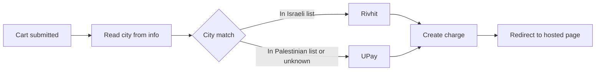

# ClalMobile Storefront

The public storefront for ClalMobile — a HOT Mobile authorized dealer. Customers browse devices, plans and accessories, then check out and track their order.

The store is a **mobile-first, bilingual (Arabic + Hebrew), RTL** Next.js App Router surface mounted at `/store`. It shares Supabase data with the admin panel and the CRM but runs under its own layout (no admin chrome, public visibility).

---

## Table of contents

1. [Overview](#1-overview)
2. [Customer journey](#2-customer-journey)
3. [Key features](#3-key-features)
4. [Checkout flow](#4-checkout-flow)
5. [Order tracking](#5-order-tracking)
6. [Payment providers](#6-payment-providers)
7. [Mobile UX and PWA](#7-mobile-ux-and-pwa)
8. [File map](#8-file-map)

---

## 1. Overview

### What the store does

- Sells two product types: **devices** (smartphones and tablets) and **accessories** (cases, chargers, earbuds, etc.).
- Offers **HOT Mobile line plans** — monthly cellular packages — alongside device sales.
- Runs **promotional deals** (limited-time offers with countdown timers and sale quotas).
- Collects **customer reviews** (moderated before they appear publicly).
- Presents everything bilingually: every surface-level label has both an Arabic (`name_ar`) and Hebrew (`name_he`) copy, with the active language stored in the `lang` cookie and rehydrated through `useLang()`.
- Persists cart, wishlist and comparison state in the browser (`localStorage`) so a customer who closes the tab returns to the same selection.

### Layout and routes

| Route                               | Purpose                                                                 |
| ----------------------------------- | ----------------------------------------------------------------------- |
| `/` (app/page.tsx)                  | Marketing landing page with featured products and plans                 |
| `/store`                            | Full catalogue (products, heroes, line plans, deals)                    |
| `/store/product/[id]`               | Product detail (gallery, colors, storage variants, specs, reviews)      |
| `/store/cart`                       | Four-step checkout: cart → info → payment → confirmation                |
| `/store/checkout/success`           | Post-payment landing after a successful gateway redirect                |
| `/store/checkout/failed`            | Post-payment landing after a failed gateway redirect                    |
| `/store/track`                      | Public order tracking by order ID                                       |
| `/store/wishlist`                   | Customer favourites                                                     |
| `/store/compare`                    | Side-by-side comparison of up to four products                          |
| `/store/account`                    | Returning-customer dashboard (requires phone OTP login)                 |
| `/store/auth`                       | Customer OTP login (phone + SMS or WhatsApp code)                       |

The `StoreLayout` wraps all `/store/*` pages. It mounts:

- `<CompareBar />` — a floating bar at the bottom of the viewport that appears when the compare list is non-empty.
- `<WebChatWidget />` — an embedded chat bubble that opens a CRM-backed conversation with support.

Everything above `StoreLayout` (shared `<StoreHeader />`, `<Footer />`) is rendered per-page so the homepage and the catalogue can diverge in navigation chrome.

### Design system at a glance

- **Dark theme** by default (`surface-bg #09090b`, brand red `#c41040`).
- Arabic font stack (`font-arabic`) with an ltr fallback for phone numbers, order IDs and prices.
- `dir="rtl"` applied at the top of every store page — icons, paddings and list directions flip automatically via Tailwind's `rtl:` variants.
- Two breakpoints via `useScreen()`: mobile (< 768px) and desktop. Most components render two completely different trees rather than responsive CSS, to keep both experiences tight.

---

## 2. Customer journey

```mermaid
flowchart TD
    A[Landing / Home] --> B[Store catalogue]
    A --> C[Line plans]
    B --> D{Filter or search}
    D -->|Smart search| E[AI-parsed filters]
    D -->|Manual filters| F[Brand / type / price / stock]
    D -->|Category tap| G[Category page]
    E --> H[Product grid]
    F --> H
    G --> H
    H --> I[Product detail]
    I --> J{Decision}
    J -->|Compare| K[Compare bar - up to 4]
    J -->|Wishlist| L[Favourites]
    J -->|Add to cart| M[Cart step 0]
    K --> I
    L --> I
    M --> N[Step 1 - customer info]
    N --> O[Step 2 - payment]
    O --> P{Cart type}
    P -->|Device only| Q[Bank transfer]
    P -->|Accessory only| R[Credit card]
    P -->|Mixed| R
    R --> S[Payment gateway redirect]
    S --> T[Checkout success]
    Q --> U[Order confirmation]
    T --> U
    U --> V[/store/track]
```

A few notes on this flow:

- **Smart search** is optional — short queries fall back to keyword matching. See [Search](#search).
- **Compare and wishlist** do not interrupt the flow: they're side branches the customer dips into and returns from.
- **Bank transfer** is used for orders containing devices; it reserves the order without charging the card and surfaces bank details for the customer to transfer manually. **Accessory-only** orders go through the hosted payment gateway.
- **Mixed carts** (device + accessory) follow the device path: devices are the anchor, so the whole order is routed to bank transfer.

---

## 3. Key features

### Search

The store exposes two search entry points, both wrapped inside `SmartSearchBar`:

**Autocomplete** — fires on every keystroke (debounced at 300 ms). The browser hits `GET /api/store/autocomplete?q=...&limit=5`, which returns matching products, brand hits and category hits in a single payload. The dropdown groups them into three sections (recent searches when the input is empty, then live results).

**Smart search on submit** — when the customer hits enter or presses the search button, the full query is routed through `GET /api/store/smart-search?q=...`.

The smart-search pipeline:

1. **Rate limit** — 10 req / min per IP, backed by a DB-persisted counter with an in-memory fallback.
2. **Cache** — a 60-second in-memory result cache keyed by the lowercase query; identical repeat queries skip the LLM call entirely.
3. **Query classification** — `isSmartQuery()` looks for signals that the query is natural language rather than a model name:
   - Three or more whitespace-separated tokens.
   - Keywords like "تحت", "فوق", "أحسن", "أرخص", "camera", "battery", "מתחת", "מעל", etc.
4. **Filter extraction** — if the query looks smart, it is sent to Claude with a short system prompt asking for a JSON filter object (type, brands, min/max price, features, sort, keywords). Output is constrained to JSON mode at a low temperature.
5. **Fallback extraction** — if the query is short or the LLM call fails, a rule-based extractor catches brand aliases ("سامسونج", "iphone", "شاومي") and price phrases ("تحت 3000", "over 2000") and returns a partial filter.
6. **Supabase query** — the filters are composed into a single Supabase query with `eq`, `in`, `lte`, `gte`, `or` (ILIKE on `name_ar`, `name_he`, `brand`) and an order clause. Results are capped at 20.
7. **Usage tracking** — when the LLM is used, input and output token counts are recorded via `trackAIUsage()` so the admin usage dashboard can show cost.

The search bar also keeps the last five queries per user in `localStorage` under `clal_recent_searches`, shown as quick re-runs when the field is empty.

### Filters and categories

Filters live in `SearchFilters.tsx` and apply client-side after the catalogue has been fetched:

- **Type** — device, accessory, all.
- **Brand** — multi-select from the distinct brand list.
- **Price range** — min / max input with a debounced update.
- **In stock only** — hides products with `stock === 0`.
- **Sort** — price ascending, price descending, best-selling (by `sold`), featured first, newest (by `created_at`).

Categories are fetched from the `categories` table via `getCategories()` and rendered as horizontal scroll chips on mobile or a sidebar on desktop. Tapping a category narrows the catalogue to products whose `category_id` matches.

### Product comparison

`useCompare()` (Zustand) holds up to four products. Selecting the fifth returns `false` and the UI shows a toast explaining the limit. The state is hydrated from `localStorage` under `clal_compare` on mount (not during SSR, to avoid hydration mismatches).

The compare page lays out products in a horizontally-scrollable table with rows for price, brand, type, storage, colors and every spec key that at least one product exposes. Missing values show a dash. A share button copies a shareable link with the selected product IDs so the customer can send it to a friend.

### Favorites / wishlist

`useWishlist()` mirrors the compare pattern (Zustand + `localStorage`), without the 4-item cap. The wishlist page offers:

- One-tap remove per product.
- "Add all to cart" — moves everything to the cart in one go.
- "Clear all" — empties the list with a confirmation.

The heart icon on any product card toggles wishlist membership via `isInWishlist()`.

### Coupons

**System design** (the codes themselves live in the DB):

- The `coupons` table holds `code`, `type` (`percent` or `flat`), `value`, `min_order`, `max_uses`, `used_count`, `expires_at`, `active`.
- At checkout, the customer types a code into an input on the cart step. The browser posts it to `POST /api/store/coupon/validate` (which internally calls `validateCoupon()`).
- Server-side, `validateCoupon()` runs these checks in order: code exists and is active → not expired → `used_count < max_uses` → `order_total >= min_order`.
- If all pass, it returns `{ valid: true, discount }` where discount is `total * value / 100` for percent coupons or `min(value, total)` for flat coupons.
- The cart store persists the applied code in `couponCode` and the computed value in `discountAmount`; `getTotal()` = `max(0, subtotal - discountAmount)`.
- On successful order creation, the server increments `used_count`.

### Loyalty program

The loyalty system is documented at the module level in `lib/loyalty.ts` and is used both by the store and the CRM 360 view:

- Every paid order earns points: `floor(total * pointsPerShekel * tierMultiplier)`.
- Tiers: **bronze**, **silver**, **fضي**, **ذهبي**, **بلاتيني**. Each tier has a minimum lifetime-points threshold and a multiplier on future earnings. The tier upgrades automatically as lifetime points cross each threshold.
- Points can be redeemed at checkout as a discount — one point is worth a fraction of a shekel (configurable in `LOYALTY_CONFIG.shekelPerPoint`).
- A customer must be logged in (OTP-verified) to redeem points. Anonymous checkouts earn points retroactively the first time they log in with the matching phone.
- All earn/redeem events are written to `loyalty_transactions` with a running `balance_after`, giving the CRM a full audit trail.

### Customer code / returning-customer OTP prefill

Every customer carries a `customer_code` (generated on first order). When a returning customer enters their phone number at checkout:

1. `POST /api/store/customer/lookup` checks `customers` by phone.
2. If a match is found, the response returns `{ hasAccount: true }` without PII.
3. The cart UI prompts the customer to receive an OTP via SMS or WhatsApp.
4. After verification via `POST /api/store/customer/verify-otp`, the server returns a lightweight profile (name, city, address, email, customer_code).
5. The cart prefills the customer info step from that profile — the customer just confirms and moves on.

This path uses the same `customer_otps` table as the `/store/auth` login page, so a customer who logs in via the account dashboard also gets a prefilled cart next time.

---

## 4. Checkout flow

The cart page (`/store/cart`) is a four-step single-page flow:

### Step 0 — Cart

Lists every item with quantity controls, per-line remove, subtotal and the coupon input. If the cart is empty it shows an empty state with a CTA back to `/store`.

### Step 1 — Customer info

A form with these fields:

- **Name** — required.
- **Phone** — required, validated by `validatePhone()` (Israeli mobile format `05X-XXXXXXX` or international E.164).
- **Email** — optional; validated by `validateEmail()` when present.
- **City** — `CityCombobox`, searchable against `ISRAEL_CITIES` (the same list that drives the payment-gateway router).
- **Address** — required, free text.
- **ID number** — required for device orders (used by HOT Mobile contracts), validated by `validateIsraeliID()`. Optional for accessories.
- **Notes** — free text, surfaced to the admin for fulfilment.

Bank-transfer paths additionally collect bank name, branch and account number, validated by `validateBranch()` and `validateAccount()`.

### Step 2 — Payment

Two branches:

**Device cart (or mixed cart)** — bank transfer:

- Bank dropdown from `BANKS`.
- Installments selector (1–12), used to display the monthly amount as `Math.ceil(total / installments)`.
- On submit, the order is created with `payment: { type: "bank", bank, branch, account, installments, monthly_amount }`.

**Accessory-only cart** — credit card:

- No form fields on this step; the gateway collects card data on its own hosted page.
- On submit, the order is created with `payment: { type: "credit" }`.

### Step 3 — Confirmation

Shows the order ID (format `CLM-XXXXX`), total, monthly amount if applicable, bank details if bank transfer, and the customer code (new customers get a freshly-minted code highlighted with a welcome banner).

### Server-side sequence



A few integrity details:

- The order-creation endpoint is **CSRF-exempt** (listed in `middleware.ts`) because it is also called from server-to-server flows (CRM manual orders). The cart page attaches a `csrf_token` cookie for the payment call.
- Abandoned carts are tracked fire-and-forget from `useCart.addItem()` — the browser posts to `/api/cart/abandoned` with a visitor ID so the admin can see which carts were built but never converted. `useCart.clearCart()` deletes the abandoned record.
- The cart is **only cleared on successful confirmation** — if the gateway redirects fail, the customer lands on `/store/checkout/failed` with the cart still populated for a retry.

---

## 5. Order tracking

`/store/track` is a public page that accepts an order ID and returns the status.

1. The customer types `CLM-XXXXX` into a single input.
2. The browser calls `GET /api/store/order-status?orderId=...`.
3. The endpoint returns `{ id, status, total, created_at, payment_status }` or a not-found error.
4. The UI maps `status` to a bilingual label:

| Status       | Arabic          | Hebrew   |
| ------------ | --------------- | -------- |
| `new`        | جديد            | חדש       |
| `approved`   | موافق عليه       | אושר      |
| `processing` | قيد التجهيز      | בהכנה     |
| `shipped`    | تم الشحن         | נשלח      |
| `delivered`  | تم التسليم       | נמסר      |
| `cancelled`  | ملغي             | בוטל      |
| `rejected`   | مرفوض            | נדחה      |

No PII is returned on the tracking endpoint — only the fields above — so the order ID alone is sufficient (and harmless) to query. For sensitive actions (cancel, reorder), the customer must log in through `/store/auth` first.

---

## 6. Payment providers

The store uses a **provider abstraction** (see `lib/integrations/hub.ts`) so business logic talks to a `PaymentProvider` interface and the concrete adapter is injected at runtime.

Two adapters ship today:

- **Rivhit (iCredit)** — default for Israeli cities. Supports Visa, Mastercard, Isracard, Bit and Apple Pay. Certified PCI-DSS Level 1.
- **UPay** — default for Palestinian cities and any other location. Supports Visa, Mastercard, PayPal, Apple Pay, Google Pay. SSL-secured hosted checkout.

### City-based auto-detect

`lib/payment-gateway.ts` exports `detectPaymentGateway(city)`:



The Israeli city set is derived from `ISRAEL_CITIES` minus a hard-coded Palestinian exclusion list (covers West Bank and Gaza cities in both Arabic and Hebrew spellings). Any city not in the Israeli set — empty string, foreign city, typo — falls through to UPay.

The resolver returns both the provider name and a display object (logo, security badge text, accepted card brands) used on the payment step to reassure the customer.

### Provider configuration

Provider credentials are stored in the `integrations` table (JSONB `config` column). The admin panel (see `ADMIN.md`) owns the CRUD flow — **no API keys, merchant IDs or webhook secrets appear in this repository or in this document**. At runtime, `getIntegrationConfig(type)` reads the row for the active provider, and the adapter reads its credentials from there (with an environment-variable fallback for bootstrapping).

Webhooks from both providers post back to `/api/payment/callback` (Rivhit) or `/api/payment/upay/callback` (UPay). Both endpoints verify signatures before updating `payment_status`.

---

## 7. Mobile UX and PWA

The storefront is a **progressive web app**:

- **Manifest** — `public/manifest.json` declares `start_url: /store`, `display: standalone`, RTL direction, Arabic as the primary language, a red brand theme and icon sizes from 72×72 up to 512×512 (with maskable variants for Android adaptive icons).
- **Service worker** — `public/sw.js` caches static assets and the shell of high-traffic store pages. First visit downloads, repeat visits load from cache with background revalidation.
- **Install prompts** — `pwa.installTitle` / `pwa.iosTitle` surfaces OS-specific installation hints (Android native prompt, iOS manual "Add to Home Screen" walkthrough).
- **Shortcuts** — manifest shortcuts jump directly to `/store` or `/store/cart` from the app icon's long-press menu.
- **Offline fallback** — the service worker returns the cached homepage when the network is unreachable, so customers on bad mobile connections see content instead of a browser error page.

Other mobile refinements:

- **Bottom sheets** for filters and sort so one-handed thumbs can reach everything.
- **Sticky add-to-cart button** on product detail pages.
- **Large tap targets** (44px minimum) across all interactive elements.
- **Per-device font size** via `useScreen()` — mobile renders most labels at 10–12 px to fit more content on small viewports; desktop opens up to 14–16 px.
- **RTL-aware flip** on icons that have directional meaning (arrows, chevrons, send icons).

---

## 8. File map

```
app/
  page.tsx                     Homepage (landing)
  store/
    layout.tsx                 Wraps CompareBar + WebChat
    page.tsx                   Catalogue
    product/[id]/page.tsx      Product detail
    cart/page.tsx              Four-step checkout
    checkout/success/          Post-payment success
    checkout/failed/           Post-payment failure
    track/page.tsx             Public order status
    wishlist/page.tsx          Favourites
    compare/page.tsx           Comparison table
    account/page.tsx           Customer dashboard
    auth/                      OTP login

lib/
  store/
    queries.ts                 getProducts, getCategories, getHeroes, validateCoupon, getWebsiteContent
    cart.ts                    useCart (Zustand + persist) + abandoned-cart tracking
    wishlist.ts                useWishlist
    compare.ts                 useCompare (max 4)
  loyalty.ts                   Points + tiers + earn/redeem
  customer-auth.ts             Bearer-token customer auth
  payment-gateway.ts           detectPaymentGateway by city
  integrations/hub.ts          Provider abstraction
  cities.ts                    City list (single source of truth)

components/
  store/
    StoreHeader.tsx            Top nav with cart/wishlist badges
    SmartSearchBar.tsx         Autocomplete + smart-search entry
    SearchFilters.tsx          Catalogue-side filter panel
    CompareBar.tsx             Floating compare strip

app/api/store/
  autocomplete/route.ts        Autocomplete
  smart-search/route.ts        AI search pipeline
  order-status/route.ts        Tracking endpoint
  coupon/validate/route.ts     Coupon validation
  customer/lookup + verify-otp Returning-customer prefill

app/api/orders/route.ts        Order creation (CSRF-exempt)
app/api/payment/route.ts       Hosted-page redirect
app/api/payment/callback/      Gateway webhooks
app/api/cart/abandoned/        Abandoned-cart tracking

public/
  manifest.json                PWA manifest
  sw.js                        Service worker
```

For architectural context (tech stack, request flow, security layers), see `DOCS.md`. For security specifics, see `SECURITY.md`. For the admin and CRM surfaces that consume and fulfil these orders, see `ADMIN.md` and `CRM.md`.
